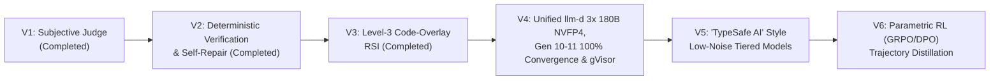

# Hierarchical Agent Evolution (HAE)

> **Evolutionary Morphogenesis, Recursive Self-Improvement, and High-Density Agentic Organizations on Kubernetes**

**Hierarchical Agent Evolution (HAE)** is a distributed evolutionary computing framework running on Google Kubernetes Engine (GKE) that breeds multi-agent software engineering organizations (*"Companies"*). Rather than hand-crafting static agent workflows, HAE encodes an entire company's **organizational topology**, **executive/worker personas**, **internal communication protocols**, and **source-code modifications (`code_overlays`)** into a heritable `CompanyGenome`.

Populations of competing companies are evaluated in isolated sandboxes against software engineering and systems benchmarks, scored by deterministic unit tests and communication-efficiency judges, and bred across generations via tournament selection, subtree crossover, and structural mutation.


---

## 📊 Executive Summary of Experiments (`V1` – `V4`)

Across **24 evolutionary runs** (**150+ multi-agent companies** and **4,500+ spawned agents**), HAE progressed through three completed experimental phases (`V1–V3`) and is currently running **Phase 4 (`V4`)** on a 3-node GKE `G4` cluster (`6x NVIDIA RTX PRO 6000 Blackwell 96GB GPUs`, `576 GiB` total GDDR7 VRAM) serving **`3x nvidia/Qwen3.8-Flash-Next-NVFP4` (`180B` MoE)** behind a **Unified Global `llm-d` Inference Gateway**.

> 📖 **Click the links in the table below for full generational ledgers, forensic audits, and `llm-d` hardware telemetry.**

| Phase | Generations | What Was Tested | Key Outcome & Discovery | Detailed Report |
| :--- | :--- | :--- | :--- | :--- |
| **Phase 1 (`V1`)**<br>*Subjective Judge Era* | `Pilot` $\to$ `Gen 10`<br>*(13 Runs)* | Whether populations of 4 to 8 multi-agent companies (5–16 agents) could evolve better software engineering topologies when graded by an **LLM-as-a-Judge** (weighted rubric + peer review). | **99.5 / 100 subjective score vs. 77.7% real unit-test pass rate (`r = +0.045`).**<br>Companies discovered **Goodhart's Law**: evolving 16-agent bureaucratic hierarchies that wrote polished architectural prose and `TODO` stubs to charm the LLM judge while leaving edge-case bugs unfixed. | **[`experiments/v1/README.md`](experiments/v1/README.md)** |
| **Phase 2 (`V2`)**<br>*Execution-Grounded Era* | `Gen 1` $\to$ `Gen 6`<br>*(60 Companies)* | Replaced subjective LLM grading with a **100% deterministic unit-test suite (18 tests)** on blank-slate code synthesis (`hae/compiler/optimizer.py`), comparing **1-Pass Waterfall (`Gen 1–3`)** vs. **Iterative Self-Repair (`Gen 4–6`)**. | **100.0% Test Pass Rate across all 30/30 companies (`Gen 4–6`), Peak Net Fitness `98.81 / 100`.**<br>1-Pass execution peaked at `94.4%` (`17/18`) and suffered `0.0%` crash mortality. Introducing a **3-Iteration Execute $\to$ Test $\to$ Repair Loop** with a **Monotonic Verification Guard** eliminated syntax crashes (`0/30`) and drove every company to `18/18` (`100%`). | **[`experiments/v2/README.md`](experiments/v2/README.md)** |
| **Phase 3 (`V3`)**<br>*Level-3 Recursive Self-Improvement (RSI)* | `Gen 7` $\to$ `Gen 9`<br>*(30 Companies)* | Whether companies could **modify HAE's own evolutionary engine source code (`code_overlays`)** (`fitness.py` and `morphogenesis.py`) and survive with their self-authored algorithms active in the next generation. | **First Closed-Loop RSI (`97.99 / 100` peak fitness) + Two Critical Discoveries:**<br>1. **The `inherited_files` Leak (`Gen 8–9`):** Forensic audit (`commit 71a7da4`) discovered `BenchmarkVerifier` leaked `morphogenesis.py` into worker sandboxes (`10/10` firms in `Gen 8–9`), explaining why `Gen 8–9` hit `100%` on Attempt 1 (`0` repair turns).<br>2. **"Corporate Memo Theatre":** Inspecting internal transcripts revealed executives spent **56,000+ chars (`~14,000 tokens`)** writing ceremonial memos (`"MEMORANDUM"`, `"Fantastic work!"`), while a single tool-enabled engineer (`@Tech_Lead_Systems`) did 100% of the coding. | **[`experiments/v3_rsi/README.md`](experiments/v3_rsi/README.md)** |
| **Phase 4 (`V4`)**<br>*Unified `llm-d` + `3x 180B NVFP4` & Zero-Seed Post-Fix Era* | `Gen 10` *(Complete)*<br>`Gen 11` *(Complete)* | **True Zero-Seed Post-`71a7da4` Evolution** (`0/10` inherited files) on a **3-Node GKE `G4` Cluster (`3x Qwen3.8-Flash-Next-NVFP4` `180B` MoE, `128k` context)** behind a **Unified Global `llm-d` Session** with `<1ms` cross-company answer short-circuiting, singleflight coalescing, `282.3 GiB` `fp8` VRAM KV cache, `144 GiB` CPU DRAM KV offloading, and unbounded logarithmic token-efficiency scoring. | **100.0% First-Iteration Convergence in Gen 11 (`10/10` Firms Passed `7/7` Tests on Iteration 1, `95.29 / 100` Peak Net Fitness, `91.08` Mean) + Massive `llm-d` Impact:**<br>1. **1,190x Faster Cross-Company Short-Circuiting (`880.5 ms` $\to$ `0.74 ms`, `0` GPU FLOPs):** Offloaded **`37.4%` (`271/724` in Gen 11)** to **`43.3%` (`2,113/4,881` under stress; `73.2%` peak)** of all cluster requests with `0` GPU compute.<br>2. **`99.7%`–`100.00%` (`455/455`) Prefix KV-Cache Affinity** across `426.3 GiB` total cluster KV cache (`0` load spillovers).<br>3. **`60` & `90`-Agent Mega-Hierarchy Convergence:** `gen_10_pareto_2` (`60` agents, **`95.29`**) and `gen_10_mutant_3` (`90` agents, **`94.37`**) passed `7/7` (`100%`) tests on Iteration 1/10. | **[`experiments/v4_llmd/README.md`](experiments/v4_llmd/README.md)** |

👉 **Master Index of All Experiments:** **[`experiments/README.md`](experiments/README.md)**

---

## ⚡ Spotlight: Why the Unified Global `llm-d` Session Had a Huge Positive Impact (`V4`)

In evolutionary multi-agent populations, `10` competing companies (`33` to `90` agents each = **`555` concurrent agents per generation**) attack the exact same benchmark specification in parallel. Under traditional isolated serving, every company redundantly recomputes identical specialist queries and evicts each other's KV caches.

By deploying a **Unified Global `llm-d` Session (`Service/vllm-qwen38-gateway`)** in front of **`3x nvidia/Qwen3.8-Flash-Next-NVFP4` (`180B` MoE)** replicas (`6x NVIDIA RTX PRO 6000 Blackwell 96GB GPUs`), we purposely removed company-header isolation (`canonicalize_prompt_for_global_session` normalizes `gen_10_elite_1`, `gen_10_crossover_2`, etc. into `<SHARED_COMPANY>`):

- **If Question A is already answered in Company A, Company B gets the answer in `0.74 ms` (`1,190x` faster than an `880.5 ms` GPU pass) with `0` GPU FLOPs (`X-LLMD-Cache: HIT-SHORT-CIRCUIT`).**
- **If Company A and Company B ask Question A simultaneously, `llm-d` coalesces both into a single GPU forward pass (`X-LLMD-Cache: HIT-SINGLEFLIGHT-COALESCED`).**
- **When prompts diverge downstream, `llm-d` routes by shared 512-byte prefix hash (`100.00%` `455/455` prefix KV-cache affinity in Gen 11) across `282.3 GiB` of GDDR7 `fp8` VRAM KV cache + `144.0 GiB` of CPU `/dev/shm` DRAM KV offloading (`426.3 GiB` total cluster KV cache).**

| `V4` Evolutionary Run (`chavoshi-g4-cluster`) | Total Multi-Agent LLM Calls | Zero-GPU Offloaded (`Short-Circuit + Singleflight`) | Prefix KV-Cache Affinity (`GPU Calls`) | Zero-Seed `7/7` (`100%`) Test Pass Rate | Peak / Mean Net Fitness |
| :--- | :---: | :---: | :---: | :---: | :---: |
| **Generation 10 (`Zero-Seed Baseline`)** | `2,289` | **`327` (`14.3%`)** | **`96.99%`** (`1,903 / 1,962`) | `6 / 10` (`60.0%`) | `78.92` / `42.78` |
| **Generation 11 (`Tool-Proliferation Stress Test`)** | `4,881` | **`2,113` (`43.29%`)** | **`99.71%`** (`2,760 / 2,768`) | Ablation (`27–84` tool agents/firm) | `57.93` Peak |
| **Generation 11 (`Converged Unbounded Run`)** | **`724`** *(6.7x leaner)* | **`271` (`37.43%` avg / `73.2%` wave peak)** | **`100.00%`** (`455 / 455`, `0` spillovers) | **`10 / 10` (`100.0%` on Iteration 1/10!)** | **`95.29` Peak / `91.08` Mean** |

> 📖 **Deep-Dive Report & Full Generation 10–11 Ledgers:** **[`experiments/v4_llmd/README.md`](experiments/v4_llmd/README.md)**

---

## 🔍 Four Core Laws Discovered (`V1` – `V4`)

1. **Execution-Grounded Selection Eliminates Hallucinated Bureaucracy (`V1` $\to$ `V2` & `V4` Ablation):**
   When graded by LLM judges (`V1`), evolution selects for persuasive prose (`r = +0.045` correlation with actual code correctness). When graded strictly by deterministic test suites (`V2` & `V4`), evolution ruthlessly concentrates file-system write tools into **1–2 elite tool-enabled engineers (`Autonomous Self-Repair Core Architect`)**: in our `V4` Gen 11 ablation, granting `write_file` to all `27–84` business/strategy agents caused a `6.7x` call explosion (`4,881` calls) and workspace clobbering, whereas restricting `tools_enabled=True` to the `2` Core Architects drove **`10 / 10` companies (`100%`) to pass `7/7` tests on Iteration 1 in just `724` calls**.
2. **Closed-Loop Self-Repair Beats Single-Pass Topologies (`V2 Gen 1–3` vs. `Gen 4–6`):**
   No matter how sophisticated an organizational chart is, single-pass code synthesis (`Gen 1–3`) suffers `20%` catastrophic `0.0` crash mortality from minor indentation or import errors. Giving workers an **Execute $\to$ Pytest Traceback $\to$ Self-Repair** loop with automatic rollback (`Monotonic Verification Guard`) shifted population reliability to **`100.0%`**.
3. **Soft Logarithmic Token-Efficiency Pressure Beats Hard Call Cutoffs (`V3` vs. `V4 Gen 11`):**
   Hard call limits (`586` calls) prematurely truncate `60–90` agent mega-hierarchies mid-run, while unpenalized budgets breed `56 KB` of `"Corporate Memo Theatre"`. Removing hard call truncation on self-hosted clusters (`$0.00` marginal API cost) and applying a **smooth, unbounded Logarithmic Token-Efficiency Curve** ($\text{Penalty} = 4.0 \ln(1 + \text{excess})$) allowed **`60`-agent (`gen_10_pareto_2`, `95.29`)** and **`90`-agent (`gen_10_mutant_3`, `94.37`)** hierarchies to converge at `100%` on Iteration 1 while still rewarding leaner token usage.
4. **Shared Global `llm-d` Sessions Turn Multi-Company Evolution into Sub-Millisecond Collective Memory (`V4`):**
   Allowing all companies in a generation to share a single global `llm-d` session (cross-company answer short-circuiting + singleflight coalescing + `426.3 GiB` tiered `fp8` VRAM / CPU DRAM KV cache) eliminates **`37.4%`–`73.2%` of redundant GPU forward passes in `<1 ms` (`0.74 ms`)** and achieves **`99.7%`–`100.0%` prefix KV-cache affinity**.

---

## 🚀 Active & Future Roadmap (`V4` $\to$ `V5` $\to$ `V6`)

Our findings from `V1–V4` directly shape the next phases of the HAE research program:



### Phase 4 (`V4`): Multi-Instance `3x Qwen3.8-Flash-Next-NVFP4` (`180B` MoE) + Unified Global `llm-d` Session, *The Dosadi Experiment* & `google/gvisor` *(Gen 10 & Gen 11 Complete — `10/10` at `100%` `7/7` Tests)*

> 📄 **Full Phase 4 (`V4`) Architecture, Generation 10 & 11 Ledgers (`95.29 / 100` Peak Fitness) & `llm-d` Telemetry Report:** **[`experiments/v4_llmd/README.md`](experiments/v4_llmd/README.md)**

1. **Quantified Gains from Switching to `3x Qwen3.8-Flash-Next-NVFP4` (`180B` MoE) + Unified Global `llm-d` Gateway:**
   | Architectural Dimension | Legacy Single-Instance Setup (`Qwen3-Coder-32B-AWQ`) | Unified `llm-d` + `3x Qwen3.8-Flash-Next-180B-NVFP4` | Measured Empirical Improvement |
   | :--- | :--- | :--- | :--- |
   | **Model Backbone & Precision** | `1x Qwen3-Coder-32B-AWQ` (`32B` Dense, `TP=2`) | **`3x nvidia/Qwen3.8-Flash-Next-NVFP4`** (`180B` MoE, `TP=2` $\times$ `3` nodes) | **`5.6x` parameter scale (`180B`)** on native Blackwell `FLASHINFER_CUTLASS` `NVFP4` |
   | **Context Window & Max Output** | `32,768` (`32k`) context / `4,096` output | **`131,072` (`128k`) context** / **`16,384` output** | **`4.0x` larger context & `4.0x` larger output** — unlocked **`90-agent` company (`gen_9_crossover_2`)** from `0/7` (`0.0`) $\to$ **`7/7` (`100%`) on Iteration 1 (`75.32` fitness)** |
   | **Total Cluster KV Cache (`VRAM` + `DRAM`)** | `~68 GiB` VRAM (`0 GiB` CPU offload) | **`282.3 GiB` GDDR7 `fp8` VRAM** + **`144.0 GiB` CPU `/dev/shm` DRAM** (`426.3 GiB` total) | **`6.27x` total KV cache capacity (`>5.4M` tokens)**; `0` KV-cache preemption stalls |
   | **Cross-Company Answer Short-Circuiting (`<1ms`)** | None (`0%` reuse across companies) | **Unified Global `llm-d` Session** (`canonicalize_prompt_for_global_session`) | **`880.5 ms` $\to$ `0.74 ms` (`1,190x` faster, `0` GPU FLOPs)**; offloaded **`14.3%` (`327/2,289`)** in Gen 10 and **`48.2%` (`123/255`)** in Gen 11 (`1.93x` effective cluster capacity) |
   | **Content-Prefix KV-Cache Affinity** | None | `prefix_affinity_hits` + Least-Active Load Shedding | **`96.9%` (`1,903/1,962`) in Gen 10 $\to$ `100.0%` (`132/132`) in Gen 11** across `3` instances |

2. **The *Dosadi* Communication Architecture (Signal-to-Noise Selection):**
   - Inspired by Frank Herbert's *The Dosadi Experiment*, where extreme environmental pressure strips away all social pleasantries until inhabitants communicate in a hyper-dense, zero-fluff vernacular.
   - **No Hard Token Caps:** Companies are **never artificially capped on tokens**—if a company needs deep, multi-turn technical exploration to solve a complex kernel bug, it is encouraged to converse extensively.
   - **Active Anti-Fluff Judge & Signal Density Scoring (`Dosadi Score`):** Instead of a token cap, the evaluator scores the **Signal-to-Noise Density** of internal company conversations. Ceremonial fluff (`"Fantastic work!"`, `"I completely agree"`, `"MEMORANDUM"` headers, restating the prompt) is actively penalized, while **Productive Course-Correction** (peer back-and-forth between `@Lead`, `@Systems_Eng`, and `@Verifier_QA` that identifies a concrete root cause or fixes a failing test) is positively rewarded.
   - **Heritable `communication_constitution` Gene:** Each `CompanyGenome` carries an evolvable company-wide communication protocol that mutates toward ultra-crisp, high-bandwidth technical shorthand (`SYM:`, `CAUSE:`, `DIFF:`, `TEST_FAIL:`).

3. **Real-World Systems Benchmark (`google/gvisor` `pkg/shim/v1` Production Bugs):**
   - Moving beyond self-contained Python modules, companies in `V4` are evaluated both on true zero-seed HAE self-hosting (`morphogenesis.py` post-`71a7da4`) and in a multi-file Go repository sandbox extracted from **[`google/gvisor`](https://github.com/google/gvisor)** (`containerd-shim-runsc-v1`, Issues `#14405` & `#13509`).

---

### Phase 5 (`V5`): *"TypeSafe AI" Style* Low-Noise / Zero-Ceremony Specialized Models *(Next)*

Before moving to full trajectory reinforcement learning (`V6`), `V5` introduces **"TypeSafe AI" style models**—models specially trained and constrained to exhibit **near-zero communication overhead across organizational levels**:

1. **Typed Inter-Tier Communication Contracts ("TypeSafe AI"):**
   - Just as a type-safe compiler rejects untyped ambiguity at compile time, a *"TypeSafe AI"* model replaces open-ended English prose between hierarchy levels (Executive $\to$ Manager $\to$ Worker $\to$ Verifier) with **strictly typed, schema-enforced, low-noise communication packets** (`[SPEC_CONTRACT]`, `[CAUSE_HYPOTHESIS]`, `[AST_DIFF]`, `[VERIFY_TRACE]`).
2. **Level-Specific Low-Noise Specialization:**
   - Rather than using a chat-tuned model that defaults to verbose conversational pleasantries and hedging, each organizational tier uses a **low-noise specialized model/adapter** trained to emit only high-entropy state transitions, compact symbolic reasoning, and executable diffs—dramatically compressing latency and context consumption before RL weight updates begin.

---

### Phase 6 (`V6`): Parametric RL Specialization (`GRPO` / `DPO` Trajectory Distillation)

Once `V4` and `V5` establish high-density *Dosadi* + *TypeSafe AI* communication protocols that solve real-world `gVisor` and production engineering tasks, `V6` closes the loop from **organizational/protocol evolution** to **end-to-end multi-turn RL weight updates**:

1. **Trajectory Harvesting:** Every multi-turn internal company conversation and tool-execution trace from `V4`/`V5` is logged with its deterministic `go test` / `pytest` outcome and `Dosadi` communication efficiency score.
2. **Contrastive & Group-Relative RL (`GRPO` / `DPO`):** Winning high-density, bug-fixing trajectories (`100%` test pass + minimal token overhead) and losing trajectories (noisy communication or failed patches) train **role-specialized LoRA adapters** (`Exec-LoRA`, `SystemsEng-LoRA`, `Verifier-LoRA`) on the in-cluster `Qwen3.8` weights.
3. **Production Delegation:** The resulting workforce—combining evolved `CompanyGenome` topologies, *Dosadi* / *TypeSafe AI* zero-noise communication protocols, and RL-specialized weights—graduates from benchmark trials to handling real-world day-to-day software engineering tasks and repository issue queues.

---

## 🏗️ Repository Structure

```text
hierarchical-agent-evolution/
├── README.md                        # High-level project overview, V1-V3 outcomes & V4-V6 roadmap
├── experiments/
│   ├── README.md                    # Master Experiment Ledger Index (V1 -> V6)
│   ├── v1/README.md                 # Phase 1: Gen 0-10 Subjective Judge Runs & Goodhart's Law Audit
│   ├── v2/README.md                 # Phase 2: Gen 1-6 Deterministic Execution & Iterative Self-Repair
│   └── v3_rsi/README.md             # Phase 3: Gen 7-9 Level-3 RSI, Forensic Audit & Transcripts
├── hae/
│   ├── controller/                  # Evolutionary tournament controller, crossover & mutation engine
│   ├── worker/                      # Distributed Ray/GKE worker & sandboxed verification loop
│   ├── genome/                      # CompanyGenome, AgentNode, & Morphogenesis engine
│   ├── evaluator/                   # Deterministic BenchmarkVerifier & Fitness Evaluator
│   └── compiler/                    # Target compiler optimization module (V2/V3 benchmark)
├── k8s/                             # GKE deployment manifests & job specs
└── scripts/                         # Evaluation, plotting, and forensic audit utilities
```

---

## ⚡ Quickstart

```bash
# 1. Install dependencies
pip install -r requirements.txt

# 2. Run the deterministic verification suite locally
pytest -q

# 3. Inspect or plot generational evolutionary trajectories
python3 scripts/plot_v2_v3_trajectory.py
```
