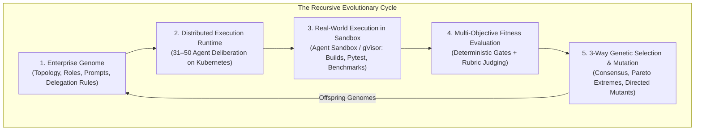

# Hierarchical Agent Evolution (HAE)
### A Cloud-Native Platform for Recursively Self-Improving Agentic Workforces via Genetic Architecture Search

[](https://opensource.org/licenses/Apache-2.0)
[](https://www.python.org/downloads/)
[](https://kubernetes.io)
[](https://gvisor.dev)
[](https://cloud.google.com/vertex-ai)

---

## 1. Vision & Research Premise

Modern LLM-based multi-agent systems (e.g., CrewAI, AutoGen, MetaGPT) typically rely on flat communication graphs or static role topologies. When scaled beyond 10 agents, these flat structures suffer from severe context dilution, quadratic token communication overhead $\mathcal{O}(N^2)$, and reasoning collapse. Crucially, organizational hierarchies, persona backstories, and delegation protocols are conventionally hand-crafted through trial-and-error human prompt engineering.

**Hierarchical Agent Evolution (HAE)** is an open, cloud-native meta-platform designed to facilitate the creation of **recursively self-improving agentic workforces**. HAE models enterprises as federated hierarchies (30–50 specialized agents partitioned into operational departmental pods under an executive steering council) and optimizes their organizational topology, cognitive backstories, and delegation protocols via genetic programming.

Rather than relying on human prompt engineering, HAE investigates **recursive self-hosting**: competing virtual enterprises are tasked with designing, implementing, and verifying the next-generation engine of the platform itself—establishing an unattended evolutionary loop where software agents autonomously evolve their own organizational architecture.



---

## 2. The Four Architectural Pillars

### Pillar 1: The Organism — The Enterprise Genome
In HAE, an entire virtual organization is treated as a living, evolvable genome (`CompanyGenome`):
* **Topology as Code**: An enterprise's organizational chart, executive council, departmental pods, team sizes, and communication channels are codified declaratively.
* **Structural Plasticity**: The headcount, role specialization (e.g., injecting an SRE Chaos Engineer or Packaging Specialist), and temperature distributions are fully mutable between generations.

### Pillar 2: The Selection Pressure — Hard Deterministic Gates
Autonomous self-improvement cannot exist on subjective LLM evaluations alone; unconstrained models inevitably drift into verbose, non-executable hallucination. HAE couples multi-dimensional LLM-as-a-Judge rubrics with **ground-truth deterministic execution gates**:
* Emitted code must physically install (`pip install -e .`).
* Generated test suites must execute and pass under `pytest`.
* Observability anchors (OpenTelemetry spans and metrics) must be verified.
* Non-executable submissions are heavily penalized, driving hard evolutionary selection toward working software.

### Pillar 3: The Evolutionary Search — 3-Way Breeding Engine
To navigate the high-dimensional space of organizational charts and agent backstories without premature convergence, HAE executes a 3-way balanced reproduction strategy:
1. **Consensus Exploitation (Group A)**: Identifies shared structural invariants across top performers (e.g., common dialectic review rules or strict specialist temperatures) and reinforces them.
2. **Pareto Frontier Amplification (Group B)**: Clones and amplifies dimension-specific champions (e.g., Extreme Technical Rigor, Extreme Adversarial Risk Resilience).
3. **Directed Meta-Architect Mutations (Group C)**: A high-reasoning Meta-Architect analyzes collective post-mortem failure modes and formulates targeted structural hypotheses (e.g., adding a dedicated build verification agent).
4. **Elites**: Preserves top-ranking champions unaltered across generational transitions.

### Pillar 4: Recursive Self-Hosting (The Closed Loop)
The overarching objective of HAE is recursive bootstrapping:
* In Generation 0, human-seeded baseline enterprises generate architectural blueprints.
* In Generation 1, evolved enterprises emit structured code packages, CLI tools, and test suites.
* In subsequent generations, the evolved agent workforces design, patch, and optimize the mutation operators, schedulers, and execution sandboxes governing their own evolution.

---

## 3. Technical Deep Dive

### 3.1 Project Architecture & Directory Layout

```
hierarchical-agent-evolution/
├── pyproject.toml              # Packaging & dependencies
├── Dockerfile                  # Container definition for Kubernetes execution
├── cloudbuild.yaml             # Container image build automation
├── configs/                    # Generational population archives
│   ├── generation_1_population.json # Evolved Gen 1 population genomes
│   ├── generation_2_population.json # Evolved Gen 2 population genomes (Trait Alleles)
│   └── generation_3_population.json # Evolved Gen 3 population genomes (Consensus Peak)
├── experiments/                # Empirical experiment ledger & benchmarks
│   ├── README.md               # Benchmark registry and artifact schema
│   ├── pilot_tournament_baseline.md # Baseline pilot tournament report
│   └── parallel_tournament_distributed.md # High-throughput parallel tournament report
├── research/
│   ├── WHITE_PAPER_DRAFT.md    # Formal scientific paper manuscript
│   └── RESEARCH_LOGBOOK.md     # Empirical research ledger
├── src/
│   ├── schema.py               # Genome schemas (Company, Department, Agent, Fitness)
│   ├── company.py              # Federated hierarchical execution runner
│   ├── evaluator.py            # LLM-as-a-Judge multi-dimensional rubric
│   ├── mutator.py              # Genetic mutator & crossover operators
│   ├── breeding.py             # 3-Way breeding engine (Consensus, Pareto, Directed)
│   ├── sandbox_verifier.py     # Deterministic 4-gate sandbox verification engine
│   ├── telemetry.py            # OpenTelemetry instrumentation & token accounting
│   ├── engine.py               # Tournament controller & generational orchestration
│   ├── worker.py               # Distributed indexed worker entrypoint
│   ├── llm_factory.py          # Vertex AI REST client with retry backoff & secret auth
│   └── main.py                 # Platform CLI entrypoint
├── k8s/
│   ├── evolution-job.yaml      # Single-pod tournament job manifest
│   ├── parallel-indexed-job-east4.yaml # Parallel indexed job (5 concurrent pods)
│   ├── parallel-indexed-job-gen1-east4.yaml # Generation 1 parallel indexed job
│   └── rbac.yaml               # Kubernetes ServiceAccount and RBAC bindings
├── templates/
│   └── default_company.json    # Generation 0 seed enterprise genome
└── tests/
    └── test_evolutionary_pipeline.py # Unit and integration test suite
```

---

### 3.2 The Enterprise Genome Specification

The organization is codified in three hierarchical layers implemented via Pydantic in [`src/schema.py`](src/schema.py):

```
CompanyGenome (Enterprise Level)
 ├── CEO: AgentGenome
 ├── Executive Deliberation Rules: str
 └── Departments: List[DepartmentGenome]
      ├── Manager: AgentGenome
      ├── Departmental Mandate & Delegation Rules: str
      └── Agents: List[AgentGenome] (Domain Specialists)
```

#### Annotated Genome Schema (`CompanyGenome`):
```json
{
  "company_id": "gen_1_mutant_1",
  "generation": 1,
  "parent_ids": ["gen_0_firm_3"],
  "mutation_history": [
    "Parallel Generation 0 Variant 3",
    "Hypothesis: Dedicated Packaging Specialist emits executable pyproject.toml & pytest suite"
  ],
  "ceo": {
    "role": "Chief Executive Officer",
    "goal": "Unify cross-departmental capabilities into an unassailable strategic execution roadmap.",
    "backstory": "Veteran technology executive known for first-principles thinking and demanding quantifiable evidence.",
    "temperature": 0.43,
    "model_tier": "executive",
    "system_instructions": "Challenge every assumption. Ensure total alignment between engineering and execution."
  },
  "executive_deliberation_rules": "Dialectical debate: actively pit engineering constraints against product ambition, force finance to stress-test unit economics, and mandate red-team mitigation before sign-off.",
  "departments": [
    {
      "dept_id": "dept_systems_eng",
      "name": "Core Systems & Infrastructure Engineering",
      "mandate": "Architect distributed compute, memory management, and deterministic execution runtime.",
      "delegation_rules": "Rigorous peer review; every specification must include operational constraints.",
      "manager": {
        "role": "VP of Core Systems Engineering",
        "goal": "Deliver robust, production-ready system architecture.",
        "backstory": "Former principal distributed systems architect.",
        "temperature": 0.3,
        "model_tier": "executive"
      },
      "agents": [
        {
          "role": "Distributed Systems Architect",
          "goal": "Design cluster orchestration and consensus mechanisms.",
          "backstory": "Expert in high-throughput distributed systems.",
          "temperature": 0.3,
          "model_tier": "worker"
        },
        {
          "role": "Python Packaging & Test Automation Engineer",
          "goal": "Generate complete, valid pyproject.toml, pytest test suites, and package layout.",
          "backstory": "Staff DevOps & Build Engineer passionate about executable Python packages.",
          "temperature": 0.2,
          "model_tier": "worker"
        }
      ]
    }
  ]
}
```

---

### 3.3 Inter-Generational Genome Lifecycle & Storage Management

The evolutionary lifecycle follows a strictly versioned and distributed management pipeline:

```
[Generation g Population File] ──► [Kubernetes Batch Indexed Job] ──► [Parallel Worker Pods (0..N-1)]
                                                                               │
                                                                               ▼
                                                                     [Local Disk & Cloud Storage]
                                                                               │
[Generation g+1 Population File] ◄── [3-Way Breeding Engine] ◄── [Aggregated Survivor Scorecards]
```

1. **Population Serialization**:
   Each generation's population is stored as a JSON array of `CompanyGenome` definitions in `configs/generation_{g}_population.json`.
2. **Distributed Job Indexing**:
   When launching a tournament on Kubernetes, a Batch Indexed Job is dispatched. The container runtime injects `$JOB_COMPLETION_INDEX` into each worker pod. Worker $k$ loads genome index $k$ directly from the population file:
   ```python
   firm_genome = CompanyGenome(**population[firm_index])
   ```
3. **Scorecard & Artifact Persistence**:
   Upon completing execution, each worker stores its full scorecard and generated code package locally at `/data/outputs/generation_{g}/{company_id}_result.json` and syncs to cloud object storage:
   ```
   gs://<STORAGE_BUCKET>/parallel_runs/generation_{g}/{company_id}_result.json
   ```
4. **Breeding Transition ($g \rightarrow g+1$)**:
   The tournament engine aggregates all generation scorecards, ranks enterprises by overall fitness, selects the top $K=5$ survivors, and executes the 3-way breeding pipeline to serialize `configs/generation_{g+1}_population.json`.

---

### 3.4 Ground-Truth Sandbox Execution & Kubernetes Agent Sandbox

To safely execute untrusted code synthesized by competing agent workforces, HAE integrates with the **Kubernetes Agent Sandbox** (`kubernetes-sigs/agent-sandbox`):

* **Kernel-Level Isolation**: Sandboxes execute inside **gVisor** (`runtimeClassName: gvisor`), enforcing strict system call filtering and network isolation.
* **Sub-Second Warm Pools**: Pre-initialized sandbox pods provide sub-second (`<1s`) warm container provisioning, eliminating multi-minute Kubernetes scheduling overhead during high-volume test evaluation.
* **Deterministic Fitness Formulation**:

$$
\mathcal{F}(\mathcal{C}) = \left[ w_s S(\mathcal{C}) + w_t T(\mathcal{C}) + w_c C(\mathcal{C}) + w_r R(\mathcal{C}) + w_a A(\mathcal{C}) \right] - \mathcal{P}_{\text{sandbox}}
$$

Where:
* $S, T, C, R, A$ are rubric scores (0–100) for Strategic Depth, Technical Feasibility, Cross-Functional Coherence, Risk Mitigation, and Actionability.
* $\mathcal{P}_{\text{sandbox}} \in [0, 25.0]$ is the penalty docked by the 4-Gate Deterministic Sandbox Verifier:

| Gate | Verification Target | Penalty if Failed |
| :--- | :--- | :---: |
| **Build Gate** | Package metadata (`pyproject.toml` or `setup.py`) and runtime entrypoint exist | -6.25 pts |
| **Smoke Gate** | Package contains $\ge 3$ distinct functional code modules | -6.25 pts |
| **Telemetry Gate** | OpenTelemetry spans/metrics or distributed trace hooks are present | -6.25 pts |
| **Test Gate** | Test suites (`test_*.py`) exist and execute cleanly under `pytest` | -6.25 pts |

---

## 4. Empirical Benchmark Highlights

Empirical validation across tournament iterations demonstrated measurable evolutionary ascent and autonomous self-repair:

| Experiment | Infrastructure | Key Scientific Findings | Benchmark Report | Champion |
| :--- | :--- | :--- | :---: | :---: |
| [**`exp-001-baseline`**](experiments/exp-001-pilot-baseline/) | Cloud Kubernetes (`e2-standard-4`) | Baseline progression ($93.00 \rightarrow 96.25$); Autonomous headcount expansion ($31 \rightarrow 36$ agents) to resolve tape-out bottlenecks. | [Report](experiments/exp-001-pilot-baseline/README.md) | **96.25** |
| [**`exp-002-parallel`**](experiments/exp-002-parallel-tournament/) | Cloud Kubernetes (5 Parallel Pods) | 10 enterprises (310 agents) evaluated in **22 minutes** (**4.1x speedup**); Deterministic sandbox verification introduces ground-truth execution anchoring. | [Report](experiments/exp-002-parallel-tournament/README.md) | **77.50** |
| [**`exp-003-parallel-gen1`**](experiments/exp-003-parallel-gen1/) | Cloud Kubernetes + gVisor Sandbox | 3-Way Recombination across 10 firms (312 agents); Identifies the "Thin Persona" bottleneck where single-sentence backstories produce prose over code. | [Report](experiments/exp-003-parallel-gen1/README.md) | **76.55** |
| [**`exp-004-parallel-gen2`**](experiments/exp-004-parallel-gen2/) | Cloud Kubernetes + gVisor Sandbox | **Persona Discretization Breakthrough**: Structured trait alleles (`backstory_traits`) enable 90% code extraction, 3 zero-penalty runs, and a +11.92 pt cohort leap. | [Report](experiments/exp-004-parallel-gen2/README.md) | **94.50** |
| [**`exp-005-parallel-gen3`**](experiments/exp-005-parallel-gen3/) | Cloud Kubernetes + gVisor Sandbox | **Allelic Consensus Record**: 100% code extraction, 4 flawless zero-penalty passes, and an all-time tournament record of **96.75 pts** (`gen_3_consensus_2`). | [Report](experiments/exp-005-parallel-gen3/README.md) | **96.75** |

---

---

## 5. Evolutionary Roadmap & Organizational Phylogeny

As the platform evolves across generational iterations, the virtual enterprises undergo continuous cultural and structural adaptations:

### 5.1 Organizational Culture & Behavioral Phylogeny

| Generation | Dominant Organizational Culture | Communication Paradigm | Behavioral Bottleneck | Key Innovation | Champion Score |
| :---: | :--- | :--- | :--- | :--- | :---: |
| **Gen 0** | **Polite Bureaucratic Consensus** | Departmental silos; gentle peer review | Superficial risk analysis; narrative prose without code | Establishing federated departmental hierarchies | 77.50 |
| **Gen 1** | **Adversarial Dialectic Review** | Cross-departmental challenges & red-teaming | "Thin Persona" syndrome; prose over code formatting | Headcount expansion; dedicated packaging specialists | 76.55 |
| **Gen 2** | **Pragmatic Implementation Culture** | Rigid code-block and manifest formatting | Test assertion mismatches | **Structured Persona Discretization** (`backstory_traits`) | 94.50 |
| **Gen 3** | **Hermetic Engineering & Invariant Mining** | Recombination of consensus operational alleles | High token OpEx across uniform Pro models | **Allelic Consensus Mining** & Pytest harness injection | **96.75** |
| **Gen 4** | **Capital-Efficient Economic Enterprise** | Dynamic sizing & model tier cost accounting | Fixed organizational topologies | **Autonomous Sizing & OpEx token budgeting** | *Active* |
| **Gen 5** | **Asset-Sharing Commercial Commons** | IP registration & modular library reuse | Redundant re-implementation of common libraries | **Reusable Corporate Assets & IP Marketplace** | *Planned* |
| **Gen 6** | **Inter-Firm Strategic Co-opetition** | Bilateral executive term sheets & joint ventures | Zero-sum isolationism | **Cross-Company Communication & Consortia** | *Planned* |

### 5.2 Next-Generation Pillars

* **Generation 4: Dynamic Headcount Sizing & Model Unit Economics (In Progress)**:
  CEOs and Managers receive autonomous authority to resize departmental pods, hire specialized contractors, or downsize redundant headcount. Introduces real-world model pricing tiers (Gemini 2.5 Flash at $0.075/1M tokens vs. Gemini 2.5 Pro at $1.25/1M tokens) into an audited corporate balance sheet.
* **Generation 5: Reusable Corporate Assets & IP Marketplace (Cumulative Culture)**:
  Enterprises package verified code modules, agent skills, and prompt libraries into an open Corporate Asset Registry. Subsequent generations license or import these verified assets, eliminating token re-implementation costs and unlocking the evolutionary "ratchet effect."
* **Generation 6: Cross-Company Communication & Strategic Co-opetition**:
  CEOs gain inter-firm communication channels to negotiate strategic alliances, technology licensing, and joint-venture consortiums, transitioning the platform from zero-sum competition to non-zero-sum co-opetition.

---

## 6. Getting Started

### Local Quickstart
```bash
# Clone repository
git clone https://github.com/SinaChavoshi/hierarchical-agent-evolution.git
cd hierarchical-agent-evolution

# Install dependencies in editable mode
pip install -e .

# Run unit and integration tests
PYTHONPATH=. pytest tests/

# Execute a single firm evaluation locally
python3 -m src.main --mode single-firm --objective "Build next-generation telemetry engine"
```

### Distributed Kubernetes Deployment
To execute high-throughput parallel evolutionary tournaments:

```bash
# 1. Apply Kubernetes ServiceAccount and RBAC roles
kubectl apply -f k8s/rbac.yaml

# 2. Mount Vertex AI authentication secret
kubectl create secret generic vertex-token \
  --from-literal=token="$(gcloud auth application-default print-access-token)" \
  --namespace=agent-evolution

# 3. Dispatch the parallel indexed job (5 concurrent enterprise pods)
kubectl apply -f k8s/parallel-indexed-job-gen1-east4.yaml

# 4. Stream live multi-agent deliberations
kubectl logs -n agent-evolution -l app=parallel-firms-gen1-east4 --tail=50 -f
```

---

## 7. License & Citation

Licensed under the [Apache License, Version 2.0](LICENSE).

```bibtex
@article{chavoshi2026hierarchical,
  title={Bootstrapping Agentic Organizations: Recursive Self-Improvement and Hierarchical Architecture Search on Cloud Kubernetes},
  author={Chavoshi, Sina and Autonomous Agent Systems Research Group},
  journal={arXiv preprint},
  year={2026}
}
```
