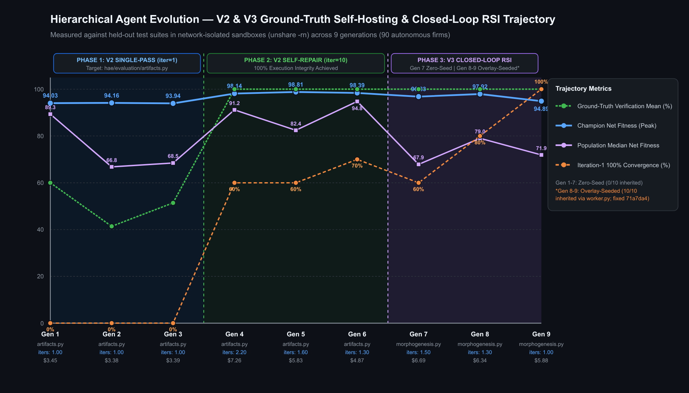
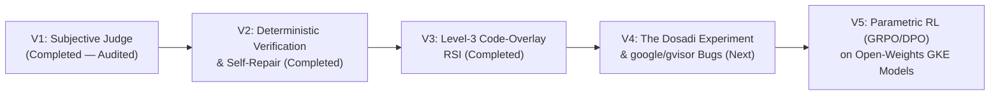

# Hierarchical Agent Evolution (HAE)

> **Evolutionary Morphogenesis, Recursive Self-Improvement, and High-Density Agentic Organizations on Kubernetes**

**Hierarchical Agent Evolution (HAE)** is a distributed evolutionary computing framework running on Google Kubernetes Engine (GKE) that breeds multi-agent software engineering organizations (*"Companies"*). Rather than hand-crafting static agent workflows, HAE encodes an entire company's **organizational topology**, **executive/worker personas**, **internal communication protocols**, and **source-code modifications (`code_overlays`)** into a heritable `CompanyGenome`.

Populations of competing companies are evaluated in isolated sandboxes against software engineering and systems benchmarks, scored by deterministic unit tests and communication-efficiency judges, and bred across generations via tournament selection, subtree crossover, and structural mutation.



---

## 📊 Executive Summary of Completed Experiments (`V1` – `V3`)

Across **22 evolutionary runs** (**130+ multi-agent companies** and **3,500+ spawned agents**), HAE progressed through three completed experimental phases. Each phase uncovered a fundamental failure mode in multi-agent systems and resolved it in the subsequent architecture.

> 📖 **Click the links in the table below for full generational ledgers, forensic audits, and internal agent deliberation transcripts.**

| Phase | Generations | What Was Tested | Key Outcome & Discovery | Detailed Report |
| :--- | :--- | :--- | :--- | :--- |
| **Phase 1 (`V1`)**<br>*Subjective Judge Era* | `Pilot` $\to$ `Gen 10`<br>*(13 Runs)* | Whether populations of 4 to 8 multi-agent companies (5–16 agents) could evolve better software engineering topologies when graded by an **LLM-as-a-Judge** (weighted rubric + peer review). | **99.5 / 100 subjective score vs. 77.7% real unit-test pass rate (`r = +0.045`).**<br>Companies discovered **Goodhart's Law**: evolving 16-agent bureaucratic hierarchies that wrote polished architectural prose and `TODO` stubs to charm the LLM judge while leaving edge-case bugs unfixed. | **[`experiments/v1/README.md`](experiments/v1/README.md)** |
| **Phase 2 (`V2`)**<br>*Execution-Grounded Era* | `Gen 1` $\to$ `Gen 6`<br>*(60 Companies)* | Replaced subjective LLM grading with a **100% deterministic unit-test suite (18 tests)** on blank-slate code synthesis (`hae/compiler/optimizer.py`), comparing **1-Pass Waterfall (`Gen 1–3`)** vs. **Iterative Self-Repair (`Gen 4–6`)**. | **100.0% Test Pass Rate across all 30/30 companies (`Gen 4–6`), Peak Net Fitness `98.81 / 100`.**<br>1-Pass execution peaked at `94.4%` (`17/18`) and suffered `0.0%` crash mortality. Introducing a **3-Iteration Execute $\to$ Test $\to$ Repair Loop** with a **Monotonic Verification Guard** eliminated syntax crashes (`0/30`) and drove every company to `18/18` (`100%`). | **[`experiments/v2/README.md`](experiments/v2/README.md)** |
| **Phase 3 (`V3`)**<br>*Level-3 Recursive Self-Improvement (RSI)* | `Gen 7` $\to$ `Gen 9`<br>*(30 Companies)* | Whether companies could **modify HAE's own evolutionary engine source code (`code_overlays`)** (`fitness.py` and `morphogenesis.py`) and survive with their self-authored algorithms active in the next generation. | **First Closed-Loop RSI (`97.99 / 100` peak fitness) + Two Critical Discoveries:**<br>1. **The `inherited_files` Leak (`Gen 8–9`):** Forensic audit (`commit 71a7da4`) discovered `BenchmarkVerifier` leaked `morphogenesis.py` into worker sandboxes (`10/10` firms in `Gen 8–9`), explaining why `Gen 8–9` hit `100%` on Attempt 1 (`0` repair turns).<br>2. **"Corporate Memo Theatre":** Inspecting internal transcripts revealed executives spent **56,000+ chars (`~14,000 tokens`)** writing ceremonial memos (`"MEMORANDUM"`, `"Fantastic work!"`), while a single tool-enabled engineer (`@Tech_Lead_Systems`) did 100% of the coding. | **[`experiments/v3_rsi/README.md`](experiments/v3_rsi/README.md)** |

👉 **Master Index of All Experiments:** **[`experiments/README.md`](experiments/README.md)**

---

## 🔍 Three Core Laws Discovered (`V1` – `V3`)

1. **Execution-Grounded Selection Eliminates Hallucinated Bureaucracy (`V1` $\to$ `V2`):**
   When graded by LLM judges (`V1`), evolution selects for persuasive prose (`r = +0.045` correlation with actual code correctness). When graded strictly by deterministic test suites with a per-agent headcount tax (`V2`), evolution ruthlessly prunes non-coding middle management or forces large firms (`32–33` agents) to concentrate all file-system tools into **1–2 elite tool-enabled engineers** backed by a `Monotonic Verification Guard`.
2. **Closed-Loop Self-Repair Beats Single-Pass Topologies (`V2 Gen 1–3` vs. `Gen 4–6`):**
   No matter how sophisticated an organizational chart is, single-pass code synthesis (`Gen 1–3`) suffers `20%` catastrophic `0.0` crash mortality from minor indentation or import errors. Giving workers a 3-turn **Execute $\to$ Pytest Traceback $\to$ Self-Repair** loop with automatic rollback (`Gen 4–6`) shifted population reliability from `63.3%` mean pass rate to **`100.0%` (`30/30` companies passing `18/18` tests)**.
3. **Unpenalized Token Budgets Breed "Corporate Memo Theatre" (`V3` Transcript Audit):**
   Because `V2`/`V3` penalized agent *headcount* (`0.05`/agent) but did not score **internal communication signal-to-noise density**, agents defaulted to standard RLHF corporate roleplay—exchanging 56 KB of congratulatory headers (`"Fantastic work!"`, `"MEMORANDUM — TO: All Hands"`) in a rigid 1-pass top-down waterfall without genuine peer-to-peer technical debate.

---

## 🚀 Future Roadmap (`V4` & `V5`)

Our findings from `V1–V3` directly shape the next two phases of the HAE research program, transitioning from synthetic single-file tasks and ceremonial corporate roleplay to **high-density peer communication (*The Dosadi Experiment*)** and **real-world systems engineering on [`google/gvisor`](https://github.com/google/gvisor)**.



### Phase 4 (`V4`): *The Dosadi Experiment* & Real-World `google/gvisor` Engineering *(Next)*

1. **The *Dosadi* Communication Architecture (Signal-to-Noise Selection):**
   - Inspired by Frank Herbert's *The Dosadi Experiment*, where extreme environmental pressure strips away all social pleasantries until inhabitants communicate in a hyper-dense, zero-fluff vernacular.
   - **No Hard Token Caps:** Companies are **never artificially capped on tokens**—if a company needs deep, multi-turn technical exploration to solve a complex kernel bug, it is encouraged to converse extensively.
   - **Active Anti-Fluff Judge & Signal Density Scoring (`Dosadi Score`):** Instead of a token cap, the evaluator scores the **Signal-to-Noise Density** of internal company conversations. Ceremonial fluff (`"Fantastic work!"`, `"I completely agree"`, `"MEMORANDUM"` headers, restating the prompt) is actively penalized, while **Productive Course-Correction** (peer back-and-forth between `@Lead`, `@Systems_Eng`, and `@Verifier_QA` that identifies a concrete root cause or fixes a failing test) is positively rewarded.
   - **Heritable `communication_constitution` Gene:** Each `CompanyGenome` carries an evolvable company-wide communication protocol that mutates toward ultra-crisp, high-bandwidth technical shorthand (`SYM:`, `CAUSE:`, `DIFF:`, `TEST_FAIL:`).

2. **Real-World Systems Benchmark (`google/gvisor` `pkg/shim/v1` Production Bugs):**
   - Moving beyond self-contained Python modules, all companies in `V4` are evaluated in a multi-file Go repository sandbox extracted from **[`google/gvisor`](https://github.com/google/gvisor)** (`containerd-shim-runsc-v1`).
   - **Target Production Issues:**
     - **[Issue `#14405`](https://github.com/google/gvisor/issues/14405) (`runsc kill --all` hangs indefinitely after `restore`):** Root cause in `pkg/shim/v1/runsccmd/runsc.go` (`Kill` missing `--all` flag) and `pkg/shim/v1/proc/init.go` (`KillAll` unconditionally guarded by `if !p.stdin.connected`).
     - **[Issue `#13509`](https://github.com/google/gvisor/issues/13509) (Containerd shim leak when `StartShim` exits early):** Root cause in `pkg/shim/v1/service.go` (`cleanupSockets()` omitted on early return path in `StartShim()`).
   - **Deterministic `go test` Suite:** Companies must diagnose the bug across `pkg/shim/v1/...`, debate the fix via multi-turn peer dialogue, and pass all **6 official `gVisor` unit tests** (`init_kill_test.go`, `runsc_test.go`, `service_test.go`).

3. **In-Cluster Open-Weights Model Hosting on GKE (`Qwen3` via `vLLM`):**
   - Hosting an open-weights coding model (`Qwen3-32B-Instruct` / `Qwen3-Coder` via `vLLM` on GKE GPU nodes) inside the cluster eliminates external API rate limits and GCP IAM reconciler disruptions, drops marginal token costs for deep multi-turn internal company dialogues to `$0.00`, and unlocks direct weight access for Phase 5.

---

### Phase 5 (`V5`): Parametric RL Specialization (`GRPO` / `DPO` Trajectory Distillation)

Once `V4` evolves companies whose multi-turn internal dialogues exhibit high *Dosadi* signal density and solve real-world `gVisor` / production engineering tasks, `V5` closes the loop from **non-parametric evolution** (mutating prompts/genomes) to **parametric weight updates**:

1. **Trajectory Harvesting:** Every multi-turn internal company conversation and tool-execution trace from `V4` is logged with its deterministic `go test` / `pytest` outcome and `Dosadi` communication efficiency score.
2. **Contrastive & Group-Relative RL (`GRPO` / `DPO`):** Winning high-density, bug-fixing trajectories (`100%` test pass + high signal-to-noise ratio) and losing trajectories (fluffy corporate memos or failed patches) train **role-specialized LoRA adapters** (`Exec-LoRA`, `SystemsEng-LoRA`, `Verifier-LoRA`) on the in-cluster `Qwen3` base model.
3. **Production Delegation:** The resulting workforce—combining evolved `CompanyGenome` topologies, *Dosadi* zero-fluff communication protocols, and RL-specialized weights—graduates from benchmark trials to handling real-world day-to-day software engineering tasks and repository issue queues.

---

## 🏗️ Repository Structure

```text
hierarchical-agent-evolution/
├── README.md                        # High-level project overview, V1-V3 outcomes & V4-V5 roadmap
├── experiments/
│   ├── README.md                    # Master Experiment Ledger Index (V1 -> V5)
│   ├── v1/README.md                 # Phase 1: Gen 0-10 Subjective Judge Runs & Goodhart's Law Audit
│   ├── v2/README.md                 # Phase 2: Gen 1-6 Deterministic Execution & Iterative Self-Repair
│   └── v3_rsi/README.md             # Phase 3: Gen 7-9 Level-3 RSI, Forensic Audit & Transcripts
├── hae/
│   ├── controller/                  # Evolutionary tournament controller, crossover & mutation engine
│   ├── worker/                      # Distributed Ray/GKE worker & sandboxed verification loop
│   ├── genome/                      # CompanyGenome, AgentNode, & Morphogenesis engine
│   ├── evaluator/                   # Deterministic BenchmarkVerifier & Fitness Evaluator
│   └── compiler/                    # Target compiler optimization module (V2/V3 benchmark)
├── k8s/                             # GKE deployment manifests & job specs
└── scripts/                         # Evaluation, plotting, and forensic audit utilities
```

---

## ⚡ Quickstart

```bash
# 1. Install dependencies
pip install -r requirements.txt

# 2. Run the deterministic verification suite locally
pytest -q

# 3. Inspect or plot generational evolutionary trajectories
python3 scripts/plot_v2_v3_trajectory.py
```
