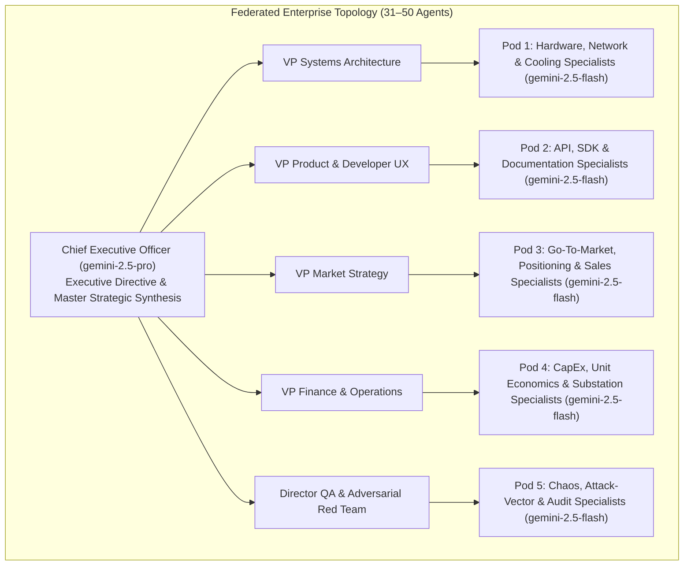

# Hierarchical Agent Evolution (HAE)
### Recursive Self-Hosting and Architecture Search for Autonomous Organizations on Cloud Kubernetes

[](https://opensource.org/licenses/Apache-2.0)
[](https://www.python.org/downloads/)
[](https://cloud.google.com/kubernetes-engine)
[](https://cloud.google.com/vertex-ai)

---

## 1. Abstract & Research Premise

Current multi-agent frameworks (e.g., CrewAI, AutoGen, MetaGPT) typically rely on flat communication graphs or static role topologies. When scaled beyond 10 agents, these flat structures exhibit severe context dilution, quadratic token communication overhead $\mathcal{O}(N^2)$, and reasoning collapse. Furthermore, organizational charts, persona backstories, and delegation protocols are conventionally hand-crafted through trial-and-error human prompt engineering.

**Hierarchical Agent Evolution (HAE)** is a distributed framework that models organizations as federated hierarchies (30–50 agents per firm partitioned into specialized departmental pods under an executive steering council) and optimizes their organizational genome via genetic programming. 

Crucially, HAE investigates **recursive self-hosting**: competing virtual enterprises are tasked with designing and implementing the next-generation engine of the platform itself, enabling continuous bootstrapping without human engineering intervention.



---

## 2. The 3-Way Genetic Breeding Engine

To navigate the high-dimensional search space of prompt backstories, organizational charts, and delegation protocols without premature convergence, HAE employs a **3-Way Breeding Pool**:

```
                       [ 50 Competing Firms in Generation g ]
                                         │
                         [ Hard Ground-Truth Sandbox Run ]
                                         │
                             [ Select Top 5 Winners ]
                                         │
    ┌────────────────────────────────────┼────────────────────────────────────┐
    │ (Exploitation)                     │ (Pareto Exploitation)              │ (Directed Exploration)
    ▼                                    ▼                                    ▼
Group A: Consensus (~15 Firms)      Group B: Dimension Extremes (~15)    Group C: Directed Mutants (~15)
- Extract common structural motifs   - 3x Extreme Execution Velocity      - Hypothesis-driven novel roles
- Universal role definitions         - 3x Extreme Technical Rigor         - Contrarian organizational rules
- Intersected delegation rules       - 3x Extreme Telemetry/Observability - Untested prompt topologies
- Shared persona guardrails          - 3x Extreme Modularity / Simplicity - Dynamic role scaling
    │                                    │                                    │
    └────────────────────────────────────┼────────────────────────────────────┘
                                         ▼
                       [ 45 New Offspring + 5 Elites = 50 Firms in Gen g+1 ]
```

1. **Group A: Consensus Exploitation (15 Firms)**:
   Identifies common structural traits across winning firms (e.g. mandatory API contract agents, strict QA temperatures $\le 0.3$) and preserves them as invariants.
2. **Group B: Pareto Frontier Amplification (15 Firms)**:
   Clones and amplifies specialized dimension champions (e.g. Extreme Technical Rigor, Extreme Adversarial Risk Mitigation, Extreme Telemetry Rigor).
3. **Group C: Directed Hypothesis Mutations (15 Firms)**:
   An LLM Meta-Architect (`gemini-2.5-pro`) reviews collective post-mortem bottlenecks and formulates testable structural hypotheses (e.g., injecting an SRE Chaos Engineer or an ITAR Compliance Officer).
4. **Elites (5 Firms)**:
   The top 5 original surviving firms are preserved unaltered into the next round.

---

## 3. Ground-Truth Deterministic Sandbox Verification

To prevent LLM hallucination and ensure competing firms write real, working software rather than plausible text memos, HAE enforces a strict **Deterministic Sandbox Gate**:

$$
\text{Fitness Floor} = \begin{cases} 
0, & \text{Build failure (\texttt{pip install -e .} fails)} \\
20 \times \text{PassRate}, & \text{Unit/Integration test failures (\texttt{pytest})} \\
50 + 0.5 \times F_{\text{LLM}}, & \text{Clean build + passing tests + successful smoke execution}
\end{cases}
$$

* **Build Gate**: Verifies valid `pyproject.toml` and directory structure.
* **Test Gate**: Executes test suites under `pytest` with coverage tracking.
* **Smoke Execution Gate**: Instantiates a mini 3-agent hierarchy using the firm's generated package and executes a sample task.
* **Telemetry Gate**: Verifies that OpenTelemetry spans and metrics are actively emitted.

---

## 4. Empirical Highlights & Experiment Archive

Validation runs on Google Kubernetes Engine (GKE) demonstrated continuous generational ascent and autonomous adaptation:

* **Generational Progression**: Baseline Generation 0 champion scored **94.60**, with Generation 1 reaching **96.25 / 100** (+1.65 pts).
* **Autonomous Headcount Expansion**: The mutation engine diagnosed a 6-month tape-out critical path in Generation 0 and autonomously expanded enterprise size from **31 to 36 agents**, injecting redundant supply-chain and regulatory roles.
* **Inference Economics**: ~115,000 tokens consumed across 6 complete virtual enterprises at an effective cost of **~$0.22 USD**.

> 📊 **Detailed Experimentation Archive**:  
> For full generational scorecards, token breakdowns, resource metrics, and lineage tracking, see the dedicated [**`experiments/`**](experiments/README.md) directory.
> * 🔬 [**Pilot Tournament on GKE Report**](experiments/pilot_tournament_gke.md)

---

## 5. Repository Structure

```
hierarchical-agent-evolution/
├── pyproject.toml              # Build config & dependencies
├── Dockerfile                  # Container definition for GKE execution
├── cloudbuild.yaml             # Google Cloud Build automation
├── experiments/                # Empirical experiment logs, scorecards & benchmarks
│   ├── README.md               # Experiments index & telemetry artifact schema
│   └── pilot_tournament_gke.md # Detailed Generation 0 vs 1 GKE report
├── research/
│   ├── WHITE_PAPER_DRAFT.md    # Academic paper manuscript
│   └── RESEARCH_LOGBOOK.md     # Empirical ledger and lineage logs
├── docs/
│   └── PLATFORM_SPECIFICATION.md# Production platform architecture blueprint
├── src/
│   ├── schema.py               # Genome schemas (Company, Department, Agent)
│   ├── company.py              # Federated hierarchical execution runner
│   ├── evaluator.py            # LLM-as-a-Judge multi-dimensional rubric
│   ├── mutator.py              # Genetic mutators & crossover operators
│   ├── breeding.py             # 3-Way breeding engine (Consensus, Pareto, Directed)
│   ├── sandbox_verifier.py     # Deterministic code extraction & execution verifier
│   ├── telemetry.py            # Research ledger, OpenTelemetry & cost tracking
│   ├── engine.py               # Tournament controller & generation manager
│   ├── worker.py               # Parallel indexed job worker entrypoint
│   ├── llm_factory.py          # Vertex AI REST client with retry logic
│   └── main.py                 # CLI entrypoint
├── k8s/
│   ├── evolution-job.yaml      # Single-pod tournament job manifest
│   ├── parallel-indexed-job-east4.yaml # Parallel indexed job (us-east4)
│   ├── parallel-indexed-job-west1.yaml # Parallel indexed job (us-west1)
│   └── rbac.yaml               # ServiceAccount & RBAC bindings
├── templates/
│   └── default_company.json    # Generation 0 seed enterprise genome
└── tests/
    └── test_evolutionary_pipeline.py # Integration test suite
```

---

## 6. Getting Started

### Local Quickstart
```bash
# Clone repository
git clone https://github.com/SinaChavoshi/hierarchical-agent-evolution.git
cd hierarchical-agent-evolution

# Install package
pip install -e .

# Run unit & integration tests
PYTHONPATH=. python3 tests/test_evolutionary_pipeline.py

# Run a single firm execution
python3 -m src.main --mode single-firm --objective "Build next-generation telemetry engine"
```

### Multi-Cluster GKE Deployment
To run high-throughput parallel tournaments across multiple cloud regions (`us-east4`, `us-west1`):

```bash
# Authenticate with GKE cluster
gcloud container clusters get-credentials <YOUR_CLUSTER_NAME> --zone <ZONE>

# Apply Kubernetes manifests
kubectl apply -f k8s/rbac.yaml
kubectl apply -f k8s/parallel-indexed-job-east4.yaml

# Stream live worker logs
kubectl logs -n agent-evolution -l app=parallel-firms-east4 -f
```

---

## 7. License & Citation

Licensed under the [Apache License, Version 2.0](LICENSE).

```bibtex
@article{chavoshi2026hierarchical,
  title={Bootstrapping Agentic Organizations: Recursive Self-Improvement and Hierarchical Architecture Search on Cloud Kubernetes},
  author={Chavoshi, Sina and Autonomous Agent Systems Research Group},
  journal={arXiv preprint},
  year={2026}
}
```
