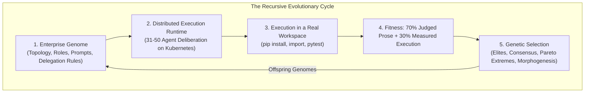

# Hierarchical Agent Evolution (HAE)
### Evolving agent organisations against a fitness function that runs their code

[](https://opensource.org/licenses/Apache-2.0)
[](https://www.python.org/downloads/)
[](https://kubernetes.io)
[](https://cloud.google.com/vertex-ai)

> [!IMPORTANT]
> **Experiment set V1 is closed; V2 has not started.** V1 ran thirteen
> experiments and published a fitness curve that turned out to measure prose,
> not software. The platform has been rebuilt around a fitness function with
> ground truth. What V1 got wrong, and how we know, is in
> [`experiments/README.md`](experiments/README.md) and
> [`experiments/v1/execution_grounded_correction.md`](experiments/v1/execution_grounded_correction.md).

---

## 1. Vision & Research Premise

Modern LLM-based multi-agent systems (CrewAI, AutoGen, MetaGPT) rely on flat
communication graphs or static role topologies. Scaled past ten agents, flat
structures suffer context dilution, $\mathcal{O}(N^2)$ communication overhead,
and reasoning collapse. Organisational hierarchies, personas, and delegation
protocols are conventionally hand-crafted by human prompt engineering.

**HAE** models an enterprise as a federated hierarchy — 30–50 specialised
agents in departmental pods under an executive council — and optimises its
topology, cognitive backstories, and delegation protocols by genetic
programming rather than by hand.

The goal is **recursive self-hosting**: competing virtual enterprises are
tasked with designing, implementing, and verifying the next-generation engine
of the platform itself.



---

## 2. The Four Architectural Pillars, and where each actually stands

The pillars are the programme's design. The status column is what the code
does today, measured rather than asserted. V1's central failure was that this
table was never written down, so four capability modules could name two
generations without ever being imported.

| Pillar | Status | Evidence |
|---|---|---|
| **1. The Organism** — the enterprise genome | **Working** | [`hae/genome/schema.py`](hae/genome/schema.py). Topology, headcount, personas and temperatures are declarative and mutable. Validated at construction; invalid genomes raise rather than loading degraded. |
| **2. The Selection Pressure** — hard execution gates | **Working, and honest about what it cannot check** | [`hae/evaluation/harness.py`](hae/evaluation/harness.py). Five gates that parse, install, import, test and inspect. A gate that cannot be evaluated reports `SKIPPED` and is excluded from the denominator — never scored as a pass. |
| **3. The Evolutionary Search** — breeding | **Working, newly unified** | [`hae/orchestration/breeder.py`](hae/orchestration/breeder.py). Elites, structural crossover, Pareto extremes, and topology morphogenesis, driven by a declarative per-generation config. |
| **4. Recursive Self-Hosting** — the closed loop | **Implemented, never yet run in a tournament** | [`hae/evaluation/benchmark.py`](hae/evaluation/benchmark.py). Firms reimplement this repository's own modules against held-out tests. Graded end to end; no generation has been run against it. |

### Pillar 1: The Organism
An organisation is a genome. `CompanyGenome` holds a CEO, departmental pods,
each pod's manager and team, their personas, temperatures and delegation
rules. Structural plasticity is the point: headcount and role specialisation
change between generations.

### Pillar 2: The Selection Pressure
Autonomous self-improvement cannot run on subjective evaluation alone; models
drift into verbose, non-executable prose. Five gates run the code:

| Gate | What it does | Weight within execution_integrity |
|---|---|---|
| `syntax` | `ast.parse` every authored `.py` | 20 |
| `build` | `pip install -e .` | 15 |
| `smoke` | import the modules | 20 |
| `tests` | collect and run the suite | 30 |
| `telemetry` | OpenTelemetry imported by code, not named in prose | 15 |

`execution_integrity` is 30% of total fitness — the heaviest single term — and
the LLM judge cannot see it.

> [!WARNING]
> V1's verifier executed nothing in three of its four gates. `build` was a
> filename substring match, `smoke` was `len(files) >= 3`, and `telemetry`
> searched text that *included the CEO's prose*, so an essay mentioning
> OpenTelemetry passed. Six generations were selected on those signals. The
> design rule now is that no gate may be satisfiable by writing about it.

### Pillar 3: The Evolutionary Search
Four operators, in a declared mixture per generation:

1. **Elites** — top parents carried forward unchanged. The control group.
2. **Structural crossover** — departments aligned by functional role, not by
   position, then recombined.
3. **Pareto extremes** — per-dimension champions, execution first. The best
   executor is routinely not the best overall, and the aggregate ranking hides
   it. In V1 the only firm ever to clear 4 of 5 gates finished sixth in its
   cohort and was never bred forward.
4. **Directed morphogenesis** — topology change, the only operator that can add
   or remove a department.

### Pillar 4: Recursive Self-Hosting
The task with ground truth:

> Given the modules `hae/<module>.py` depends on, and its docstring as the
> specification, implement `hae/<module>.py` so that `tests/test_<module>.py`
> — which the firm never sees — collects and passes.

Fitness is the fraction of held-out tests that pass. That number is ungameable
by writing well, monotonic, comparable across generations, and self-referential
in the way the programme requires: **a firm that beats our implementation has
produced a mergeable patch.**

Three ways a firm could cheat, and what stops each, are documented and tested
in [`tests/test_benchmark.py`](tests/test_benchmark.py).

---

## 3. Technical Deep Dive

### 3.1 Directory layout

```
hae/
├── task/                What a firm is asked to do, and on what terms
│   ├── spec.py            Task: objective + verifier + budget + capabilities
│   ├── verifier.py        Verifier ABC; execution-gate, benchmark, null, composite
│   └── budget.py          Enforced spend ceiling, with a synthesis reserve
├── genome/              Heritable structure
│   ├── schema.py          CompanyGenome / DepartmentGenome / AgentGenome, validated
│   ├── breeding.py        ThreeWayBreedingEngine
│   ├── morphogenesis.py   Topology mutation and structural crossover
│   └── mutator.py         LLM-driven genome mutation
├── runtime/             Executing one firm
│   ├── company.py         Hierarchical runner: CEO -> pods -> agents, ReAct tool loop
│   └── workspace.py       The filesystem an agent writes into (credential-scrubbed)
├── evaluation/          Scoring one firm
│   ├── harness.py         Five execution gates
│   ├── artifacts.py       What counts as an authored file
│   ├── judge.py           LLM rubric + composite fitness
│   ├── benchmark.py       Self-hosting benchmark (Pillar 4)
│   └── verification_loop.py  Agents can query the harness mid-run
├── infra/               Cross-cutting
│   ├── llm.py             Provider dispatch, token cache, usage accounting
│   ├── config.py          Environment resolution, no placeholder defaults
│   ├── preflight.py       Pre-launch environment checks + IAM repair
│   └── telemetry.py
├── orchestration/       Running many firms
│   ├── engine.py          Local tournament engine
│   ├── worker.py          One firm per pod (k8s entry point)
│   ├── breeder.py         Declarative generation breeding
│   ├── controller.py      Unattended breed -> launch -> harvest -> repeat
│   └── runtimes.py        Kubernetes launch + GCS harvest adapters
└── cli.py               tournament | single-firm | breed | benchmark | preflight | campaign
```

### 3.2 The fitness function

```
fitness = 0.20 * strategic_depth              (judged)
        + 0.20 * technical_feasibility        (judged)
        + 0.10 * cross_functional_coherence   (judged)
        + 0.10 * risk_mitigation              (judged)
        + 0.10 * actionability_and_synthesis  (judged)
        + 0.30 * execution_integrity          (MEASURED)
```

The two lowest-signal judged dimensions were cut from a combined 35% to 20%.
In Generation 10 both had a mean of 99.0 with $\sigma = 1.67$: the judge had
stopped discriminating. The freed 30% went to the measured dimension.

When the judge's JSON cannot be parsed, the result is `evaluation_failed=True`
at 0.0 and the firm is excluded from breeding. V1 silently substituted a
hardcoded `70/70/70/65/70` and bred the firm forward as though it had been
evaluated.

### 3.3 The architectural guard

[`tests/test_architecture.py`](tests/test_architecture.py) walks the import
graph from the entry points and fails on any module nothing can reach. This is
not a style check. Five modules in V1 — 587 lines, each with passing unit tests
— were imported by nothing but their own tests, and three V1 generations were
named after them:

| Generation | Announced capability | Reality |
|---|---|---|
| 6 | Inter-Firm Consortiums & Pluggable Harnesses | `consortium.py`, `harnesses.py` never imported |
| 9 | Autonomous Morphogenesis & Dynamic Topologies | `morphogenesis.py` reachable only from one-off scripts |
| 10 | Federated Mesh & Self-Evolving Rubrics | `federated_mesh.py`, `rubric_evolution.py` never imported |

A unit test cannot catch this, because each module's own tests passed. Only a
whole-graph check can. The guard found the morphogenesis case on its first run.

### 3.4 The execution sandbox

Firms write code and run it. That is the entire point of the fitness function,
and it means LLM-authored shell commands execute inside a pod that holds a
Workload Identity binding for `roles/aiplatform.user` and
`roles/storage.objectAdmin`.

**What we found.** The sandbox used to scrub credentials from the environment
and point `GCE_METADATA_HOST` at a discard port. Measured in-cluster, on the
real service account, from inside the sandbox:

| Probe | Result |
|---|---|
| `google.auth.default()` | ✅ `DefaultCredentialsError` |
| `curl http://169.254.169.254/computeMetadata/v1/.../token` | 🔴 **HTTP 200, live `access_token`** |
| `curl http://metadata.google.internal/...` | 🔴 **HTTP 200, `expires_in: 3587`** |
| `urllib.urlopen` straight to the IP | 🔴 **leaked** |

An environment variable binds only the callers that read it. Google's client
libraries read it; `curl` does not. The variable was doing real work and was
never a boundary — the mistake was treating it as one.

**What closes it.** Every `execute_bash` runs inside its own empty network
namespace:

```python
subprocess.run(["unshare", "-rn", "/bin/sh", "-c", command], shell=False, ...)
```

Removing the network entirely is stronger and simpler than blocking the one
address we happened to think of, and unlike a NetworkPolicy it does not depend
on the cluster's dataplane enforcing anything. Verified in-cluster:

| Probe | Result |
|---|---|
| metadata server inside the namespace | ✅ unreachable (IP, DNS name, and raw `urllib`) |
| `pytest` inside the namespace | ✅ `1 passed` |
| loopback bind inside the namespace | ✅ `bound True` |

So the isolation costs the agents nothing they use. The cost of *not* having it
was a live cloud credential handed to generated code.

This is reproducible, not anecdotal:
[`scripts/verify_sandbox_isolation.py`](scripts/verify_sandbox_isolation.py)
runs in-cluster on the tournament service account and prints `VERDICT PASS` or
the reasons it failed. It begins with a **control** — reaching the metadata
server *outside* the sandbox and confirming the token is still there — because
a probe that cannot reproduce the hole cannot testify that it is shut. Last run
against image `:v2-netns`: control positive, all three leak paths closed,
`VERDICT PASS`.


**It fails closed.** Tournament pods set `HAE_REQUIRE_NETWORK_ISOLATION=1`
([`k8s/generation-job.yaml.template`](k8s/generation-job.yaml.template)). Where
namespaces are unavailable the sandbox refuses to execute rather than quietly
running unisolated — a sandbox that stops sandboxing without saying so is worse
than one that was never claimed, because the surrounding code goes on trusting
it. Locally the flag is unset, commands still run, and every result dict
carries `network_isolated: bool` so the record never overstates what happened.
[`tests/test_sandbox_isolation.py`](tests/test_sandbox_isolation.py) pins all of
this, including the metadata leak inverted into a regression test.

**Not gVisor.** gVisor isolates the host *kernel* from the workload and does
nothing about a network path; a gVisor-sandboxed pod reaches
`169.254.169.254` just as successfully. It becomes the right tool when
untrusted third parties supply objectives. This deployment is single-tenant, so
the network path was the live hole and the kernel was not.

---

## 4. Results


No V2 results exist yet. V1's results, and the corrections applied to them, are
in [`experiments/v1/README.md`](experiments/v1/README.md). The short version:

* `corr(generation, execution_score) = +0.045` across Generations 5–10. Six
  generations of selection produced **no measurable improvement in whether the
  code runs**, while published net fitness climbed at +0.50/generation.
* **No firm in 60 ever passed all five gates.**
* Under the rebuilt rubric, five of six champions change.

---

## 5. Getting Started

### Local

```bash
git clone https://github.com/SinaChavoshi/hierarchical-agent-evolution.git
cd hierarchical-agent-evolution
pip install -e ".[harness]"

export GOOGLE_CLOUD_PROJECT=your-project     # required; not defaulted
export GOOGLE_CLOUD_LOCATION=us-east4

# Inspect a self-hosting benchmark task, including its reference run.
python -m hae.cli --mode benchmark --task artifacts

# Run one firm against one objective.
python -m hae.cli --mode single-firm --objective "Build a telemetry engine"

# Run the full suite, including the architectural guard.
python -m unittest discover -s tests
```

The platform talks to Vertex over raw REST, so no inference SDK is required.
Other providers are selected with `--provider {gemini_api,openai,anthropic,ollama,vllm}`.

### Distributed on Kubernetes

```bash
# 1. Breed the population from a declarative generation spec.
python -m hae.cli --mode breed --generation-spec configs/generations/gen1.json

# 2. Publish it as a ConfigMap (data only; code is baked into the image).
kubectl create configmap hae-gen1-population -n agent-evolution \
    --from-file=configs/generation_1_population.json

# 3. Render and apply the Job.
PYTHONPATH=. python3 scripts/render_job.py \
    --generation 1 --image-tag v2-gen1 \
    --project "$GOOGLE_CLOUD_PROJECT" --bucket "$GCS_BUCKET" | kubectl apply -f -
```

> [!CAUTION]
> **Authentication is Workload Identity only, deliberately with no fallback.**
> The pod's Kubernetes service account must be bound to a Google service
> account holding `roles/aiplatform.user` and `roles/storage.objectAdmin`.
>
> Every V1 generation from 5 onward ran on a **human engineer's OAuth token**,
> injected as a `vertex-token` Secret. Vertex tokens expire after about an
> hour, which is why firms died mid-tournament in Generations 9 and 10 and had
> to be re-dispatched by hand. The service account had zero project IAM roles
> the whole time; nobody noticed, because the token fallback kept working.
>
> That secret is gone and no fallback replaces it. If Workload Identity is not
> configured the run fails immediately and loudly, which is the point.

#### Preflight

Do not launch a generation without running preflight first:

```bash
export GOOGLE_CLOUD_PROJECT=<project>
export GOOGLE_CLOUD_LOCATION=us-east4
export GCS_BUCKET=<bucket>
export AGENT_GSA=agent-evolution-sa@$GOOGLE_CLOUD_PROJECT.iam.gserviceaccount.com

python -m hae.cli --mode preflight --repair
```

It takes about eight seconds and exits non-zero on failure, so a launch script
can gate on it:

```bash
python -m hae.cli --mode preflight --repair || exit 1
kubectl apply -f rendered-job.yaml
```

Every check makes a **real request** rather than inspecting configuration: a
one-token `generateContent` against each model tier in the target region, and a
write-then-delete probe against the results bucket. This distinction matters —
`roles/aiplatform.user` appearing in an IAM policy and "this identity can call
this model in this region" are different claims, and they have disagreed here.

```
====================================================================
PREFLIGHT
====================================================================
  [PASS] config              project=... bucket=... location=us-east4
  [PASS] credentials         token acquired (256 chars)
  [PASS] iam-repair          all 2 required roles already bound
  [PASS] vertex:gemini-2.5-flash   us-east4 reachable, 200
  [PASS] vertex:gemini-2.5-pro     us-east4 reachable, 200
  [PASS] gcs                 gs://... writable
====================================================================
  All checks passed. Safe to launch.
====================================================================
```

On failure it prints the exact command to fix each problem and skips dependent
checks, so one unset variable reports as one error rather than four.

> [!WARNING]
> **Latchkey reaps this project's IAM bindings on its own schedule.** Any grant
> made to the tournament service account will be removed again. This is not a
> problem that gets fixed once.
>
> `--repair` re-grants `roles/aiplatform.user` and `roles/storage.objectAdmin`
> if they are missing, then blocks until a live Vertex call succeeds (IAM
> changes are not synchronous; granting and launching immediately reproduces
> the original failure with extra confidence).
>
> This is a **stopgap**. It narrows the exposure from "the whole time" to
> "between launch and the next reap", and does nothing about a reap that lands
> mid-run. The durable fix is a Latchkey exemption for the tournament service
> account. Until then, worker pods also run a detection-only preflight at
> startup and exit in ~2s rather than burning a retry budget against a 403 —
> in Generation 11 that difference was seven pods and roughly an hour.
>
> Repair requires `roles/resourcemanager.projectIamAdmin` on the *operator's*
> credentials. It is deliberately unavailable to worker pods: a pod that can
> grant itself IAM is a privilege escalation with extra steps.

---

## 5.5 Tasks, budgets and unattended campaigns

### The task model

A **Task** binds four things that V1 kept in four unrelated places: the
objective, how it is checked, what it may spend, and what it may do.

```json
{
  "task_id": "self-hosting-artifacts",
  "objective": "Implement the artifact-filtering module ...",
  "benchmark_task": "artifacts",
  "budget_usd": 1.50,
  "max_calls": 120,
  "capabilities": ["workspace.read", "workspace.write",
                   "workspace.shell", "workspace.verify"],
  "max_iterations": 1,
  "carry_artifacts": false
}
```

Unknown keys are rejected, for the same reason `GenerationSpec` rejects them: a
silently ignored setting is a run that did not do what its config says it did.

`verifier` is an interface, not a constant. `execution-gates` (the V1 default),
`benchmark` (a held-out test suite), `none`, or a weighted `CompositeVerifier`.
A task declaring `"verifier": "none"` is scored by the LLM judge alone — the
system will run it, and will say so loudly every time, because a judge-only
score saturates and is not a measurement.

### Budgets are enforced

`genome.budget_usd` in V1 was consulted only to compute a score penalty *after*
the money was spent. `Task.budget` is a ceiling: calls are refused at the limit.

A reserve fraction (default 10%) is held back for the CEO's final synthesis, so
a firm that overruns returns a **truncated** deliverable rather than none at
all. The scorecard records `budget_exhausted` and the refusal count, so a
truncated run is never mistaken for a considered one.

### Carryover: evolving the product, not just the factory

By default each generation starts from an empty workspace, so evolution
improves the *organisation* at making one-shot attempts and the deliverable is
discarded. With `"carry_artifacts": true`, generation N+1 starts from N's best
workspace and the firms are told to improve it rather than restart.

> [!IMPORTANT]
> This changes what a fitness trajectory means, so it is off by default and the
> worker **refuses** `--seed-files` when the task does not ask for it. Scorecards
> record `inherited_files` and `authored_files` separately — without that, a
> firm handed eleven files and writing one reports the same "12 files" as a firm
> that wrote twelve, and every artifact-count trend becomes meaningless.

### Unattended campaigns

```bash
python -m hae.cli --mode campaign \
  --task-file configs/tasks/self-hosting-artifacts.json \
  --specs configs/generations/gen1.json configs/generations/gen2.json \
  --max-total-usd 200
```

The controller runs breed → launch → wait → harvest → gate → repeat, and
preflights before **every** generation rather than once at the start, because
Latchkey reaps IAM bindings on its own schedule.

It stops on any of: generation count, total spend, wall clock, or a fitness
plateau.

#### The completeness gate

Before breeding from a generation's results, the controller checks that the
survivors are a *fair sample* of what was launched.

> [!CAUTION]
> Generation 11 is the specification for this check. Ten firms launched, three
> crashed at genome load — and those three were `gen_11_pareto_bonus_1`,
> `gen_11_mutant_1` and `gen_11_mutant_2`: every structurally novel topology in
> the population. The seven survivors were elites and crossovers.
>
> A naive controller would have harvested the seven, written a mean to the
> ledger as "Generation 11", and bred generation 12 from a gene pool that had
> silently had all its exploration removed. Over a few generations that is not
> an error — it is a collapse of diversity reported as a rising fitness curve.

So a completion-rate threshold is not sufficient, and the gate also fails when
**any breeding operator class is wiped out**, even at an acceptable overall
rate. Losing the single mutant from a population of ten is 90% completion and a
total loss of the exploration arm.

---

## 6. Roadmap

V2 begins after expert review of this refactor. The entry criteria are tracked
in [`experiments/v2/README.md`](experiments/v2/README.md).

| Next | Why |
|---|---|
| Run Generation 1 against the self-hosting benchmark | Pillar 4 is implemented but has never driven a selection event |
| Measure judged-vs-measured correlation on real V2 data | The 70/30 split is a considered guess, not a fitted parameter |
| Merge the first firm that beats our implementation | The loop is not closed until a generated patch lands |
| Retire the prose objective entirely if the benchmark discriminates | Two fitness functions is one too many |

---

## 7. License

Apache 2.0. See [LICENSE](LICENSE).
