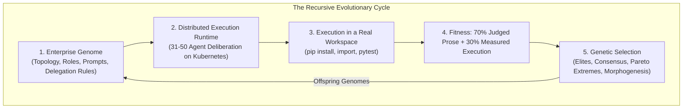

# Hierarchical Agent Evolution (HAE)
### Evolving agent organisations against a fitness function that runs their code

[](https://opensource.org/licenses/Apache-2.0)
[](https://www.python.org/downloads/)
[](https://kubernetes.io)
[](https://cloud.google.com/vertex-ai)

> [!IMPORTANT]
> **Experiment set V1 is closed; V2 has not started.** V1 ran thirteen
> experiments and published a fitness curve that turned out to measure prose,
> not software. The platform has been rebuilt around a fitness function with
> ground truth. What V1 got wrong, and how we know, is in
> [`experiments/README.md`](experiments/README.md) and
> [`experiments/v1/execution_grounded_correction.md`](experiments/v1/execution_grounded_correction.md).

---

## 1. Vision & Research Premise

Modern LLM-based multi-agent systems (CrewAI, AutoGen, MetaGPT) rely on flat
communication graphs or static role topologies. Scaled past ten agents, flat
structures suffer context dilution, $\mathcal{O}(N^2)$ communication overhead,
and reasoning collapse. Organisational hierarchies, personas, and delegation
protocols are conventionally hand-crafted by human prompt engineering.

**HAE** models an enterprise as a federated hierarchy — 30–50 specialised
agents in departmental pods under an executive council — and optimises its
topology, cognitive backstories, and delegation protocols by genetic
programming rather than by hand.

The goal is **recursive self-hosting**: competing virtual enterprises are
tasked with designing, implementing, and verifying the next-generation engine
of the platform itself.



---

## 2. The Four Architectural Pillars, and where each actually stands

The pillars are the programme's design. The status column is what the code
does today, measured rather than asserted. V1's central failure was that this
table was never written down, so four capability modules could name two
generations without ever being imported.

| Pillar | Status | Evidence |
|---|---|---|
| **1. The Organism** — the enterprise genome | **Working** | [`hae/genome/schema.py`](hae/genome/schema.py). Topology, headcount, personas and temperatures are declarative and mutable. Validated at construction; invalid genomes raise rather than loading degraded. |
| **2. The Selection Pressure** — hard execution gates | **Working, and honest about what it cannot check** | [`hae/evaluation/harness.py`](hae/evaluation/harness.py). Five gates that parse, install, import, test and inspect. A gate that cannot be evaluated reports `SKIPPED` and is excluded from the denominator — never scored as a pass. |
| **3. The Evolutionary Search** — breeding | **Working, newly unified** | [`hae/orchestration/breeder.py`](hae/orchestration/breeder.py). Elites, structural crossover, Pareto extremes, and topology morphogenesis, driven by a declarative per-generation config. |
| **4. Recursive Self-Hosting** — the closed loop | **Implemented, never yet run in a tournament** | [`hae/evaluation/benchmark.py`](hae/evaluation/benchmark.py). Firms reimplement this repository's own modules against held-out tests. Graded end to end; no generation has been run against it. |

### Pillar 1: The Organism
An organisation is a genome. `CompanyGenome` holds a CEO, departmental pods,
each pod's manager and team, their personas, temperatures and delegation
rules. Structural plasticity is the point: headcount and role specialisation
change between generations.

### Pillar 2: The Selection Pressure
Autonomous self-improvement cannot run on subjective evaluation alone; models
drift into verbose, non-executable prose. Five gates run the code:

| Gate | What it does | Weight within execution_integrity |
|---|---|---|
| `syntax` | `ast.parse` every authored `.py` | 20 |
| `build` | `pip install -e .` | 15 |
| `smoke` | import the modules | 20 |
| `tests` | collect and run the suite | 30 |
| `telemetry` | OpenTelemetry imported by code, not named in prose | 15 |

`execution_integrity` is 30% of total fitness — the heaviest single term — and
the LLM judge cannot see it.

> [!WARNING]
> V1's verifier executed nothing in three of its four gates. `build` was a
> filename substring match, `smoke` was `len(files) >= 3`, and `telemetry`
> searched text that *included the CEO's prose*, so an essay mentioning
> OpenTelemetry passed. Six generations were selected on those signals. The
> design rule now is that no gate may be satisfiable by writing about it.

### Pillar 3: The Evolutionary Search
Four operators, in a declared mixture per generation:

1. **Elites** — top parents carried forward unchanged. The control group.
2. **Structural crossover** — departments aligned by functional role, not by
   position, then recombined.
3. **Pareto extremes** — per-dimension champions, execution first. The best
   executor is routinely not the best overall, and the aggregate ranking hides
   it. In V1 the only firm ever to clear 4 of 5 gates finished sixth in its
   cohort and was never bred forward.
4. **Directed morphogenesis** — topology change, the only operator that can add
   or remove a department.

### Pillar 4: Recursive Self-Hosting
The task with ground truth:

> Given the modules `hae/<module>.py` depends on, and its docstring as the
> specification, implement `hae/<module>.py` so that `tests/test_<module>.py`
> — which the firm never sees — collects and passes.

Fitness is the fraction of held-out tests that pass. That number is ungameable
by writing well, monotonic, comparable across generations, and self-referential
in the way the programme requires: **a firm that beats our implementation has
produced a mergeable patch.**

Three ways a firm could cheat, and what stops each, are documented and tested
in [`tests/test_benchmark.py`](tests/test_benchmark.py).

---

## 3. Technical Deep Dive

### 3.1 Directory layout

```
hae/
├── genome/              Heritable structure
│   ├── schema.py          CompanyGenome / DepartmentGenome / AgentGenome, validated
│   ├── breeding.py        ThreeWayBreedingEngine
│   ├── morphogenesis.py   Topology mutation and structural crossover
│   └── mutator.py         LLM-driven genome mutation
├── runtime/             Executing one firm
│   ├── company.py         Hierarchical runner: CEO -> pods -> agents, ReAct tool loop
│   └── workspace.py       The filesystem an agent writes into
├── evaluation/          Scoring one firm
│   ├── harness.py         Five execution gates
│   ├── artifacts.py       What counts as an authored file
│   ├── judge.py           LLM rubric + composite fitness
│   ├── benchmark.py       Self-hosting benchmark (Pillar 4)
│   └── verification_loop.py  Agents can query the harness mid-run
├── infra/               Cross-cutting
│   ├── llm.py             Multi-provider inference, token cache, measured usage
│   ├── config.py          Environment resolution; fails loud on missing settings
│   └── telemetry.py       Research ledger
├── orchestration/       Running a tournament
│   ├── engine.py          Local sequential / threaded tournament
│   ├── worker.py          One firm per Kubernetes pod
│   └── breeder.py         Next generation from a declarative spec
└── cli.py               tournament | single-firm | breed | benchmark

configs/generations/     One JSON per generation. Declarative, not scripted.
k8s/                     One Job template; scripts/render_job.py fills it in
experiments/v1/          Frozen V1 archive: scorecards, genomes, scripts, manifests
experiments/v2/          Empty. Entry criteria listed in its README.
tests/                   158 tests, including an architectural guard
```

### 3.2 The fitness function

```
fitness = 0.20 * strategic_depth              (judged)
        + 0.20 * technical_feasibility        (judged)
        + 0.10 * cross_functional_coherence   (judged)
        + 0.10 * risk_mitigation              (judged)
        + 0.10 * actionability_and_synthesis  (judged)
        + 0.30 * execution_integrity          (MEASURED)
```

The two lowest-signal judged dimensions were cut from a combined 35% to 20%.
In Generation 10 both had a mean of 99.0 with $\sigma = 1.67$: the judge had
stopped discriminating. The freed 30% went to the measured dimension.

When the judge's JSON cannot be parsed, the result is `evaluation_failed=True`
at 0.0 and the firm is excluded from breeding. V1 silently substituted a
hardcoded `70/70/70/65/70` and bred the firm forward as though it had been
evaluated.

### 3.3 The architectural guard

[`tests/test_architecture.py`](tests/test_architecture.py) walks the import
graph from the entry points and fails on any module nothing can reach. This is
not a style check. Five modules in V1 — 587 lines, each with passing unit tests
— were imported by nothing but their own tests, and three V1 generations were
named after them:

| Generation | Announced capability | Reality |
|---|---|---|
| 6 | Inter-Firm Consortiums & Pluggable Harnesses | `consortium.py`, `harnesses.py` never imported |
| 9 | Autonomous Morphogenesis & Dynamic Topologies | `morphogenesis.py` reachable only from one-off scripts |
| 10 | Federated Mesh & Self-Evolving Rubrics | `federated_mesh.py`, `rubric_evolution.py` never imported |

A unit test cannot catch this, because each module's own tests passed. Only a
whole-graph check can. The guard found the morphogenesis case on its first run.

---

## 4. Results

No V2 results exist yet. V1's results, and the corrections applied to them, are
in [`experiments/v1/README.md`](experiments/v1/README.md). The short version:

* `corr(generation, execution_score) = +0.045` across Generations 5–10. Six
  generations of selection produced **no measurable improvement in whether the
  code runs**, while published net fitness climbed at +0.50/generation.
* **No firm in 60 ever passed all five gates.**
* Under the rebuilt rubric, five of six champions change.

---

## 5. Getting Started

### Local

```bash
git clone https://github.com/SinaChavoshi/hierarchical-agent-evolution.git
cd hierarchical-agent-evolution
pip install -e ".[harness]"

export GOOGLE_CLOUD_PROJECT=your-project     # required; not defaulted
export GOOGLE_CLOUD_LOCATION=us-east4

# Inspect a self-hosting benchmark task, including its reference run.
python -m hae.cli --mode benchmark --task artifacts

# Run one firm against one objective.
python -m hae.cli --mode single-firm --objective "Build a telemetry engine"

# Run the full suite, including the architectural guard.
python -m unittest discover -s tests
```

The platform talks to Vertex over raw REST, so no inference SDK is required.
Other providers are selected with `--provider {gemini_api,openai,anthropic,ollama,vllm}`.

### Distributed on Kubernetes

```bash
# 1. Breed the population from a declarative generation spec.
python -m hae.cli --mode breed --generation-spec configs/generations/gen1.json

# 2. Publish it as a ConfigMap (data only; code is baked into the image).
kubectl create configmap hae-gen1-population -n agent-evolution \
    --from-file=configs/generation_1_population.json

# 3. Render and apply the Job.
PYTHONPATH=. python3 scripts/render_job.py \
    --generation 1 --image-tag v2-gen1 \
    --project "$GOOGLE_CLOUD_PROJECT" --bucket "$GCS_BUCKET" | kubectl apply -f -
```

> [!CAUTION]
> **Authentication is Workload Identity only, deliberately with no fallback.**
> The pod's Kubernetes service account must be bound to a Google service
> account holding `roles/aiplatform.user` and `roles/storage.objectAdmin`.
>
> Every V1 generation from 5 onward ran on a **human engineer's OAuth token**,
> injected as a `vertex-token` Secret. Vertex tokens expire after about an
> hour, which is why firms died mid-tournament in Generations 9 and 10 and had
> to be re-dispatched by hand. The service account had zero project IAM roles
> the whole time; nobody noticed, because the token fallback kept working.
>
> That secret is gone and no fallback replaces it. If Workload Identity is not
> configured the run fails immediately and loudly, which is the point.

Verify the binding before launching a generation:

```bash
gcloud projects get-iam-policy "$GOOGLE_CLOUD_PROJECT" \
  --flatten="bindings[].members" \
  --filter="bindings.members:agent-evolution-sa@$GOOGLE_CLOUD_PROJECT.iam.gserviceaccount.com" \
  --format="value(bindings.role)"
```

---

## 6. Roadmap

V2 begins after expert review of this refactor. The entry criteria are tracked
in [`experiments/v2/README.md`](experiments/v2/README.md).

| Next | Why |
|---|---|
| Run Generation 1 against the self-hosting benchmark | Pillar 4 is implemented but has never driven a selection event |
| Measure judged-vs-measured correlation on real V2 data | The 70/30 split is a considered guess, not a fitted parameter |
| Merge the first firm that beats our implementation | The loop is not closed until a generated patch lands |
| Retire the prose objective entirely if the benchmark discriminates | Two fitness functions is one too many |

---

## 7. License

Apache 2.0. See [LICENSE](LICENSE).
