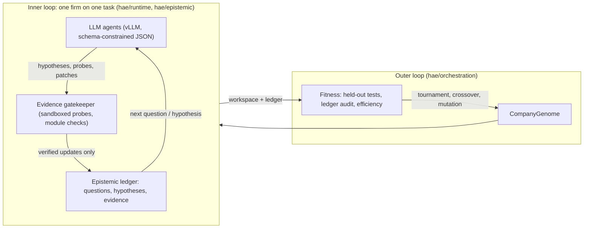

# Hierarchical Agent Evolution (HAE)

HAE is a research codebase for evolving multi-agent LLM organisations ("firms")
that write and repair software. A firm's structure is a heritable
`CompanyGenome`: departments and roles, the JSON schemas agents use to talk to
each other, the hyper-parameters of its search procedure, and any source
overlays it has written for itself. Populations of firms run against a
benchmark in sandboxes, are scored by held-out tests and a non-LLM audit of
their reasoning trail, and are bred by tournament selection, crossover and
mutation.

The repository contains the engine (`hae/`), the Kubernetes manifests used to
run generations on GKE with self-hosted vLLM models (`k8s/`), the population
and task files of every generation (`configs/`), and the harvested results and
per-phase write-ups (`results/`, `experiments/`). It is a single-maintainer
research project: expect rough edges, and read the caveats in each report
before quoting a number.

## How a firm runs


```mermaid
flowchart LR
    subgraph Outer["Outer loop (hae/orchestration)"]
        Genome["CompanyGenome"]
        Judge["Fitness: held-out tests, ledger audit, efficiency"]
        Judge -->|tournament, crossover, mutation| Genome
    end
    subgraph Inner["Inner loop: one firm on one task (hae/runtime, hae/epistemic)"]
        LLM["LLM agents (vLLM, schema-constrained JSON)"]
        Ledger["Epistemic ledger: questions, hypotheses, evidence"]
        Gate["Evidence gatekeeper (sandboxed probes, module checks)"]
        LLM -->|hypotheses, probes, patches| Gate
        Gate -->|verified updates only| Ledger
        Ledger -->|next question / hypothesis| LLM
    end
    Genome --> Inner
    Inner -->|workspace + ledger| Judge
```

- The first pass on a task is a plain hierarchical run: the CEO decomposes the
  objective, departments produce typed JSON packets, engineers write the
  modules, and the benchmark grades the workspace.
- Repair iterations (V6 onwards) run an explicit search instead of asking the
  LLM to "fix it": agents propose falsifiable hypotheses with short probe
  scripts, a deterministic gatekeeper runs the probes in a sandbox, and only a
  hypothesis that survived may be turned into a patch. Everything the search
  believed, tested and ruled out is kept in a JSON ledger that the fitness
  function audits.
- Evolution acts on the genome between generations. Since V8 the genome also
  carries a library of specialist roles and a policy for assembling a team per
  task, so organisation shape is selected rather than hand-designed.

## Phases

Each phase changed one thing about the fitness function, the benchmark or the
firm runtime, and each has a write-up with its data. `experiments/README.md`
is the index.

| Phase | Generations | What changed | Main result | Write-up |
|---|---|---|---|---|
| V1 | pilot to 10 | LLM-judged prose fitness | Judged fitness rose from 25 to 97 while the correlation between generation and actual execution was +0.045; 0 of 60 late firms passed all execution gates. Closed and audited. | [experiments/v1](experiments/v1/README.md) |
| V2 | 1 to 6 | Held-out unit tests as fitness, zero-seed workspaces, a 10-iteration test-and-repair loop | 30 of 30 firms passed 7/7 tests in Gen 4-6; mean iterations fell from 2.20 to 1.30. | [experiments/v2](experiments/v2/README.md) |
| V3 | 7 to 9 | Firms rewrite parts of HAE's own breeding code (`code_overlays`) and the breeder executes the winners | Worked mechanically; the audit found a workspace-inheritance bug in Gen 8-9 and 56 KB per run of inter-agent memo text. | [experiments/v3_rsi](experiments/v3_rsi/README.md) |
| V4 | 10 to 11 | Self-hosted 180B model behind an `llm-d` gateway with cross-firm prefix caching | 10/10 firms at 7/7 in Gen 11, with the caveat that identical prompts were coalesced across firms. | [experiments/v4_llmd](experiments/v4_llmd/README.md) |
| V5 | 12 to 15 | Grammar-constrained JSON packets between agents; a 4-module benchmark with 50 held-out tests | Output tokens per call fell 92%. Gen 15: 10/10 firms at 46-50/50, two at 50/50; the rest plateaued on the same tests. Gen 12 scores retracted (cache seed). | [experiments/v5_typesafe_xgrammar](experiments/v5_typesafe_xgrammar/README.md) |
| V6 | 16 | Evidence-gated epistemic search for repair iterations; audit-based fitness | Pilot plus three cohort runs of 26 firm-runs. The search recovers catastrophic first passes once a module can be authored (6 of 9 in run 2 vs 1 of 7 in run 1); plateau starts barely move; the LLM's stated priors carry no information (flat hit rate across prior bins). | [experiments/v6_epistemic_search](experiments/v6_epistemic_search/README.md), [results](results/hae_gen16_v6_cohort_r2/README.md) |
| V7 | - | Learned value and prior heads trained on the V6 ledgers | Shadow mode only. The state-value head beats the base rate out of fold (Brier 0.186 vs 0.202); the hypothesis-prior head does not. | [results/v7_value_heads](results/v7_value_heads/README.md) |
| V8 | - | Role library and CEO-policy genes, a recruit-specialist move, SWE-bench adapters | Implemented and unit-tested; no live run yet. | [docs/v8_role_evolution_and_swebench_roadmap.md](docs/v8_role_evolution_and_swebench_roadmap.md), [docs/v8/](docs/v8/) |

Numbers in the table are taken from the linked reports; the reports carry the
sample sizes and the caveats (first-pass variance, prompt changes between runs,
cache effects) that the one-line summaries omit.

## Repository layout

```text
hae/
  genome/         CompanyGenome schema, mutation and crossover, role seeds, morphogenesis
  runtime/        HierarchicalCompanyRunner (first pass + epistemic repair), workspace, overlays
  epistemic/      ledger, moves, gatekeeper, PUCT search, value/audit, organisation (V8), heads (V7)
  evaluation/     benchmark, execution harness, verification loop, fitness judge
  orchestration/  tournament engine, GKE worker, breeder
  swebench/       dataset access, container executor, SWE-bench runner and prediction export
  infra/          LLM providers (Vertex, vLLM), config, preflight, telemetry
  task/           task specs, budgets, verifiers
  cli.py          entry point: tournament, single-firm, breed, benchmark, preflight, swebench
configs/          population files per generation, generation specs, task definitions
k8s/              GKE cluster setup, vLLM / llm-d serving manifests, per-generation Job manifests
scripts/          population builders, harvesters, telemetry and summary scripts, head trainer
experiments/      per-phase design notes, results and errata (V1-V6)
results/          harvested scorecards, epistemic trees, traces and generated summary tables
docs/             platform specification, V8 roadmap and track notes
data/swebench/    SWE-bench dev-slice manifest (the fetched splits are git-ignored)
tests/            unit and regression tests (stdlib unittest, no network)
```

## Running

Tests need Python 3.10+ and nothing outside the standard library:

```bash
python3 -m unittest discover -s tests -q
```

A firm needs an LLM endpoint. `--provider` selects Vertex AI, the Gemini API,
OpenAI, Anthropic, Ollama or an OpenAI-compatible vLLM server; the cluster
runs use vLLM (`LLM_PROVIDER=vllm`, `VLLM_BASE_URL`, `VLLM_MODEL`). The
variables are read in `hae/infra/config.py` and `hae/infra/llm.py`. Entry
points:

```bash
python3 -m hae.cli --mode preflight                      # check credentials, image, endpoint
python3 -m hae.cli --mode single-firm --task-file configs/tasks/self-hosting-fullstack-iter5.json
python3 -m hae.cli --mode breed --generation-spec configs/generations/gen16_cohort.json
python3 -m hae.cli --mode campaign --specs configs/generations/gen1.json configs/generations/gen2.json
python3 -m hae.cli --mode swebench --help                # one firm on one SWE-bench instance
```

Generations are run as indexed Kubernetes Jobs (one pod per firm) against a
vLLM deployment in the same cluster; `k8s/cluster-setup.sh`, the serving
manifests and the `hae-gen16-*-job.yaml` files are the record of how each run
was launched, and `scripts/harvest_*.py` collect the outputs.

## Reading the results

- `results/<run>/README.md` is the report for a run; `summary_tables.md` and
  `generation_16_cohort_summary.json` are generated by
  `scripts/summarize_gen16_cohort.py` and `value_telemetry.csv` by
  `scripts/extract_value_telemetry.py`.
- `results/<run>/outputs/<firm>/generation_16/<firm>_epistemic_tree.json` is
  the full reasoning trail of a V6 firm: ledger, every search trajectory, and
  the audit. `results/<run>/traces/` has the same trail as readable text.
- Iteration 1 of every V6 run is the unchanged V5 first pass and its draw
  dominates a trajectory; compare runs by first-pass class and over seeds, not
  by single trajectories.

## License

Apache-2.0, see `LICENSE`.
