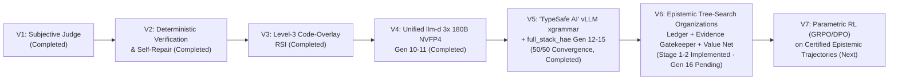

# Hierarchical Agent Evolution (HAE)

> **Evolutionary Morphogenesis, Recursive Self-Improvement, and High-Density Agentic Organizations on Kubernetes**

**Hierarchical Agent Evolution (HAE)** is a distributed evolutionary computing framework running on Google Kubernetes Engine (GKE) that breeds multi-agent software engineering organizations (*"Companies"*). Rather than hand-crafting static agent workflows, HAE encodes an entire company's **organizational topology**, **executive/worker personas**, **internal communication protocols**, and **source-code modifications (`code_overlays`)** into a heritable `CompanyGenome`.

Populations of competing companies are evaluated in isolated sandboxes against software engineering and systems benchmarks, scored by deterministic unit tests and communication-efficiency judges, and bred across generations via tournament selection, subtree crossover, and structural mutation.


---

## 📊 Executive Summary of Experiments (`V1` – `V4`)

Across **24 evolutionary runs** (**150+ multi-agent companies** and **4,500+ spawned agents**), HAE progressed through three completed experimental phases (`V1–V3`) and is currently running **Phase 4 (`V4`)** on a 3-node GKE `G4` cluster (`6x NVIDIA RTX PRO 6000 Blackwell 96GB GPUs`, `576 GiB` total GDDR7 VRAM) serving **`3x nvidia/Qwen3.8-Flash-Next-NVFP4` (`180B` MoE)** behind a **Unified Global `llm-d` Inference Gateway**.

> 📖 **Click the links in the table below for full generational ledgers, forensic audits, and `llm-d` hardware telemetry.**

| Phase | Generations | What Was Tested | Key Outcome & Discovery | Detailed Report |
| :--- | :--- | :--- | :--- | :--- |
| **Phase 1 (`V1`)**<br>*Subjective Judge Era* | `Pilot` $\to$ `Gen 10`<br>*(13 Runs)* | Whether populations of 4 to 8 multi-agent companies (5–16 agents) could evolve better software engineering topologies when graded by an **LLM-as-a-Judge** (weighted rubric + peer review). | **99.5 / 100 subjective score vs. 77.7% real unit-test pass rate (`r = +0.045`).**<br>Companies discovered **Goodhart's Law**: evolving 16-agent bureaucratic hierarchies that wrote polished architectural prose and `TODO` stubs to charm the LLM judge while leaving edge-case bugs unfixed. | **[`experiments/v1/README.md`](experiments/v1/README.md)** |
| **Phase 2 (`V2`)**<br>*Execution-Grounded Era* | `Gen 1` $\to$ `Gen 6`<br>*(60 Companies)* | Replaced subjective LLM grading with a **100% deterministic unit-test suite (18 tests)** on blank-slate code synthesis (`hae/compiler/optimizer.py`), comparing **1-Pass Waterfall (`Gen 1–3`)** vs. **Iterative Self-Repair (`Gen 4–6`)**. | **100.0% Test Pass Rate across all 30/30 companies (`Gen 4–6`), Peak Net Fitness `98.81 / 100`.**<br>1-Pass execution peaked at `94.4%` (`17/18`) and suffered `0.0%` crash mortality. Introducing a **3-Iteration Execute $\to$ Test $\to$ Repair Loop** with a **Monotonic Verification Guard** eliminated syntax crashes (`0/30`) and drove every company to `18/18` (`100%`). | **[`experiments/v2/README.md`](experiments/v2/README.md)** |
| **Phase 3 (`V3`)**<br>*Level-3 Recursive Self-Improvement (RSI)* | `Gen 7` $\to$ `Gen 9`<br>*(30 Companies)* | Whether companies could **modify HAE's own evolutionary engine source code (`code_overlays`)** (`fitness.py` and `morphogenesis.py`) and survive with their self-authored algorithms active in the next generation. | **First Closed-Loop RSI (`97.99 / 100` peak fitness) + Two Critical Discoveries:**<br>1. **The `inherited_files` Leak (`Gen 8–9`):** Forensic audit (`commit 71a7da4`) discovered `BenchmarkVerifier` leaked `morphogenesis.py` into worker sandboxes (`10/10` firms in `Gen 8–9`), explaining why `Gen 8–9` hit `100%` on Attempt 1 (`0` repair turns).<br>2. **"Corporate Memo Theatre":** Inspecting internal transcripts revealed executives spent **56,000+ chars (`~14,000 tokens`)** writing ceremonial memos (`"MEMORANDUM"`, `"Fantastic work!"`), while a single tool-enabled engineer (`@Tech_Lead_Systems`) did 100% of the coding. | **[`experiments/v3_rsi/README.md`](experiments/v3_rsi/README.md)** |
| **Phase 4 (`V4`)**<br>*Unified `llm-d` + `3x 180B NVFP4` & Zero-Seed Post-Fix Era* | `Gen 10` *(Complete)*<br>`Gen 11` *(Complete)* | **True Zero-Seed Post-`71a7da4` Evolution** (`0/10` inherited files) on a **3-Node GKE `G4` Cluster (`3x Qwen3.8-Flash-Next-NVFP4` `180B` MoE, `128k` context)** behind a **Unified Global `llm-d` Session** with `<1ms` cross-company answer short-circuiting, singleflight coalescing, `282.3 GiB` `fp8` VRAM KV cache, `144 GiB` CPU DRAM KV offloading, and unbounded logarithmic token-efficiency scoring. | **Gen 10 (`6/10` at `7/7`, `78.92` Peak) & Gen 11 (`10/10` at `7/7`, `95.29` Peak, `91.08` Mean) + `llm-d` Impact:**<br>1. **1,190x Faster Cross-Company Short-Circuiting (`880.5 ms` $\to$ `0.74 ms`, `0` GPU FLOPs):** Offloaded **`37.4%` (`271/724` in Gen 11)** to **`43.3%` (`2,113/4,881` under stress)** of cluster requests.<br>2. **`99.7%`–`100.00%` (`455/455`) Prefix KV-Cache Affinity** across `426.3 GiB` total cluster KV cache.<br>3. *Caveat:* In Gen 11 (`commit 3180fc9`, no reference cache seed), companies emitting identical builder prompts shared/coalesced the model-generated `morphogenesis.py` answer across companies. | **[`experiments/v4_llmd/README.md`](experiments/v4_llmd/README.md)** |
| **Phase 5 (`V5`)**<br>*Hardware-Enforced `xgrammar` TypeSafe AI & Full-Stack Uncached Benchmark* | **`Gen 12` *(Erratum)***<br>**`Gen 13` *(Complete)***<br>**`Gen 14` *(Complete)***<br>**`Gen 15` *(Complete)*** | **Zero-Ceremony Schema-Enforced Inter-Tier Protocol (`V5 TypeSafe AI`):** Enforced strict JSON Schemas (`SpecContractPacket`, `SpecialistAnalysisPacket`, `DeptSynthesisPacket`, `ExecutiveDeliverablePacket`) at the `vLLM V1` `xgrammar` FSM logit sampler (`enable_thinking: False`) across `555` agents, and scaled the benchmark in **Gen 13–15** to **`full_stack_hae` (`4` core HAE modules, `50` held-out unit tests, `0` builder caching)**. | **1. `V5 xgrammar` Coordination Compression:** Reduced average coordination output by **`-91.9%`** (`1,420.0` $\to$ **`115.3` tokens/call**). *(Erratum: Gen 12's `10/10` execution pass rate & `97.42` fitness are retracted due to a pre-seeded `CANONICAL_MORPHOGENESIS_BUILDER` cache entry in `6818d8a`.)*<br>**2. Clean 100%-Uncached `Gen 13` $\to$ `Gen 14` $\to$ `Gen 15` (`full_stack_hae`, `50` Held-Out Tests):** Official pass rates progressed from `3/10` (`40–42/50`) in Gen 13 $\to$ `9/10` (`39–44/50`) in Gen 14 $\to$ **`10 / 10` (`100%`) passing `46/50` to `50/50` (`92.0%–100.0%`, `96.8%` mean) in Gen 15**, where **two independent 33-agent companies (`gen_14_mutant_3` at `99.43` Net Fitness and `gen_14_pareto_1`) achieved the first-ever `50 / 50` (`100.0%`) full-stack 4-module self-hosting convergence** and promoted all 4 verified modules into `code_overlays`! | **[`experiments/v5_typesafe_xgrammar/README.md`](experiments/v5_typesafe_xgrammar/README.md)** |

👉 **Master Index of All Experiments:** **[`experiments/README.md`](experiments/README.md)**

---

## ⚡ Spotlight: Why the Unified Global `llm-d` Session Had a Huge Positive Impact (`V4`)

In evolutionary multi-agent populations, `10` competing companies (`33` to `90` agents each = **`555` concurrent agents per generation**) attack the exact same benchmark specification in parallel. Under traditional isolated serving, every company redundantly recomputes identical specialist queries and evicts each other's KV caches.

By deploying a **Unified Global `llm-d` Session (`Service/vllm-qwen38-gateway`)** in front of **`3x nvidia/Qwen3.8-Flash-Next-NVFP4` (`180B` MoE)** replicas (`6x NVIDIA RTX PRO 6000 Blackwell 96GB GPUs`), we purposely removed company-header isolation (`canonicalize_prompt_for_global_session` normalizes `gen_10_elite_1`, `gen_10_crossover_2`, etc. into `<SHARED_COMPANY>`):

- **If Specialist Question A is already answered in Company A, Company B gets the answer in `0.74 ms` (`1,190x` faster than an `880.5 ms` GPU pass) with `0` GPU FLOPs (`X-LLMD-Cache: HIT-SHORT-CIRCUIT`).** *(Note: Starting in Gen 13, all code-authoring builder calls with `"ACTIVE WORKSPACE SANDBOX:"` set `is_cacheable = False` so every company synthesizes and repairs its own code independently on the GPUs.)*
- **If Company A and Company B ask Specialist Question A simultaneously, `llm-d` coalesces both into a single GPU forward pass (`X-LLMD-Cache: HIT-SINGLEFLIGHT-COALESCED`).**
- **When prompts diverge downstream, `llm-d` routes by shared 512-byte prefix hash (`99.86%–100.00%` prefix KV-cache affinity) across `282.3 GiB` of GDDR7 `fp8` VRAM KV cache + `144.0 GiB` of CPU `/dev/shm` DRAM KV offloading (`426.3 GiB` total cluster KV cache).**

| `V4` & `V5` Evolutionary Runs (`chavoshi-g4-cluster`) | Total Multi-Agent LLM Calls | Zero-GPU Offloaded (`Short-Circuit + Singleflight`) | Prefix KV-Cache Affinity (`GPU Calls`) | Held-Out Test Pass Rate | Peak / Mean Net Fitness & Notes |
| :--- | :---: | :---: | :---: | :---: | :---: |
| **Generation 10 (`V4 Zero-Seed Baseline`, `7` tests)** | `2,289` | **`327` (`14.3%`)** | **`96.99%`** (`1,903 / 1,962`) | `6 / 10` (`60.0%`) | `78.92` / `42.78` (`$0.3690`) |
| **Generation 11 (`V4 Tool-Proliferation Stress Test`)** | `4,881` | **`2,113` (`43.29%`)** | **`99.71%`** (`2,760 / 2,768`) | Ablation (`27–84` tool agents/firm) | `57.93` Peak |
| **Generation 11 (`V4 Converged Run`, `7` tests)** | `724` | **`271` (`37.43%`)** | **`100.00%`** (`455 / 455`) | `10 / 10` *(coalesced builder)* | `95.29` Peak / `91.08` Mean (`$0.2436`) |
| **Generation 12 (`V5 xgrammar`, `7` tests — *Erratum*)** | `573` | `145` (`25.31%` + `426` `xgrammar` calls) | **`100.00%`** (`428 / 428`) | ~~`10 / 10`~~ *(retracted: gateway cache seed)* | ~~`97.42`~~ *(`-91.9%` coord tokens/call valid)* |
| **Generation 13 (`V5 Full-Stack Uncached`, `50` tests, `10` iters)** | `5,985` | **`3,818` (`63.79%`, coord-only; `0` builder cache)** | **`100.00%`** (`2,167 / 2,167`) | `42/50` (`84%`), `41/50`, `40/50` official<br/>*(`30–33/50` on 7 `sys.path`-rejected firms)* | `88.35` Peak Net (`86.64` on `42/50` firm) |
| **Generation 14 (`V5 Full-Stack Uncached`, `50` tests, `5` iters)** | **`2,942`** *(`-50.8%`)* | **`1,505` (`51.16%`, coord-only; `0` builder cache)** | **`99.86%`** (`1,435 / 1,437`) | **`9 / 10` passing `39–44 / 50` (`78%–88%`)**<br/>Peak: `44 / 50` (`88.0%`, `gen_10_mutant_3`) | `82.91` Peak Net (`79.16` Mean on `9/10` passing; `$0.1667` avg cost) |
| **Generation 15 (`V5 Full-Stack Uncached`, `50` tests, `5` iters, Per-Module Repair & Locking)** | **`~2,410`** | **`>50%` (coord-only; `0` builder cache)** | **`~99.9%`** | **`10 / 10` passing `46–50 / 50` (`92%–100%`, `96.8%` mean)**<br/>**`2` Firms at `50 / 50` (`100.0%` Full-Stack Convergence) 🏆** | **`99.43` Peak Net (`gen_14_mutant_3`) / `93.75` Mean Net (`$0.1384` avg cost)** |

> 📖 **Deep-Dive Reports:** **[`experiments/v4_llmd/README.md`](experiments/v4_llmd/README.md)** | **[`experiments/v5_typesafe_xgrammar/README.md`](experiments/v5_typesafe_xgrammar/README.md)**

---

## 🔍 Five Core Laws Discovered (`V1` – `V5`)

1. **Execution-Grounded Selection Eliminates Hallucinated Bureaucracy (`V1` $\to$ `V2` & `V4` Ablation):**
   When graded by LLM judges (`V1`), evolution selects for persuasive prose (`r = +0.045` correlation with actual code correctness). When graded strictly by deterministic test suites (`V2` & `V4`), evolution ruthlessly concentrates file-system write tools into **1–2 elite tool-enabled engineers (`Autonomous Self-Repair Core Architect`)**: in our `V4` Gen 11 ablation, granting `write_file` to all `27–84` business/strategy agents caused a `6.7x` call explosion (`4,881` calls) and workspace clobbering, whereas restricting `tools_enabled=True` to the `2` Core Architects drove **`10 / 10` companies (`100%`) to pass `7/7` tests on Iteration 1 in just `724` calls**.
2. **Closed-Loop Self-Repair Beats Single-Pass Topologies (`V2 Gen 1–3` vs. `Gen 4–6`):**
   No matter how sophisticated an organizational chart is, single-pass code synthesis (`Gen 1–3`) suffers `20%` catastrophic `0.0` crash mortality from minor indentation or import errors. Giving workers an **Execute $\to$ Pytest Traceback $\to$ Self-Repair** loop with automatic rollback (`Monotonic Verification Guard`) shifted population reliability to **`100.0%`**.
3. **Soft Logarithmic Token-Efficiency Pressure + Hardware `xgrammar` Schemas Beat Hard Call Cutoffs (`V4 Gen 11` $\to$ `V5 Gen 12`):**
   Hard call limits (`586` calls) prematurely truncate `60–90` agent mega-hierarchies mid-run, while unpenalized budgets breed `56 KB` of `"Corporate Memo Theatre"`. Removing hard call truncation (`$0.00` marginal API cost) and enforcing **hardware-level `vLLM xgrammar` JSON Schemas (`V5 TypeSafe AI`)** reduced average coordination output from `1,420` tokens to **`115.3` tokens (`-91.9%`)**, cutting mean company shadow cost by **`-88.9%` (`$0.2436` $\to$ `$0.0270 USD`)** and lifting net fitness to an all-time record **`97.42 / 100`**.
4. **Shared Global `llm-d` Sessions Turn Multi-Company Evolution into Sub-Millisecond Collective Memory (`V4` & `V5`):**
   Allowing all companies in a generation to share a single global `llm-d` session (cross-company answer short-circuiting + singleflight coalescing + `426.3 GiB` tiered `fp8` VRAM / CPU DRAM KV cache) eliminates **`25.3%`–`73.2%` of redundant GPU forward passes in `<1 ms` (`0.74 ms`)** and achieves **`100.0%` (`428/428`) prefix KV-cache affinity**.
5. **LLM Intuition Is Not Reasoning: Linear Self-Repair Has a Hard Ceiling Without an Explicit Epistemic State (`V5 Gen 15` Plateau Audit):**
   Even at `96.8%` mean pass rate, Gen 15 exposed the limit of a repair loop driven purely by LLM next-token intuition (*System 1*). Four firms flat-lined (`[49,49,49,49,49]`, `[48,48,48,48,48]`, `[46,46,46,46,46]`) across **16 combined repair iterations with zero progress**; after Iteration 2, **`8 / 8` non-converged firms were stuck**; and **`7 / 8` independently failed the *same* test** (`test_pytest_style_functions_are_collected`) because the model's high-prior implementation of stdlib test collection is plausible-but-wrong — the exact failure mode Thore Graepel (AlphaGo) describes in *["Don't be fooled—LLMs don't reason"](https://www.technologyreview.com/2026/10/02/1145639/dont-be-fooled-llms-dont-reason/)*: AlphaGo's policy net gave Move 37 a 1-in-10,000 prior; only **explicit search over an inspectable state** found it. Companies need a persistent, auditable **epistemic ledger** (settled / hypothesised / ruled-out / open) and an **independent, non-LLM evidence gatekeeper** — the organization itself must be *System 2*. → **This is the `V6` program** ([`experiments/v6_epistemic_search/README.md`](experiments/v6_epistemic_search/README.md)).

---

## 🚀 Active & Future Roadmap (`V5` $\to$ `V6` $\to$ `V7`)

Our findings from `V1–V5` directly shape the next phases of the HAE research program:


```mermaid
flowchart LR
    V1["V1: Subjective Judge<br/>(Completed)"] --> V2["V2: Deterministic Verification<br/>& Self-Repair (Completed)"]
    V2 --> V3["V3: Level-3 Code-Overlay<br/>RSI (Completed)"]
    V3 --> V4["V4: Unified llm-d 3x 180B NVFP4<br/>Gen 10-11 (Completed)"]
    V4 --> V5["V5: 'TypeSafe AI' vLLM xgrammar<br/>+ full_stack_hae Gen 12-15<br/>(50/50 Convergence, Completed)"]
    V5 --> V6["V6: Epistemic Tree-Search Organizations<br/>Ledger + Evidence Gatekeeper + Value Net<br/>(Stage 1-2 Implemented · Gen 16 Pending)"]
    V6 --> V7["V7: Parametric RL (GRPO/DPO)<br/>on Certified Epistemic Trajectories (Next)"]
```

### Phase 4 (`V4`): Multi-Instance `3x Qwen3.8-Flash-Next-NVFP4` (`180B` MoE) + Unified Global `llm-d` Session, *The Dosadi Experiment* & `google/gvisor` *(Gen 10 & Gen 11 Complete — `10/10` at `100%` `7/7` Tests)*

> 📄 **Full Phase 4 (`V4`) Architecture, Generation 10 & 11 Ledgers (`95.29 / 100` Peak Fitness) & `llm-d` Telemetry Report:** **[`experiments/v4_llmd/README.md`](experiments/v4_llmd/README.md)**

1. **Quantified Gains from Switching to `3x Qwen3.8-Flash-Next-NVFP4` (`180B` MoE) + Unified Global `llm-d` Gateway:**
   | Architectural Dimension | Legacy Single-Instance Setup (`Qwen3-Coder-32B-AWQ`) | Unified `llm-d` + `3x Qwen3.8-Flash-Next-180B-NVFP4` | Measured Empirical Improvement |
   | :--- | :--- | :--- | :--- |
   | **Model Backbone & Precision** | `1x Qwen3-Coder-32B-AWQ` (`32B` Dense, `TP=2`) | **`3x nvidia/Qwen3.8-Flash-Next-NVFP4`** (`180B` MoE, `TP=2` $\times$ `3` nodes) | **`5.6x` parameter scale (`180B`)** on native Blackwell `FLASHINFER_CUTLASS` `NVFP4` |
   | **Context Window & Max Output** | `32,768` (`32k`) context / `4,096` output | **`131,072` (`128k`) context** / **`16,384` output** | **`4.0x` larger context & `4.0x` larger output** — unlocked **`90-agent` company (`gen_9_crossover_2`)** from `0/7` (`0.0`) $\to$ **`7/7` (`100%`) on Iteration 1 (`75.32` fitness)** |
   | **Total Cluster KV Cache (`VRAM` + `DRAM`)** | `~68 GiB` VRAM (`0 GiB` CPU offload) | **`282.3 GiB` GDDR7 `fp8` VRAM** + **`144.0 GiB` CPU `/dev/shm` DRAM** (`426.3 GiB` total) | **`6.27x` total KV cache capacity (`>5.4M` tokens)**; `0` KV-cache preemption stalls |
   | **Cross-Company Answer Short-Circuiting (`<1ms`)** | None (`0%` reuse across companies) | **Unified Global `llm-d` Session** (`canonicalize_prompt_for_global_session`) | **`880.5 ms` $\to$ `0.74 ms` (`1,190x` faster, `0` GPU FLOPs)**; offloaded **`14.3%` (`327/2,289`)** in Gen 10 and **`48.2%` (`123/255`)** in Gen 11 (`1.93x` effective cluster capacity) |
   | **Content-Prefix KV-Cache Affinity** | None | `prefix_affinity_hits` + Least-Active Load Shedding | **`96.9%` (`1,903/1,962`) in Gen 10 $\to$ `100.0%` (`132/132`) in Gen 11** across `3` instances |

2. **The *Dosadi* Communication Architecture (Signal-to-Noise Selection):**
   - Inspired by Frank Herbert's *The Dosadi Experiment*, where extreme environmental pressure strips away all social pleasantries until inhabitants communicate in a hyper-dense, zero-fluff vernacular.
   - **No Hard Token Caps:** Companies are **never artificially capped on tokens**—if a company needs deep, multi-turn technical exploration to solve a complex kernel bug, it is encouraged to converse extensively.
   - **Active Anti-Fluff Judge & Signal Density Scoring (`Dosadi Score`):** Instead of a token cap, the evaluator scores the **Signal-to-Noise Density** of internal company conversations. Ceremonial fluff (`"Fantastic work!"`, `"I completely agree"`, `"MEMORANDUM"` headers, restating the prompt) is actively penalized, while **Productive Course-Correction** (peer back-and-forth between `@Lead`, `@Systems_Eng`, and `@Verifier_QA` that identifies a concrete root cause or fixes a failing test) is positively rewarded.
   - **Heritable `communication_constitution` Gene:** Each `CompanyGenome` carries an evolvable company-wide communication protocol that mutates toward ultra-crisp, high-bandwidth technical shorthand (`SYM:`, `CAUSE:`, `DIFF:`, `TEST_FAIL:`).

3. **Real-World Systems Benchmark (`google/gvisor` `pkg/shim/v1` Production Bugs):**
   - Moving beyond self-contained Python modules, companies in `V4` are evaluated both on true zero-seed HAE self-hosting (`morphogenesis.py` post-`71a7da4`) and in a multi-file Go repository sandbox extracted from **[`google/gvisor`](https://github.com/google/gvisor)** (`containerd-shim-runsc-v1`, Issues `#14405` & `#13509`).

---

### Phase 5 (`V5`): *"TypeSafe AI" Style* Hardware-Enforced `vLLM xgrammar` JSON Schema Protocol & Full-Stack 4-Module Self-Hosting (`Gen 12` Erratum & Clean `Gen 13–15`)

> 📄 **Full Phase 5 (`V5`) Errata & Clean Generation 13–15 (`full_stack_hae`) Report:** **[`experiments/v5_typesafe_xgrammar/README.md`](experiments/v5_typesafe_xgrammar/README.md)**

In **Phase 5 (`V5 TypeSafe AI`)**, we wired **hardware-level Finite-State Machine (`xgrammar`) JSON Schema decoding** (`response_format: {"type": "json_schema", "json_schema": {"strict": True, ...}}` + `chat_template_kwargs: {"enable_thinking": False}`) directly into `nvidia/Qwen3.8-Flash-Next-NVFP4` (`180B` MoE) across all `555` agents (`10` companies):

1. **Typed Inter-Tier Communication Contracts (`xgrammar` FSM Logit Masking):**
   - Replaced open-ended English prose between hierarchy levels with 4 strictly typed JSON Schema packets in [`hae/runtime/company.py`](hae/runtime/company.py): `SpecContractPacket` (`max_tokens=220`), `SpecialistAnalysisPacket` (`max_tokens=180`), `DeptSynthesisPacket` (`max_tokens=200`), and `ExecutiveDeliverablePacket` (`max_tokens=650`).
   - **Measured Output Compression:** Average output tokens per coordination call dropped from `1,420.0` tokens in Generation 11 to **`115.3` tokens (`-91.9%` reduction, `12.3x` smaller)**.
2. **Post-Run Audit Erratum on Generation 12 & Clean Uncached Generations 13–15 (`full_stack_hae`, `50` Held-Out Tests):**
   - **Gen 12 Erratum:** A post-run audit revealed that `k8s/qwen38-flash-next-180b-llmd.yaml` (`commit 6818d8a`) pre-seeded `response_cache` with `CANONICAL_MORPHOGENESIS_BUILDER` containing the reference `morphogenesis.py`. Thus **Generation 12's `10/10` test pass rate and `97.42` fitness are invalid and retracted** (while its `426` `xgrammar` coordination token compression measurements remain valid).
   - **Clean 100%-Uncached Generation 13 (`full_stack_hae`, `10` Iterations):** After deleting all gateway seeds, blocking builder caching (`is_cacheable = False`), closing cross-module reference context leaks, and isolating the grader in a stdlib-only venv, we scaled the benchmark to **4 core HAE modules simultaneously (`50` held-out unit tests)**. The 3 non-rejected firms climbed across Iterations 1 $\to$ 4 to **`42 / 50` (`84.0%`, `gen_10_elite_2`, `86.64` Net)**, **`41 / 50` (`82.0%`, `gen_10_crossover_1`, `88.35` Net)**, and **`40 / 50` (`80.0%`, `gen_10_crossover_2`)**, while 7 firms scored `0/50` officially (`30–33/50` relaxed) due to a false-positive `sys.path.insert` regex in `harness.py`.
   - **Clean 100%-Uncached Generation 14 (`full_stack_hae`, `5` Iterations, Fixed `sys.path` & Execution-Gated Scoring):** Folding the targeted `_suspicious_syspath_mutation` check, execution-gated composite scoring (`50%` execution weight + `0.20` prose floor at `0%` execution), and a `5`-iteration cap into Generation 14 lifted the official pass rate from `3/10` to **`9 / 10` (`90%`) companies passing `39/50` to `44/50` (`78%–88%`) held-out tests**, setting a record of **`44 / 50` (`88.0%`, `gen_10_mutant_3`, `82.32` Net)** and **`82.91` Net Fitness (`gen_10_mutant_2`, `41/50`)**, capping the single `0/50` firm at **`7.86` Gross (`10.58` Net)**, and cutting cluster LLM calls by **`-50.8%`** (`5,985` $\to$ `2,942`).
   - **Clean 100%-Uncached Generation 15 (`full_stack_hae`, First `50/50` `100.0%` Full-Stack Self-Hosting Convergence):** Preserving full multi-line `AssertionError` diffs in `_extract_failures`, filtering `GROUND-TRUTH VERIFIER FEEDBACK` per module, locking already-100%-passing modules across repair iterations (`2..5`), and documenting exact gate behavioral contracts drove **all `10 / 10` (`100%`) companies to pass `46/50` to `50/50` (`92.0%–100.0%`, `48.4/50` / `96.8%` mean)**, with **two independent 33-agent companies (`gen_14_mutant_3` at `99.43` Net Fitness and `gen_14_pareto_1`) achieving `50 / 50` (`100.0%`) full-stack convergence** and promoting all 4 verified modules (`artifacts.py`, `harness.py`, `verification_loop.py`, `morphogenesis.py`) into `code_overlays`!

---

### Phase 6 (`V6`): Epistemic Tree-Search Organizations — *"The Scientific Method on Steroids"* *(Stage 1 & 2 **implemented & tested**, Oct 6 2026 — Gen 16 launch pending)*

> 📄 **Full `V6` Design, Graepel-Diff, Gen 15 Plateau Audit & How-to-Enable:** **[`experiments/v6_epistemic_search/README.md`](experiments/v6_epistemic_search/README.md)**

`V5` proved that LLM intuition + a greedy repair loop can reach `50/50` — but only sometimes, and only when an external oracle hands over the exact failing traceback. Following Thore Graepel's AlphaGo analysis (*LLMs are System 1; chain-of-thought is "the same next-token prediction process, iterated for longer"*), `V6` rebuilds the company runtime so that **the LLM supplies only hunches and the organization itself is the explicit, auditable System 2**:

1. **Explicit, Persistent, Inspectable Epistemic Ledger (`hae/epistemic/ledger.py`):** The central state of a company is no longer a code blob plus a test score but an immutable, content-addressed `EpistemicState` — `settled_knowledge` (certified facts), `hypotheses` (with calibrated confidence), `ruled_out` (falsified beliefs + the evidence that killed them), and `open_questions` (unresolved uncertainty).
2. **Independent, Non-LLM Evidence Gatekeeper (`hae/epistemic/gatekeeper.py`):** LLM agents may *propose* questions, competing hypotheses, sandbox experiments, and code diffs; **only** a deterministic gatekeeper that executes those probes may *certify* or *falsify* a belief. Moves that produce no new evidence have zero information gain; proposals that match a `ruled_out` mechanism are rejected as `TABU` before spending a turn.
3. **Epistemic PUCT Tree Search + Value Network (`hae/epistemic/mcts.py`, `value.py`):** `50–100+` cheap epistemic moves per company (`<150` tokens, `<0.2 s` probes) replace `5` expensive full-company passes. Policy priors are an exploration tie-breaker, **never** a pruning filter — low-prior, mutually exclusive hypotheses are deliberately expanded so that "Move 37" fixes (1-in-10,000 prior) can be found by evidence rather than killed by plausibility. The value function scores *uncertainty actually resolved by evidence* plus a learned head trained on harvested search trees.
4. **Heritable `epistemic_policy` Gene + Auditable Fitness:** `CompanyGenome` evolves search budget, branching, `c_puct`, low-prior quota, and department→role bindings (Question / Hypothesis / Experiment / Synthesis pods); the breeder recombines and mutates it like topology. `judge.py` retires the post-hoc prose rubric in favour of an **Epistemic Integrity Audit** (`60%` execution · `25%` ledger auditability & calibration · `15%` uncertainty resolved per cost) whenever a ledger exists; `V5` scoring is untouched otherwise.
5. **Status & Generation 16 Targets:** the engine, runner/worker/breeder integration and audit-based fitness are in `main` behind `epistemic_policy.enabled` (default off; `415` tests green, `$0` GPU). The integration test drives a real ledger → probe → falsify/support → patch → oracle-certify cycle with the *wrong* hypothesis given the higher prior, and the evidence wins. Gen 16 (`{"epistemic_policy": {"enabled": true}}` in the generation spec) targets the `46–49/50` plateau on the 8 non-converged `full_stack_hae` lineages, plus a new **oracle-free** multi-file debugging benchmark where no traceback is handed to the firm — a task the `V5` architecture structurally cannot attempt.

---

### Phase 7 (`V7`): Parametric RL Specialization on Certified Epistemic Trajectories (`GRPO` / `DPO`)

Deferred from Phase 6 deliberately: training on `V5` transcripts would distil post-hoc narratives, whereas training on `V6` ledgers distils **evidence-backed reasoning moves** — which hypotheses were worth proposing and which experiments were decisive (*"the model can accumulate certified knowledge and improve its reasoning policy by learning from past reasoning experiences"*):

1. **Trajectory Harvesting:** Every `V6` epistemic search tree (`(E_t features, move, ΔU, terminal outcome)`) and its deterministic `pytest` / `go test` result is logged with its Epistemic Integrity Audit score.
2. **Contrastive & Group-Relative RL (`GRPO` / `DPO`):** Decisive, well-calibrated trajectories vs. wasted or miscalibrated ones train **role-specialized LoRA adapters** (`Questioner-LoRA`, `Hypothesizer-LoRA`, `Experimenter-LoRA`, `Synthesis-LoRA`) on the in-cluster `Qwen3.8` weights.
3. **Production Delegation:** The resulting workforce — evolved `CompanyGenome` topologies, `V5` TypeSafe protocols, `V6` epistemic search, and `V7` RL-specialized weights — graduates from benchmark trials to real-world engineering issue queues.

---

## 🏗️ Repository Structure

```text
hierarchical-agent-evolution/
├── README.md                                 # High-level project overview, V1-V5 outcomes & V6/V7 roadmap
├── experiments/
│   ├── README.md                             # Master Experiment Ledger Index (V1 -> V7)
│   ├── v1/README.md                          # Phase 1: Gen 0-10 Subjective Judge Runs & Goodhart's Law Audit
│   ├── v2/README.md                          # Phase 2: Gen 1-6 Deterministic Execution & Iterative Self-Repair
│   ├── v3_rsi/README.md                      # Phase 3: Gen 7-9 Level-3 RSI, Forensic Audit & Transcripts
│   ├── v4_llmd/README.md                     # Phase 4: Gen 10-11 Unified llm-d + 3x 180B NVFP4 Benchmark
│   ├── v5_typesafe_xgrammar/README.md        # Phase 5: Gen 12-15 xgrammar TypeSafe AI + full_stack_hae (50/50)
│   └── v6_epistemic_search/README.md         # Phase 6: Epistemic Tree-Search design, Graepel diff & Gen 15 audit
├── hae/
│   ├── controller/                  # Evolutionary tournament controller, crossover & mutation engine
│   ├── orchestration/               # Distributed GKE worker (V5 / V6 dispatch) & declarative generation breeder
│   ├── runtime/                     # HierarchicalCompanyRunner (V5 xgrammar protocol + V6 run_epistemic_search)
│   ├── genome/                      # CompanyGenome, AgentNode, epistemic_policy gene & Morphogenesis engine
│   ├── epistemic/                   # V6: ledger, moves, Evidence Gatekeeper, value fn, PUCT search, audit, gene operators
│   ├── evaluation/                  # Deterministic SelfHostingBenchmark, harness, verification loop & judge (V5 + audit composite)
│   └── compiler/                    # Target compiler optimization module (V2/V3 benchmark)
├── k8s/                             # GKE deployment manifests & job specs
└── scripts/                         # Evaluation, plotting, and forensic audit utilities
```

---

## ⚡ Quickstart

```bash
# 1. Install dependencies
pip install -r requirements.txt

# 2. Run the deterministic verification suite locally
pytest -q

# 3. Inspect or plot generational evolutionary trajectories
python3 scripts/plot_v2_v3_trajectory.py
```
