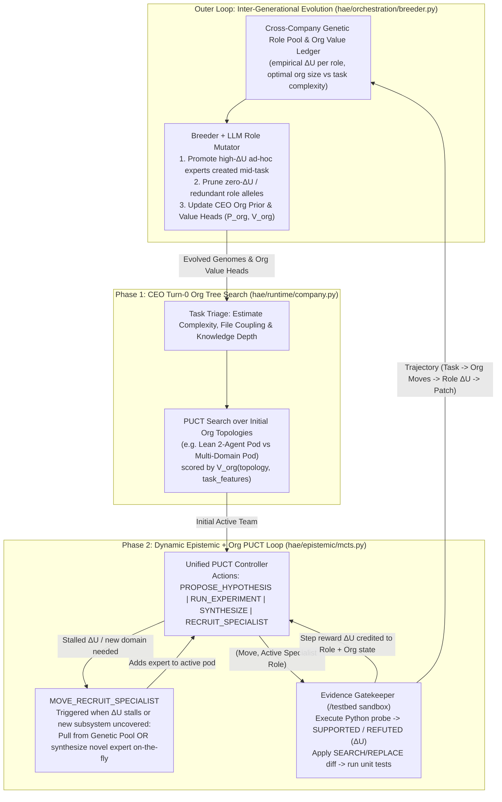

# Roadmap (`V8`): Dynamic Organizational MCTS, Live Role Expansion & `SWE-bench Verified`

## Executive Summary
Instead of treating a company's org chart (`departments`) as a fixed input per generation, **`V8` treats organizational structure itself as a dynamic search state**:
1. **No Pre-Fixed Org Chart:** A company genome no longer hardcodes a fixed tree of 30–90 agents. Instead, a genome carries a **CEO Meta-Architect Policy**, a **Genetic Library of Specialist Roles**, and learned **Org Prior / Value Heads** ($P_{\text{org}}, V_{\text{org}}$).
2. **Turn-0 CEO Organizational Tree Search:** Given a task (`problem_statement` + repo graph), the CEO evaluates task complexity, subsystem coupling, and domain depth via PUCT over candidate org structures to instantiate the smallest capable initial team (e.g., 2 specialists for a localized bug vs. a multi-pod team for cross-cutting architectural issues).
3. **Dynamic Mid-Execution Expansion (`MOVE_RECRUIT_SPECIALIST`):** The organization is **not fixed at Turn 0**. Recruiting a new domain specialist or spawning a sub-pod is a **first-class PUCT move inside `EpistemicSearchLoop`** (`hae/epistemic/mcts.py`). When existing specialists hit repeated `REFUTED` probes ($\Delta U \approx 0$) or uncover an unfamiliar subsystem dependency, PUCT selects `MOVE_RECRUIT_SPECIALIST` to dynamically expand the active team mid-run.
4. **Cross-Company Evolutionary Distillation:** After every task, the trajectory of *(task complexity $\rightarrow$ initial org $\rightarrow$ mid-run expansions $\rightarrow$ per-role $\Delta U$ & resolution)* updates the cross-company Role Pool and Org Value Function for the next generation on **`SWE-bench`** (`Kimi K3` backend).

---

## Architecture Overview



---

## Dimension 1: Dynamic Organizational MCTS & Mid-Execution Role Expansion

### 1.1 Replace Static `departments` with Dynamic `OrgState` (`hae/genome/schema.py`)
1. Replace the static `departments: List[DepartmentGenome]` org chart with:
   - `ceo_policy: CEOPolicyGene` (controls org sizing penalty $\lambda_{\text{headcount}}$, expansion stall threshold, temperature).
   - `role_library: List[RoleAllele]` (deduplicated specialist definitions inherited/mutated across generations, tagged with `role_id`, `domain_tags`, `historical_mean_delta_u`, `support_rate`, `cost_per_move`).
2. During execution, `OrgState` tracks the **live active team** at step $t$:
   - `active_roles: List[RoleAllele]` (starts at size $2\text{--}4$ at Turn 0; can dynamically expand up to `max_active_roles` mid-task).
   - Per-role online statistics within the run: `visits[r]`, `cumulative_delta_u[r]`, `consecutive_stalls`.

### 1.2 Turn-0 CEO Organizational Tree Search (`hae/runtime/company.py`)
1. Before entering code repair, `CEO.search_initial_organization(problem_statement, repo_map)` scores candidate initial team compositions $O_0 \subset \text{role\_library}$ using a lightweight PUCT search over `(task_complexity, domain_depth, candidate_roles)`:
   $$V_{\text{org}}(O_0 \mid \text{task}) = \sum_{r \in O_0} \hat{Q}(r \mid \text{task\_domain}) - \lambda_{\text{headcount}} \cdot |O_0|$$
2. Simple, single-file bugs naturally select a **2-role pod** (1 probe specialist + 1 diff synthesizer); complex cross-module issues start with **3–4 complementary domain specialists**.

### 1.3 Mid-Execution Dynamic Expansion (`MOVE_RECRUIT_SPECIALIST` in `hae/epistemic/mcts.py`)
1. Add `MOVE_RECRUIT_SPECIALIST = "RECRUIT_SPECIALIST"` to `hae/epistemic/moves.py` and the main PUCT loop in `hae/epistemic/mcts.py`.
2. **Prior Boost on Epistemic Stall / Domain Shift:**
   - Track `stall_counter` (consecutive moves with $\Delta U < 0.05$) and `unmatched_modules` (files surfaced in tracebacks/imports whose domain tags are uncovered by `active_roles`).
   - Compute dynamic expansion prior:
     $$P(\text{RECRUIT\_SPECIALIST} \mid E_t) = \sigma\bigl(w_1 \cdot \text{stall\_counter} + w_2 \cdot |\text{unmatched\_modules}| - w_3 \cdot |\text{active\_roles}|\bigr)$$
3. **Execution of `MOVE_RECRUIT_SPECIALIST`:**
   - The CEO inspects `EpistemicState` (`ruled_out` claims + active failure tracebacks) and either:
     1. Pulls the highest-scoring matching specialist from `role_library`, **or**
     2. Synthesizes a brand-new domain expert `RoleAllele` on the fly (e.g., `"SymPy Matrix Eigenvalue Invariant Specialist"` or `"Django QuerySet Alias Compiler Debugger"`).
   - The newly recruited expert is immediately appended to `active_roles` with an optimistic exploration prior so PUCT routes the very next `PROPOSE_HYPOTHESIS` / `SYNTHESIZE` move to the new expert.
   - **Credit Assignment:** Any subsequent $\Delta U > 0$ or module test pass achieved by the recruited expert is credited to both the expert's `role_id` and the CEO's expansion decision!

### 1.4 Cross-Company Evolutionary Distillation (`hae/orchestration/breeder.py`, `hae/genome/mutator.py`)
At generation boundary $G \rightarrow G+1$:
1. **Promote Dynamic Mid-Run Discoveries:** Any expert dynamically synthesized mid-task that achieved verified `SUPPORTED` probes ($\Delta U > 0.20$) or resolved a task is promoted into the persistent cross-company `role_library`.
2. **Prune Dead Roles:** Any role in `role_library` that is never selected or produces net zero $\Delta U$ across tasks is pruned.
3. **Train / Update Org Value & Mutate Roles:** Aggregate `(task_features, initial_org, mid_run_expansions, net_delta_u, resolved)` across **all companies** to update `V_org` weights and guide LLM allelic mutation of role descriptions.

---

## Dimension 2: Switching from Self-Hosting to `SWE-bench Verified` (`Kimi K3`)

### 2.1 Three Repository Adapter Changes
1. **External Repo Sandbox Staging (`hae/epistemic/gatekeeper.py:220–247`):**
   - Parameterize `EvidenceGatekeeper` with `repo_root="/testbed"` and `python_executable="/opt/miniconda3/envs/testbed/bin/python"`.
   - Overlay candidate workspace edits onto `/testbed` without copying `("hae", "pyproject.toml")`.
2. **Turn-0 Issue Seeding Without Oracle Tracebacks (`hae/runtime/company.py`):**
   - Seed `EpistemicState` at Turn 0 directly from the GitHub `problem_statement` (`uncertainty = 1.0`). Require hypothesis probes to reproduce the bug (`SUPPORTED`) before unlocking code edits.
3. **Structured Diff Synthesis & Patch Export (`hae/runtime/company.py`, `hae/epistemic/moves.py`):**
   - Apply anchored `REPAIR_PLAN` / `SEARCH-REPLACE` diffs (`ProposeCodeDiff`) against `/testbed` rather than full-file overwrites.
   - Export `git -C /testbed diff` at termination in upstream `swebench` format:
     ```json
     {"instance_id": "<id>", "model_name_or_path": "hae-v8-kimi-k3", "model_patch": "<git diff>"}
     ```

### 2.2 Clean Evolution vs. Evaluation Split (Zero Data Leakage)
- **Evolution Split (Dev Set):** Run multi-generation evolution (CEO org search + dynamic expansion + cross-company role distillation) on a **50-task dev slice from `SWE-bench dev / Lite`** (strictly disjoint from `SWE-bench Verified`).
- **Held-Out Official Benchmark (`SWE-bench Verified`, 500 tasks):** Freeze the evolved champion (`Kimi K3` backend) and run once on all 500 `SWE-bench Verified` tasks, graded via untouched `python -m swebench.harness.run_evaluation` against Moonshot AI's published `Kimi K3` baseline.

---

## Implementation Sequence for Executing Agent

| Phase | Target Files | Deliverable & Verification |
| :--- | :--- | :--- |
| **Phase 1: Dynamic `OrgState` & CEO Turn-0 Search** | `hae/genome/schema.py`, `hae/runtime/company.py` | Replace static `departments` routing with `RoleAllele` library, `OrgState`, and CEO Turn-0 PUCT org sizing (`search_initial_organization`). |
| **Phase 2: Mid-Run `MOVE_RECRUIT_SPECIALIST` & Role PUCT** | `hae/epistemic/moves.py`, `hae/epistemic/mcts.py`, `hae/orchestration/breeder.py`, `hae/genome/mutator.py` | Add `MOVE_RECRUIT_SPECIALIST` triggered on $\Delta U$ stall / domain shift, online per-role PUCT routing, and cross-company mid-run role promotion/mutation in `Breeder.breed()`. |
| **Phase 3: External `SWE-bench` Adapters** | `hae/epistemic/gatekeeper.py`, `hae/runtime/company.py`, `hae/epistemic/moves.py` | Support `/testbed` + container Python staging, Turn-0 issue seeding, and `git diff` export. Smoke test on 3 local `SWE-bench` containers. |
| **Phase 4: Evolve on Dev Slice $\rightarrow$ Eval on Verified** | Cluster runner + `swebench.harness.run_evaluation` | Evolve 3–5 generations on 50 disjoint dev tasks (`Kimi K3`), verify dynamic mid-task role creation/promotion in logs, then evaluate frozen champion on all 500 `SWE-bench Verified` tasks. |
