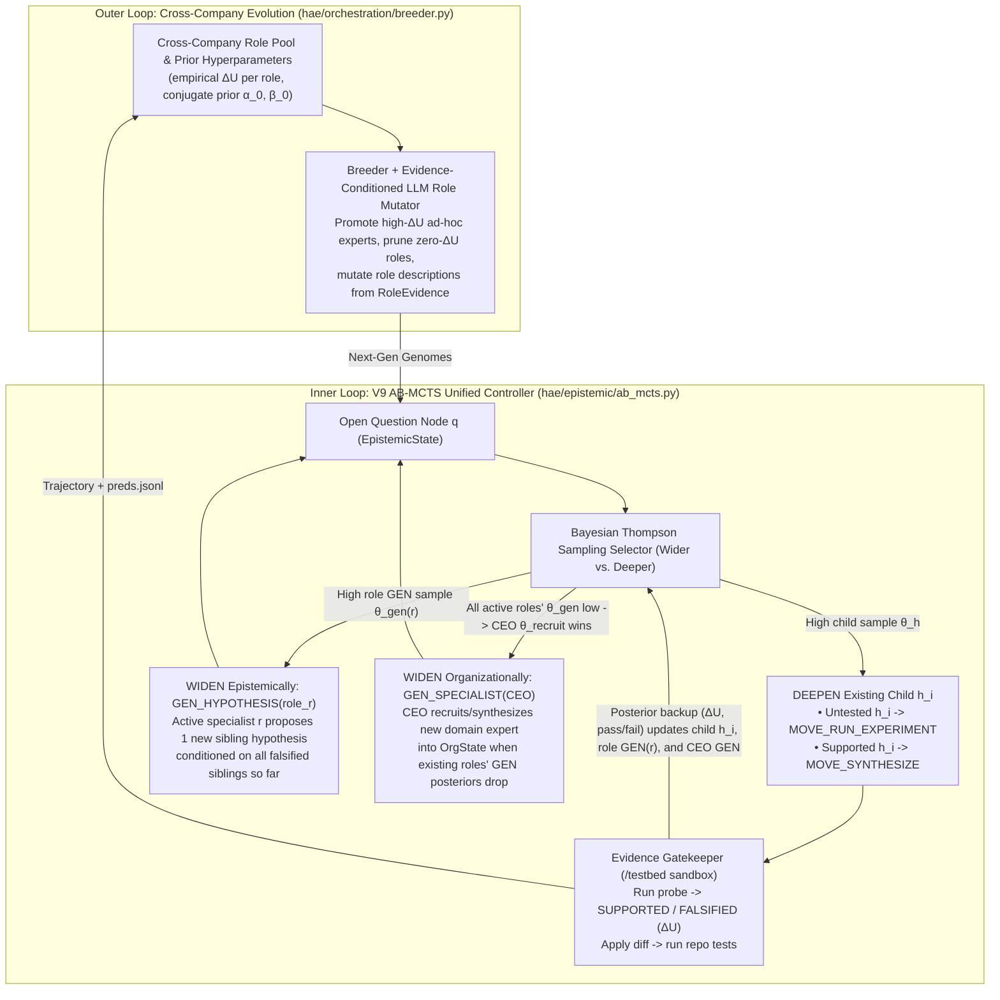

# Multi-Generation Roadmap (`V8` $\rightarrow$ `V9` $\rightarrow$ `V10`): Dynamic Org Evolution, AB-MCTS & `SWE-bench Verified`

## Milestone Progression Summary

| Milestone | Scope | Primary Goal |
| :--- | :--- | :--- |
| **`V8` *(Code Merged — Ready to Run)*** | Dynamic `OrgState`, Turn-0 CEO Org Search, `MOVE_RECRUIT_SPECIALIST`, Evidence-Conditioned LLM Role Mutation & `SWE-bench` Container Harness | Run `V8` across 3–5 generations on the **50-task `SWE-bench` dev slice** (`Kimi K3`) to establish the baseline `% Resolved`, log empirical role `ΔU` distributions, and measure fixed-width search bottlenecks (`STOP_EXHAUSTED` vs. over-branching). |
| **`V9` *(Next Implementation Target)*** | **Adaptive Branching MCTS (`AB-MCTS`)** replacing fixed-width PUCT (`_choose_action`) + coin-flip recruitment (`_maybe_recruit`) | Unify epistemic branching (`GEN_HYPOTHESIS`), organizational branching (`GEN_SPECIALIST`), and deep refinement (`EXPERIMENT` / `SYNTHESIZE`) under a single `GEN`-node Thompson Sampling controller ([Sakana AI, arXiv:2503.04412](https://arxiv.org/abs/2503.04412)). Validate head-to-head against `V8` on the 50-task dev slice. |
| **`V10` *(Final Held-Out Evaluation)*** | Full Official **`SWE-bench Verified` (500 tasks)** Evaluation | Freeze the winning `V9` champion genome (`Kimi K3` backend) and evaluate once on all 500 `SWE-bench Verified` tasks via untouched `swebench.harness.run_evaluation` against Moonshot AI's published `Kimi K3` baseline. |

---

## Why `V9` Moves to Adaptive Branching MCTS (`AB-MCTS`)

### Reference Paper
- **Title:** *"Wider or Deeper? Scaling LLM Inference-Time Compute with Adaptive Branching Tree Search"* (Inoue et al., Sakana AI, NeurIPS 2025)
- **Paper Link:** [https://arxiv.org/abs/2503.04412](https://arxiv.org/abs/2503.04412)

### The Structural Limitation in `V8`'s Current Search Loop (`hae/epistemic/mcts.py`)
In standard MCTS / AlphaZero PUCT, the action space at every state is finite and pre-enumerated. In LLM software engineering (`HAE`), the action space is **unbounded**: at any open `Question` node $q$, an agent can either **go deeper** (run an experiment on an existing hypothesis or synthesize/refine a patch) or **go wider** (propose a brand-new hypothesis or recruit a new specialist persona).

Because standard PUCT cannot naturally compare an unexpanded sibling against existing children, `hae/epistemic/mcts.py` currently relies on brittle hardcoded rules:
1. **Fixed Branching Width (`branching_k = 3`, `max_hypothesis_rounds = 2`):**
   - **Wastes compute on easy bugs:** If Hypothesis $h_1$ is immediately verified (`ΔU = 0.65`), `V8` still paid to generate $k=3$ upfront hypotheses and enforces `min_hypotheses_before_synthesis`.
   - **Prematurely quits on hard bugs:** If the first two rounds ($2 \times 3 = 6$ hypotheses) are all falsified on a subtle multi-module issue, `V8` hits `max_hypothesis_rounds` and aborts with `STOP_EXHAUSTED` even with moves remaining.
2. **Hardcoded Priority Waterfall (`_choose_action`, `mcts.py:420–435`):**
   - `synthesize` $\succ$ `experiment` $\succ$ `propose` is a deterministic `if / elif` ladder. Even if remaining untested siblings look weak after seeing earlier siblings fail, the loop is forced to test every leftover sibling before it is allowed to generate a better hypothesis.
3. **Disconnected Coin-Flip Org Expansion (`_maybe_recruit`, `mcts.py:296`):**
   - `MOVE_RECRUIT_SPECIALIST` sits *outside* the tree search using a manual heuristic coin flip (`rng.random() < org_state.recruit_prior()`) governed by 6 separate tuning knobs (`stall_moves`, `recruit_w_stall`, `recruit_w_unmatched`, `recruit_w_headcount`, `recruit_bias`, `recruit_cooldown_moves`).

### How `AB-MCTS` Solves All Three Problems Simultaneously
**AB-MCTS** ([arXiv:2503.04412](https://arxiv.org/abs/2503.04412)) introduces an explicit virtual **`GEN` node** alongside existing child branches at every node in the tree, using **Thompson Sampling over Bayesian conjugate posteriors** to decide at every single step whether to **widen** (sample a new branch via `GEN`) or **deepen** (exploit/refine an existing child branch):

1. **Dynamic Width Per Bug (`Width = 1` on Easy Tasks, `Width = 8+` on Hard Tasks):**
   - When the first hypothesis $h_1$ yields high reward ($\Delta U \gg 0$), its posterior shifts upward immediately; Thompson Sampling draws from $h_1$ (`EXPERIMENT` $\rightarrow$ `SYNTHESIZE`) with **effective width $= 1$**, saving 50–65% of moves on straightforward bugs.
   - When existing children are `FALSIFIED` ($\Delta U \approx 0$), their child posteriors drop below the `GEN` prior — automatically triggering additional sibling hypotheses conditioned on the exact falsified claims, with zero arbitrary `max_hypothesis_rounds` cap.
2. **Unified Multi-Specialist / Multi-Role Selection (`AB-MCTS-A` Node Aggregation):**
   - Instead of one `GEN` node, each active specialist role $r \in \text{OrgState.active\_roles}$ has its own **Epistemic `GEN` arm** (`GEN_HYPOTHESIS(r)`), and the **CEO** has an **Organizational `GEN` arm** (`GEN_SPECIALIST(CEO)`).
   - When existing active roles repeatedly produce low-$\Delta U$ hypotheses on a question, the posteriors of all current `GEN_HYPOTHESIS(r)` arms drop below `GEN_SPECIALIST(CEO)`'s prior — **causing Thompson Sampling itself to select `MOVE_RECRUIT_SPECIALIST` as part of the exact same mathematical tree policy!**

---

## Architecture Overview (`V9` Unified AB-MCTS + Dynamic Org)

---

## Agent Implementation Specification for `V9` (`AB-MCTS`)

Share the specification below directly with your executing agent after collecting the `V8` 50-task dev slice baseline:

### 1. New Module: `hae/epistemic/ab_mcts.py`
Implement an `AdaptiveBranchingController` supporting **AB-MCTS-A (Node Aggregation with Conjugate Beta/Gaussian Posteriors)**:

1. **Action Arms at Question Node $q$:**
   At each step on frontier question $q$, construct the candidate arm set $\mathcal{A}(q)$:
   - **Deepen — Untested Hypothesis Arm (`arm = ("experiment", h_i)`):** for each $h_i \in \text{untested}(q)$.
     - Initialize conjugate Beta parameters from the calibrated prior:
       $$\alpha_{h_i} = 1 + \tau \cdot P(h_i), \quad \beta_{h_i} = 1 + \tau \cdot (1 - P(h_i))$$
   - **Deepen — Supported Hypothesis Synthesis Arm (`arm = ("synthesize", h_j)`):** for each $h_j \in \text{supported\_unpatched}(q)$ with `synthesis_failures < MAX_SYNTHESIS_FAILURES`.
     - Initialize from posterior $P_{\text{post}}(h_j)$ and update with each synthesis attempt's verification outcome.
   - **Widen Epistemically — Role Proposal Arm (`arm = ("gen_hypothesis", r)`):** one `GEN` arm for each probe-capable specialist $r \in \text{org\_state.active\_roles}$.
     - Maintains a aggregated Beta posterior $(\alpha_{\text{gen}, r}, \beta_{\text{gen}, r})$ initialized from $r$'s historical `support_rate` / `optimistic_prior`.
     - **Single-Hypothesis Incremental Generation (`k = 1` per `GEN` draw):** Unlike `V8` (which generated $k=3$ hypotheses blind upfront), each `GEN_HYPOTHESIS(r)` draw generates **1 new hypothesis** seeing all previously `FALSIFIED` claims and probe outputs on $q$!
     - Whenever a hypothesis proposed by role $r$ is tested by `EvidenceGatekeeper` with normalized reward $y \in [0, 1]$ ($y = \min(1.0, \Delta U + 0.5 \cdot \mathbb{I}[\text{SUPPORTED}])$), update role $r$'s `GEN` posterior:
       $$\alpha_{\text{gen}, r} \leftarrow \alpha_{\text{gen}, r} + y, \quad \beta_{\text{gen}, r} \leftarrow \beta_{\text{gen}, r} + (1 - y)$$
   - **Widen Organizationally — CEO Specialist Recruitment Arm (`arm = ("gen_specialist", "ceo")`):** enabled when `org_state.can_recruit(move_index)` is True.
     - Initialized with prior $(\alpha_{\text{ceo}}, \beta_{\text{ceo}})$ boosted by uncovered module count (`len(org_state.unmatched_modules)`).
     - Automatically wins Thompson Sampling when existing specialists' `GEN_HYPOTHESIS(r)` posteriors decay due to falsified/refused probes ($\alpha_{\text{gen}, r} / (\alpha_{\text{gen}, r} + \beta_{\text{gen}, r})$ drops below the CEO `GEN` prior) — eliminating `_maybe_recruit`'s ad-hoc coin flip.

2. **Thompson Sampling Step Selection (`select_arm(q, rng)`):**
   - For every candidate arm $a \in \mathcal{A}(q)$, draw $\theta_a \sim \text{Beta}(\alpha_a, \beta_a)$ using `self.rng.betavariate(alpha_a, beta_a)`.
   - Return $\arg\max_{a \in \mathcal{A}(q)} \theta_a$.

### 2. Schema & Backward-Compatibility Gate (`hae/genome/schema.py`, `hae/epistemic/mcts.py`)
1. Add `search_algorithm: str = "puct"` (`"puct" | "ab_mcts"`) and `ab_prior_strength: float = 4.0` to `EpistemicPolicyGene` in `hae/genome/schema.py`.
2. **Strict Backward Compatibility Invariant:** When `policy.search_algorithm == "puct"` (the default for all `V5–V8` configs), `EpistemicSearchLoop` must execute the exact existing `V8` code path with zero behavioral or RNG drift.
3. When `policy.search_algorithm == "ab_mcts"`, `EpistemicSearchLoop.run()` delegates step selection (`propose` vs `experiment` vs `synthesize` vs `recruit_specialist`) directly to `AdaptiveBranchingController`.

### 3. Required Unit & Integration Tests (`tests/test_ab_mcts.py`)
1. **Easy-Bug Fast Path Test (`Width = 1`):** Verify that when the first hypothesis proposed by `GEN_HYPOTHESIS` receives high prior and passes `RUN_EXPERIMENT` (`SUPPORTED`), AB-MCTS immediately selects `SYNTHESIZE` in **3 total moves** (`GEN_HYPOTHESIS` $\rightarrow$ `RUN_EXPERIMENT` $\rightarrow$ `SYNTHESIZE`) without wasting moves generating extra hypotheses.
2. **Hard-Bug Adaptive Widening Test (`Width > 6`):** Verify that when the first 4 hypotheses are `FALSIFIED`, child posteriors drop below `GEN_HYPOTHESIS`, causing AB-MCTS to dynamically generate 5th/6th hypotheses conditioned on the falsified claims without hitting an artificial `max_hypothesis_rounds = 2` wall.
3. **Automatic Org Recruitment on Specialist Decay:** Verify that when active specialist $r_1$'s proposed hypotheses repeatedly fail ($\beta_{\text{gen}, r_1}$ grows), `GEN_SPECIALIST(CEO)` overtakes `GEN_HYPOTHESIS(r_1)` under Thompson Sampling and recruits specialist $r_2$, whose higher-prior `GEN` arm then takes over proposal generation.
4. **`V8` Byte-Identity Test:** Verify `policy.search_algorithm = "puct"` produces identical move logs and RNG draws to `V8`.
