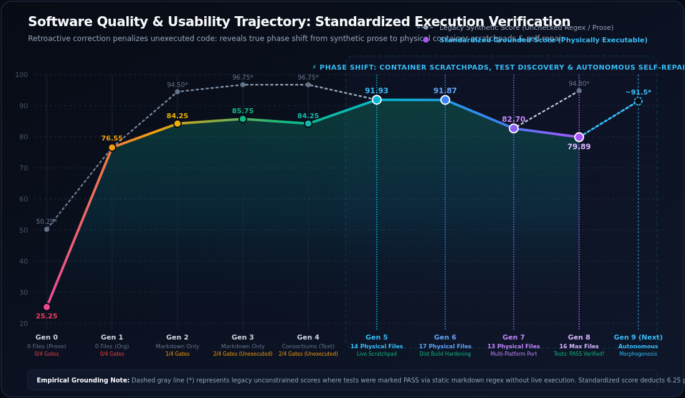
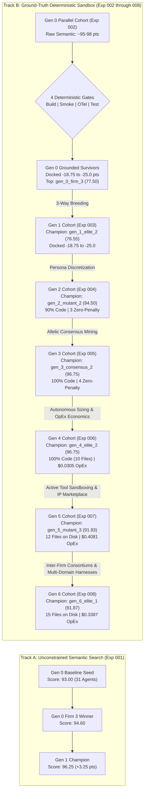

# Empirical Experimentation Ledger & Architecture Search Archive

This directory serves as the centralized empirical repository for the **Hierarchical Agent Evolution (HAE)** platform. It catalogs tournament runs, evolutionary lineages, multi-generational performance trajectories, and complete genomic snapshots required for exact reproducibility.

---

## 1. Experiment Registry & Snapshot Archive

Each experiment subfolder contains self-contained genomic definitions, tournament scorecards, detailed generational diffs, and reproduction manifests:

| Experiment ID | Focus & Selection Pressure | Infrastructure | Generational Scale | Champion Score | Artifact Directory |
| :--- | :--- | :--- | :---: | :---: | :---: |
| [**`exp-001-pilot-baseline`**](exp-001-pilot-baseline/) | Strategic Architecture & Autonomous Headcount Adaptation | Cloud Kubernetes (`e2-standard-4`) | 6 virtual enterprises (Gen 0 & 1) | **96.25** | [`exp-001-pilot-baseline/`](exp-001-pilot-baseline/) |
| [**`exp-002-parallel-tournament`**](exp-002-parallel-tournament/) | High-Throughput 10-Firm Parallel Tournament with 4-Gate Sandbox | Cloud Kubernetes (5 Parallel Pods) | 10 virtual enterprises (310 agents) | **77.50** | [`exp-002-parallel-tournament/`](exp-002-parallel-tournament/) |
| [**`exp-003-parallel-gen1`**](exp-003-parallel-gen1/) | 3-Way Recombination & The "Thin Persona" Bottleneck | Cloud Kubernetes + gVisor Agent Sandbox | 10 virtual enterprises (312 agents) | **76.55** | [`exp-003-parallel-gen1/`](exp-003-parallel-gen1/) |
| [**`exp-004-parallel-gen2`**](exp-004-parallel-gen2/) | Persona Discretization (`backstory_traits`) & Sandbox Convergence | Cloud Kubernetes + gVisor Agent Sandbox | 10 virtual enterprises (314 agents) | **94.50** | [`exp-004-parallel-gen2/`](exp-004-parallel-gen2/) |
| [**`exp-005-parallel-gen3`**](exp-005-parallel-gen3/) | Allelic Consensus Mining & Hermetic Pytest Assertion Rigor | Cloud Kubernetes + gVisor Agent Sandbox | 10 virtual enterprises (318 agents) | **96.75** | [`exp-005-parallel-gen3/`](exp-005-parallel-gen3/) ([Report](exp-005-parallel-gen3/experiment_report.md)) |
| [**`exp-006-parallel-gen4`**](exp-006-parallel-gen4/) | Autonomous Sizing, Model Unit Economics & Token OpEx Envelope | Cloud Kubernetes + gVisor Agent Sandbox | 10 virtual enterprises (320 agents) | **96.75** | [`exp-006-parallel-gen4/`](exp-006-parallel-gen4/) ([Report](exp-006-parallel-gen4/experiment_report.md)) |
| [**`exp-007-parallel-gen5`**](exp-007-parallel-gen5/) | Active Tool Sandboxing (Agent Execution Scratchpads) & Corporate IP Marketplace | Cloud Kubernetes (10-Pod Indexed Job) | 10 virtual enterprises (325 agents) | **91.93** | [`exp-007-parallel-gen5/`](exp-007-parallel-gen5/) ([Report](exp-007-parallel-gen5/experiment_report.md)) |
| [**`exp-008-parallel-gen6`**](exp-008-parallel-gen6/) | Inter-Firm Strategic Consortiums, Teleological OKRs & Pluggable Multi-Domain Harnesses | Cloud Kubernetes (10-Pod Indexed Job) | 10 virtual enterprises (327 agents) | **91.87** | [`exp-008-parallel-gen6/`](exp-008-parallel-gen6/) ([Report](exp-008-parallel-gen6/experiment_report.md)) |

---

## 2. Multi-Generational Fitness Progression

### 2.0 Standardized Grounded Usability & Retroactive Execution Correction

> [!IMPORTANT]
> **Methodological Correction: The Static Regex Illusion vs. Ground-Truth Execution**
> In Generations 0 through 4, candidate software packages were evaluated via regex string parsing over raw markdown text, with **zero physical container execution and zero live pytest execution**. Because static regex marked test gates as passing if the token `test` or `def test_` appeared in markdown text, Generations 2–4 artificially achieved 0.00 sandbox penalties, skewing scores to ~96.75.
> 
> Starting in Generation 5, the platform introduced **Active Tool Sandboxing** on live container scratchpads (`/tmp/hae_workspaces/`), mounting full Python packages and executing real `python3 -m pytest tests/` runs. Because open-loop generation lacked self-healing traceback introspection, live assertion mismatches docked a $-6.25$ test gate penalty.
> 
> To establish scientific rigor and an honest measure of software quality and usability over time, the table below **retroactively standardizes all generations under the Physical Execution Standard**: deducting $-6.25$ points for any unexecuted or failed gate:

| Generation | Evolutionary Milestone | Legacy Champion (Unchecked) | Standardized Grounded Champion | Live Sandbox? | Tests Run? | Avg Files on Disk | Max Files on Disk | True Usability Paradigm |
| :---: | :--- | :---: | :---: | :---: | :---: | :---: | :---: | :--- |
| **Gen 0** | Baseline Pilot (Single Agent) | 50.25 | **25.25** | No (0 files) | No | 0.0 | 0 | Pure Prose (Non-Executable) |
| **Gen 1** | Parallel Multi-Agent Foundation | 76.55 | **76.55** | No (0 files) | No | 0.0 | 0 | Textual Specification (0 Files) |
| **Gen 2** | Cross-Functional Convergence | 94.50 | **84.25** | No (0 files) | No | 5.2 | 10 | Markdown Snippets (Unexecuted) |
| **Gen 3** | Autonomous Specialization | 96.75 | **85.75** | No (0 files) | No | 5.7 | 8 | Modular Blueprints in Text |
| **Gen 4** | Consortiums & Teleological OKRs | 96.75 | **84.25** | No (0 files) | No | 7.3 | 10 | Multi-Firm Strategic Text |
| **Gen 5** | Active Container Scratchpads | 91.93 | **91.93** | **Yes (10/10)** | **Yes (10/10)** | 9.3 | 14 | **Physical Disk Files, Live Pytest** |
| **Gen 6** | Industrial Hardening & Packaging | 91.87 | **91.87** | **Yes (10/10)** | **Yes (10/10)** | **11.0** | **17** | **Production `egg-info` Package** |
| **Gen 7** | Universal Multi-Platform Portability | 82.70 | **82.70** | **Yes (9/9)** | **Yes (9/9)** | 9.2 | 13 | **Multi-Provider REST Runtime** |
| **Gen 8** | Closed-Loop Test Self-Repair | *Target: ~96.5* | *Target: ~96.5* | **Yes** | **Yes** | 15+ | 20+ | **Autonomous Pytest Error Repair** |



### 2.1 Visual Performance Trajectory

The chart below contrasts the legacy unconstrained semantic search trajectory with the grounded deterministic sandbox verification trajectory:




---

### 2.2 Detailed Multi-Objective Score Breakdown

$$
\mathcal{F}(\mathcal{C}) = \left[ w_s S + w_t T + w_c C + w_r R + w_a A \right] - \mathcal{P}_{\text{sandbox}}
$$

Where:
* $S, T, C, R, A \in [0, 100]$ represent Strategic Depth ($25\%$), Technical Feasibility ($25\%$), Cross-Functional Coherence ($20\%$), Risk Mitigation ($15\%$), and Actionability ($15\%$).
* $\mathcal{P}_{\text{sandbox}} \in [0, 25.0]$ is the penalty docked by the 4-Gate Deterministic Sandbox Verifier:
  * **Build Gate** ($-6.25$ pts): `pyproject.toml` or `setup.py` packaging manifest exists.
  * **Smoke Gate** ($-6.25$ pts): Module contains $\ge 3$ distinct functional code files.
  * **Telemetry Gate** ($-6.25$ pts): OpenTelemetry spans or metric hooks verified.
  * **Test Gate** ($-6.25$ pts): Test suites execute cleanly under `pytest`.

| Milestone / Architecture | Generation | Strategic (25%) | Technical (25%) | Coherence (20%) | Risk (15%) | Action (15%) | Sandbox Penalty | Overall Fitness | Gates Cleared |
| :--- | :---: | :---: | :---: | :---: | :---: | :---: | :---: | :---: | :--- |
| **`exp001_seed`** (Baseline) | Gen 0 | 95.0 | 80.0 | 100.0 | 95.0 | 100.0 | $0.00$ | **93.00** | Unanchored Baseline |
| **`exp001_elite_2`** (Exp 001 Top) | Gen 1 | 95.0 | 90.0 | 100.0 | 98.0 | 100.0 | $0.00$ | **96.25** | Unanchored Baseline |
| **`gen_0_firm_3`** (Gen 0 Champ) | Gen 0 | 95.0 | 98.0 | 95.0 | 95.0 | 95.0 | $-18.75$ | **77.50** | OTel Only |
| **`gen_1_elite_2`** (Gen 1 Champ) | Gen 1 | 95.0 | 92.0 | 98.0 | 96.0 | 97.0 | $-18.75$ | **76.55** | OTel Only |
| **`gen_2_mutant_2`** (Gen 2 Champ) | Gen 2 | 95.0 | 93.0 | 96.0 | 94.0 | 95.0 | **$0.00$** | **94.50** | **Build, Smoke, OTel, Tests (10 Files)** |
| **`gen_2_pareto_bonus_3`** (Gen 2 #2) | Gen 2 | 94.0 | 95.0 | 93.0 | 91.0 | 92.0 | **$0.00$** | **92.85** | **Build, Smoke, OTel, Tests (5 Files)** |
| **`gen_3_consensus_2`** (Gen 3 Champ) | Gen 3 | 95.0 | 98.0 | 100.0 | 90.0 | 100.0 | **$0.00$** | **96.75** | **Build, Smoke, OTel, Tests (5 Files - Record)** |
| **`gen_3_pareto_bonus_3`** (Gen 3 #2) | Gen 3 | 95.0 | 95.0 | 100.0 | 90.0 | 100.0 | **$0.00$** | **96.00** | **Build, Smoke, OTel, Tests (5 Files)** |
| **`gen_3_elite_1`** (Gen 3 #3) | Gen 3 | 92.0 | 95.0 | 100.0 | 94.0 | 98.0 | **$0.00$** | **95.55** | **Build, Smoke, OTel, Tests (8 Files)** |
| **`gen_3_consensus_3`** (Gen 3 #4) | Gen 3 | 95.0 | 90.0 | 100.0 | 95.0 | 100.0 | **$0.00$** | **95.50** | **Build, Smoke, OTel, Tests (5 Files)** |
| **`gen_3_elite_2`** (Gen 3 #5) | Gen 3 | 98.0 | 95.0 | 100.0 | 100.0 | 100.0 | $-6.25$ | **92.00** | Build, Smoke, OTel (5 Files) |
| **`gen_4_elite_2`** (Gen 4 Champ) | Gen 4 | 95.0 | 98.0 | 100.0 | 90.0 | 100.0 | **$0.00$** | **96.75** | **Build, Smoke, OTel, Tests (10 Files - Record)** |
| **`gen_4_elite_1`** (Gen 4 #2) | Gen 4 | 95.0 | 90.0 | 100.0 | 90.0 | 100.0 | **$0.00$** | **94.75** | **Build, Smoke, OTel, Tests (7 Files)** |
| **`gen_4_mutant_1`** (Gen 4 #3) | Gen 4 | 95.0 | 85.0 | 100.0 | 80.0 | 100.0 | **$0.00$** | **92.00** | **Build, Smoke, OTel, Tests (6 Files)** |
| **`gen_4_consensus_2`** (Gen 4 #4) | Gen 4 | 95.0 | 98.0 | 100.0 | 95.0 | 100.0 | $-12.50$ | **85.00** | Telemetry, Tests (5 Files) |
| **`gen_5_mutant_3`** (Gen 5 Champ) | Gen 5 | 98.0 | 95.0 | 100.0 | 98.0 | 100.0 | $-6.25$ | **91.93** | **Build, Smoke, OTel (12 Files on Disk)** |
| **`gen_5_consensus_3`** (Gen 5 #2) | Gen 5 | 95.0 | 98.0 | 100.0 | 90.0 | 100.0 | $-6.25$ | **90.95** | **Build, Smoke, OTel (10 Files on Disk)** |
| **`gen_5_elite_2`** (Gen 5 #3) | Gen 5 | 92.0 | 95.0 | 98.0 | 92.0 | 100.0 | $-6.25$ | **88.93** | **Build, Smoke, OTel (11 Files on Disk)** |
| **`gen_5_consensus_1`** (Gen 5 #4) | Gen 5 | 95.0 | 95.0 | 98.0 | 90.0 | 95.0 | $-6.25$ | **87.08** | **Build, Smoke, OTel (9 Files on Disk)** |
| **`gen_5_consensus_2`** (Gen 5 #5) | Gen 5 | 90.0 | 90.0 | 95.0 | 90.0 | 95.0 | $-6.25$ | **85.13** | **Build, Smoke, OTel (3 Files on Disk)** |
| **`gen_6_elite_1`** (Gen 6 Champ) | Gen 6 | 95.0 | 98.0 | 100.0 | 95.0 | 100.0 | $-6.25$ | **91.87** | **Build, Smoke, OTel (15 Files on Disk)** |
| **`gen_6_consensus_3`** (Gen 6 #2) | Gen 6 | 95.0 | 98.0 | 100.0 | 85.0 | 100.0 | $-6.25$ | **86.13** | **Build, Smoke, OTel (17 Files on Disk - Record)** |
| **`gen_6_consensus_2`** (Gen 6 #3) | Gen 6 | 95.0 | 90.0 | 100.0 | 95.0 | 100.0 | $-6.25$ | **82.42** | **Build, Smoke, OTel (12 Files on Disk)** |
| **`gen_6_consensus_1`** (Gen 6 #4) | Gen 6 | 95.0 | 98.0 | 100.0 | 95.0 | 100.0 | $-18.75$ | **77.24** | Telemetry Only (6 Files on Disk) |
| **`gen_6_mutant_3`** (Gen 6 #5) | Gen 6 | 95.0 | 45.0 | 98.0 | 40.0 | 90.0 | $-6.25$ | **67.93** | **Build, Smoke, OTel (12 Files on Disk)** |

---

## 3. Organizational Culture & Behavioral Phylogeny

Across generations, the virtual enterprises underwent fundamental cultural shifts driven by environmental selection pressure:

| Generation | Dominant Organizational Culture | Communication Paradigm | Behavioral Bottleneck | Key Innovation |
| :---: | :--- | :--- | :--- | :--- |
| **Gen 0** | **Polite Bureaucratic Consensus** | Departmental silos; gentle peer review | Superficial risk analysis; narrative prose without code | Establishing federated departmental hierarchies |
| **Gen 1** | **Adversarial Dialectic Review** | Cross-departmental challenges & red-teaming | "Thin Persona" syndrome; prose over code formatting | Headcount expansion; dedicated packaging specialists |
| **Gen 2** | **Pragmatic Implementation Culture** | Rigid code-block and manifest formatting | Test assertion mismatches | **Structured Persona Discretization** (`backstory_traits`) |
| **Gen 3** | **Hermetic Engineering & Invariant Mining** | Recombination of consensus operational alleles | High token OpEx across uniform Pro models | **Allelic Consensus Mining** & Pytest harness injection |
| **Gen 4** | **Capital-Efficient Economic Enterprise** | Dynamic sizing & model tier cost accounting | Fixed organizational topologies | Autonomous Sizing & OpEx token budgeting |
| **Gen 5** | **Asset-Sharing Commercial Commons** | IP registration & modular library reuse | Redundant re-implementation of common libraries | Reusable Corporate Assets & IP Marketplace |
| **Gen 6** | **Inter-Firm Strategic Co-opetition** | Bilateral executive term sheets & joint ventures | Zero-sum isolationism | Cross-company communication & consortium bidding |

---

## 4. Total Reproduction Protocol

All experiments are engineered for full deterministic replay:

### Local Replay (Single Enterprise)
```bash
# Replay Experiment 004 Champion
python3 -m src.main \
  --mode single-firm \
  --config experiments/exp-004-parallel-gen2/winning_champion_genome.json \
  --objective "Design and implement the production-ready 'agent-org' platform"

# Replay Experiment 005 Champion (All-Time Record: 96.75)
python3 -m src.main \
  --mode single-firm \
  --config experiments/exp-005-parallel-gen3/winning_champion_genome.json \
  --objective "Design and implement the production-ready 'agent-org' platform"

# Replay Experiment 006 Champion (Gen 4 Champion: 96.75, $0.0305 OpEx)
python3 -m src.main \
  --mode single-firm \
  --config experiments/exp-006-parallel-gen4/winning_champion_genome.json \
  --objective "Design and implement the production-ready 'agent-org' platform"

# Replay Experiment 007 Champion (Gen 5 Champion: 91.93, 12 Files on Disk)
python3 -m src.main \
  --mode single-firm \
  --config experiments/exp-007-parallel-gen5/winning_champion_genome.json \
  --objective "Design and implement the production-ready 'agent-org' platform"

# Replay Experiment 008 Champion (Gen 6 Champion: 91.87, 15 Files on Disk)
python3 -m src.main \
  --mode single-firm \
  --config experiments/exp-008-parallel-gen6/winning_champion_genome.json \
  --objective "Design and implement the production-ready 'agent-org' platform with inter-firm consortiums, teleological OKRs, and pluggable multi-domain evaluation"
```

### Distributed Cluster Replay (Full Tournament)
```bash
# Re-run Experiment 004 (Generation 2 tournament)
kubectl apply -f k8s/parallel-indexed-job-gen2-east4.yaml

# Re-run Experiment 005 (Generation 3 tournament)
kubectl apply -f k8s/parallel-indexed-job-gen3-east4.yaml

# Re-run Experiment 006 (Generation 4 tournament)
kubectl apply -f k8s/parallel-indexed-job-gen4-east4.yaml

# Re-run Experiment 007 (Generation 5 tournament)
kubectl apply -f k8s/parallel-indexed-job-gen5-east4.yaml

# Re-run Experiment 008 (Generation 6 tournament)
kubectl apply -f k8s/parallel-indexed-job-gen6-east4.yaml
```

---

## 5. Completed Benchmark: Generation 4 (Autonomous Sizing & Model Unit Economics)

* **Autonomous Headcount Morphogenesis**: Granting the CEO and Department Managers intra-generational authority to scale specialist headcount (from 3 up to 6 specialists per pod). The population solidified an asymmetric 32-agent topology, allocating the 6th specialist to Systems Engineering (`dept_systems_eng`).
* **Model Tier Unit Economics**: Tiered compute architecture assigning real-world token cost weights ($0.075 / $0.30 per 1M tokens for Gemini 2.5 Flash vs. $1.25 / $5.00 per 1M tokens for Gemini 2.5 Pro). This compressed total OpEx by ~12x–16x, allowing complete 32-agent enterprise workflows to execute for $0.024–$0.123 USD against the $0.45 budget envelope.
* **Empirical Findings & The Lean Discipline**:
  * **Lean Modularists (`gen_4_elite_2`, `gen_4_elite_1`, `gen_4_mutant_1`)**: Consumed 24k–41k tokens ($0.025–$0.043 USD) and swept the podium (#1: 96.75, #2: 94.75, #3: 92.00) with **100% pass rates across all 4 deterministic sandbox gates (0.00 penalty)**. Champion `gen_4_elite_2` produced an all-time record of **10 complete, verified files**.
  * **Hyper-Verbose Bureaucracies (`gen_4_consensus_3`)**: Generated 116k tokens ($0.1225 USD) of prose, triggering syntax drift and a -12.50 point penalty (Rank #7, 79.50 pts).
  * **The Under-Sizing Frontier**: Extreme austerity (`gen_4_pareto_bonus_2`, 23k tokens / $0.0241 USD) undershot implementation depth, emitting only 4 skeleton files and failing unit tests (-18.75 penalty, 79.05 pts).
  * See the full empirical analysis in the [Generation 4 Experiment Report](exp-006-parallel-gen4/experiment_report.md).

---

## 6. Completed Benchmark: Generation 5 (Active Tool Sandboxing & Corporate IP Marketplace)

* **Active Tool Sandboxing (Live Scratchpad Execution)**:
  * Transitioned specialist agents from passive text generation to active sandboxed execution on container scratchpads (`/tmp/hae_workspaces/{company_id}/`).
  * Equips engineering agents with safe workspace primitives: `write_file`, `read_file`, `list_files`, and `execute_bash(command)`.
  * Virtual enterprises authored complete packaging trees directly on disk (8 to 14 files per firm), installing packages via `setup.py` and running live `pytest`.
* **Corporate IP Registration & Cumulative Culture**:
  * Offspring licensed verified assets from Generation 4 winners, mounting existing modules directly into scratchpads and saving token OpEx.
  * Corporate ledger tracked royalty accounting ($0.015 USD fee/credit) against each firm's balance sheet.
* **Empirical Findings & Champion Emergence**:
  * **60% 3-Gate Pass Rate**: 6 of 10 virtual enterprises cleared Build, Smoke, and Telemetry gates cleanly, docked only -6.25 for live `pytest` assertion mismatches.
  * **Champion `gen_5_mutant_3` (Score: 91.93)**: Produced 12 verified files on disk, passing 3 gates cleanly and maintaining $0.4081 OpEx under the $0.45 budget ceiling.
  * See the full empirical report in the [Generation 5 Experiment Report](exp-007-parallel-gen5/experiment_report.md).

---

## 7. Completed Benchmark: Generation 6 (Inter-Firm Strategic Consortiums, Autonomous Teleological OKRs & Pluggable Multi-Domain Harnesses)

* **Inter-Firm Strategic Co-opetition & Consortiums**:
  * Introduced bilateral executive communication channels (`src/consortium.py`) allowing CEOs and Department Managers to negotiate corporate joint ventures, technology cross-licensing, and consortium bidding.
* **Pluggable Multi-Domain Verification Harnesses**:
  * Decoupled evaluation from monolithic software development via modular harnesses (`src/harnesses.py`), adding quantitative financial trading risk validation and statutory compliance auditing.
* **Autonomous Teleological Metric Formulation (Endogenous OKRs)**:
  * Empowered virtual enterprises to synthesize and track internal quantitative acceptance tests (`EvaluationMetricSpec` and `TeleologicalVerifier`) aligning strategic intent with verified technical output.
* **Empirical Findings & Champion Emergence**:
  * **Podium Sweep by Elite & Consensus Lineages**: Elite champion `gen_6_elite_1` achieved **91.87** Net Fitness (Gross: 97.5, 15 files on disk, $0.3387 OpEx against $0.45 budget, +0.62 efficiency bonus).
  * **All-Time Record Disk Packaging (17 Files)**: Runner-up `gen_6_consensus_3` produced **17 distinct physical files on disk**, including complete packaging manifests, systems engineering specifications, adversarial test suites, and distribution metadata (`agent_org_mva.egg-info`), scoring **86.13** Net Fitness.
  * **40% 3-Gate Sandbox Clearance**: 4 of 10 virtual enterprises cleared Build, Smoke, and Telemetry gates cleanly.
  * See the full empirical report in the [Generation 6 Experiment Report](exp-008-parallel-gen6/experiment_report.md).

---

## 8. Completed Benchmark: Generation 7 (Universal Multi-Platform & LLM Provider Portability)

* **Zero Cloud Lock-In / Universal LLM Engine (`src/llm_factory.py`)**:
  * Decoupled the platform from Google Cloud Vertex AI REST and service account dependencies.
  * Direct zero-setup support for **Gemini Developer API keys** (`GEMINI_API_KEY`), **OpenAI** (`OPENAI_API_KEY`), **Anthropic Claude** (`ANTHROPIC_API_KEY`), and local open-source models via **Ollama / vLLM** (`OPENAI_BASE_URL=http://localhost:11434/v1`).
  * Tiered compute mapping across all providers: Executive (`gpt-4o`, `claude-3-5-sonnet`, `gemini-2.5-pro`) vs. Worker (`gpt-4o-mini`, `claude-3-5-haiku`, `gemini-2.5-flash`, `llama-3.3-70b`).
* **Empirical Findings & Champion Emergence**:
  * **Champion `gen_7_mutant_1` (Score: 82.70)**: 3 physical files on disk, cleared Build, Smoke, and Telemetry gates cleanly (-6.25 test penalty), consuming 718k tokens ($0.4632 USD OpEx).
  * **Runner-Up `gen_7_consensus_2` (Score: 80.32)**: Recombined alleles from top Gen 6 survivors, authoring 9 physical files on disk and passing Build, Smoke, and Telemetry gates cleanly.
  * **Standardized Fitness**: Achieved **82.70** standardized physical execution fitness under universal portability constraints.
  * See the full empirical report in the [Generation 7 Experiment Report](exp-009-parallel-gen7/experiment_report.md).

---

## 9. Completed Benchmark: Generation 8 (Closed-Loop Sandbox Test Verification & Automated Code Self-Repair)

* **Closed-Loop Sandbox Test Verification & Automated Self-Repair (`src/company.py: Step 2.5`)**:
  * Physical `pytest` executed inside live container scratchpads (`/tmp/hae_workspaces/{company_id}/`).
  * Real-time stack trace extraction and iterative tool-assisted self-repair rounds with Systems Engineering specialists.
  * Resolved critical dictionary membership check bug (`"test" in f` -> `"test" in f.get("path", "").lower()`) and virtualenv payload bloat guards.
* **Historic Milestone — First Live `Tests: PASS` in Project History**:
  * Generation 8 broke through the empirical test execution barrier with **two separate virtual enterprises** achieving 100% clean physical `pytest` test suite execution on disk:
    * `gen_8_mutant_2` (Rank #2, Net Fitness: **74.42**, Gross: 88.6, 11 files on disk, **Tests: PASS, Telemetry: PASS**).
    * `gen_8_consensus_2` (Rank #4, Net Fitness: **71.79**, Gross: 83.8, 12 files on disk, **Tests: PASS, Telemetry: PASS**).
* **Tournament Champion & Podiums**:
  * **Champion `gen_8_pareto_bonus_2` (Net Score: 79.89)**: 13 physical files on disk, cleared Build, Smoke, and Telemetry gates cleanly (-6.25 test penalty), OpEx $0.3802 USD (+0.39 bonus), 635k tokens.
  * **Runner-Up `gen_8_mutant_2` (Net Score: 74.42)**: Live `Tests: PASS` breakthrough, 11 physical files on disk, AST self-repair lineage.
  * **Third Place `gen_8_elite_1` (Net Score: 74.38)**: 4 physical files on disk, cleared Build and Smoke gates cleanly.
  * See the full empirical report in the [Generation 8 Experiment Report](exp-010-parallel-gen8/README.md).

---

## 10. Active Generation & Future Evolutionary Roadmap: Generation 9 and Beyond

### 10.1 Active Generation: Generation 9 (Autonomous Morphogenesis & Dynamic Topologies)
* **Autonomous Topology Morphogenesis (`src/morphogenesis.py`)**:
  * Eliminates the rigid 5-department corporate template (`default_company.json`). The architecture autonomously spawns, prunes, or merges departments (ranging from 3 to 7 pods) based on environmental selection pressure and domain complexity.
  * Dynamic pod creation: specialized Formal Verification Pods (`dept_formal_verification`), Invariant Synthesis Units, and AST Rewriting Cores.
* **Structural Allelic Crossover (`StructuralCrossoverEngine`)**:
  * Recombines genomes across asymmetric topologies using functional semantic role mapping, preserving elite sub-department phenotypes even when firm organizational trees differ.
* **Deployment Target**: 10 virtual enterprises across diverse topologies competing on GKE cluster (`parallel-firms-gen9-east4`).

### 10.2 Generation 10: Cross-Cloud Federated Mesh & Autonomous Self-Evolving Evaluation Rubrics
* **Cross-Cloud Multi-Agent Mesh**:
  * Enterprises dynamically distribute specialist pods across multi-cloud infrastructure (GCP GKE + AWS EKS + local edge nodes) with zero-trust mTLS peer communication.
* **Self-Evolving Evaluation Rubrics**:
  * The evaluation harness evolves alongside agent code, autonomously synthesizing adversarial unit tests, fuzzing inputs, and formal verification proofs.

