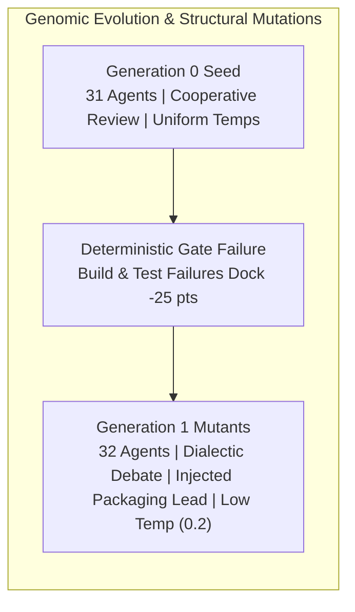

# Empirical Experimentation Ledger & Architecture Search Archive

This directory serves as the centralized empirical repository for the **Hierarchical Agent Evolution (HAE)** platform. It catalogs tournament runs, evolutionary lineages, multi-generational performance trajectories, and complete genomic snapshots required for exact reproducibility.

---

## 1. Experiment Registry & Snapshot Archive

Each experiment subfolder contains self-contained genomic definitions, tournament scorecards, and reproduction manifests:

| Experiment ID | Focus & Selection Pressure | Infrastructure | Generational Scale | Champion Score | Artifact Directory |
| :--- | :--- | :--- | :---: | :---: | :---: |
| [**`exp-001-pilot-baseline`**](exp-001-pilot-baseline/) | Strategic Architecture & Autonomous Headcount Adaptation | Cloud Kubernetes (`e2-standard-4`) | 6 virtual enterprises (Gen 0 & 1) | **96.25** | [`exp-001-pilot-baseline/`](exp-001-pilot-baseline/) |
| [**`exp-002-parallel-tournament`**](exp-002-parallel-tournament/) | High-Throughput 10-Firm Parallel Tournament with 4-Gate Sandbox | Cloud Kubernetes (5 Parallel Pods) | 10 virtual enterprises (310 agents) | **77.50** | [`exp-002-parallel-tournament/`](exp-002-parallel-tournament/) |
| [**`exp-003-parallel-gen1`**](exp-003-parallel-gen1/) | 3-Way Recombination & Directed Packaging Mutation | Cloud Kubernetes + gVisor Agent Sandbox | 10 virtual enterprises (312 agents) | *Evaluating* | [`exp-003-parallel-gen1/`](exp-003-parallel-gen1/) |

---

## 2. Multi-Generational Fitness Progression

### 2.1 Cross-Generational Performance Trajectory

The graph below illustrates peak and cohort performance across evolutionary milestones:
* **Unconstrained Semantic Search (Exp 001)**: Pure rubric-based judging allowed rapid convergence toward near-perfect strategic synthesis ($93.00 
ightarrow 96.25$).
* **Deterministic Ground-Truth Disruption (Exp 002)**: Introducing the 4-Gate Deterministic Sandbox Verifier exposed execution gaps (non-executable code docked up to $-25.0$ pts), resetting baseline scores to $71.25 - 77.50$ and creating strong selection pressure toward syntactically and functionally valid packages.
* **Genomic Adaptation (Exp 003)**: Injected packaging specialists in Generation 1 directed mutants designed to conquer Build and Test gates.

```
Overall Fitness Trajectory Across Generations & Tournaments
100 ┼──────────────────────────────────────────────────────── [Gen 1 Champion: 96.25] (Exp 001)
    │                                    *─────────────────── [Gen 0 Champion: 94.60] (Exp 001)
 90 ┼─ - - - - - - - - - - - - - - - - - - - - - - - - - - - 
    │                                                    ▲   [Gen 1 Target: >90] (Exp 003)
 80 ┼────────────────────────────────────*              /
    │                 *                   \            /
    │                /                     \──────────*────── [Gen 0 Firm 3: 77.50] (Exp 002: Hard Gates)
 70 ┼───────────────*───────────────────────*─────────*────── [Gen 0 Cohort Median: 72.95] (Exp 002)
    │              /                         \───────*─────── [Gen 0 Firm 1: 71.25] (Exp 002)
 60 ┼─────────────* 
    │
    └─────────────┬──────────────────────────┬───────────────►
             Generation 0               Generation 1
         (Unconstrained Seed)       (3-Way Bred Offspring)
```

### 2.2 Detailed Multi-Objective Score Breakdown

$$\mathcal{F}(\mathcal{C}) = \left[ w_s S + w_t T + w_c C + w_r R + w_a A 
ight] - \mathcal{P}_{	ext{sandbox}}$$

| Milestone / Firm | Generation | Strategic (25%) | Technical (25%) | Coherence (20%) | Risk (15%) | Action (15%) | Sandbox Penalty | Overall Fitness |
| :--- | :---: | :---: | :---: | :---: | :---: | :---: | :---: | :---: |
| **`exp001_seed`** (Baseline) | Gen 0 | 95.0 | 80.0 | 100.0 | 95.0 | 100.0 | 0.0 (Unanchored) | **93.00** |
| **`exp001_firm_3`** (Gen 0 Winner) | Gen 0 | 95.0 | 88.0 | 98.0 | 97.0 | 98.0 | 0.0 (Unanchored) | **94.60** |
| **`exp001_elite_2`** (Tournament Champion) | Gen 1 | 95.0 | 90.0 | 100.0 | 98.0 | 100.0 | 0.0 (Unanchored) | **96.25** |
| **`gen_0_firm_1`** (Parallel Wave) | Gen 0 | 95.0 | 95.0 | 95.0 | 95.0 | 95.0 | -25.0 (Failed all gates) | **71.25** |
| **`gen_0_firm_3`** (Parallel Champion) | Gen 0 | 95.0 | 98.0 | 95.0 | 95.0 | 95.0 | -18.75 (Cleared Telemetry) | **77.50** |
| **`gen_1_mutant_1`** (Directed Hypothesis) | Gen 1 | 95.0 | 95.0 | 95.0 | 95.0 | 95.0 | Projected: 0.0 | *Evaluating* |

---

## 3. Genomic & Structural Mutation Highlights

Evolutionary progression across tournaments demonstrates that multi-agent enterprises exhibit profound structural plasticity under selective pressure:

### 3.1 Headcount Dynamics & Specialized Sub-Pods
* **Gen 0 Seed Architecture (31 Agents)**: Standardized allocation consisting of 1 CEO, 5 Department Managers, and 25 Specialists (5 per pod across Strategy, Silicon/Systems, Software, Product/GTM, and Finance/Risk).
* **Pilot Mutant Evolution ($31 
ightarrow 36$ Agents)**: In Experiment 001, judge critique identified existential dependencies on single-source lithography. The LLM Meta-Architect dynamically injected 5 new operational roles (e.g., *Secondary Silicon Foundry Architect*, *Tariff & Export Compliance Specialist*, and *Autonomous Fault Recovery Engineer*), directly raising Risk Resilience from 80.0 to 98.0.
* **Gen 1 Packaging Evolution ($31 
ightarrow 32$ Agents)**: In Experiment 003, directed mutants (`gen_1_mutant_1` and `gen_1_mutant_2`) responded to sandbox gate failures by expanding the Systems Engineering pod to include a dedicated *Python Packaging & Test Automation Engineer* tasked explicitly with authoring valid `pyproject.toml` manifests and executable `pytest` suites.

### 3.2 Cognitive Backstory & Behavioral Instruction Mutations
* **Executive Deliberation Evolution**: Early seed generations relied on cooperative consensus reconciliation. Offspring genomes mutated toward **adversarial dialectic review**, actively pitting systems constraints against commercial ambitions and enforcing mandatory red-team stress testing before executive sign-off.
* **Specialist Persona Sharpening**: Specialist prompts evolved from broad domain descriptions to mathematically precise operational briefs (e.g., specifying explicit Roofline model memory bandwidth bounds, CoWoS interposer yield percentages, and OpenTelemetry span naming conventions).

### 3.3 Hyperparameter Temperature Landscapes
Analysis of winning lineages revealed distinct temperature clustering based on organizational hierarchy:
* **Executive Suite ($	au \in [0.35, 0.45]$)**: Balances strategic synthesis with decision determinism.
* **Market & Strategy Specialists ($	au \in [0.50, 0.70]$)**: Higher entropy encourages creative disruption, non-obvious moat identification, and counter-factual competitive scenarios.
* **Hardware & Systems Verification Specialists ($	au \in [0.20, 0.30]$)**: Near-zero entropy eliminates syntax errors, hallucinated packaging files, and invalid physical calculations.



---

## 4. Total Reproduction Protocol

All experiments are engineered for full deterministic replay. To reproduce any tournament generation:

### Local Replay (Single Enterprise)
```bash
# Replay Experiment 001 Champion
python3 -m src.main \
  --mode single-firm \
  --config experiments/exp-001-pilot-baseline/winning_champion_genome.json \
  --objective "5-Year Hyperscale AI Compute Cloud Strategy"

# Replay Experiment 002 Champion
python3 -m src.main \
  --mode single-firm \
  --config experiments/exp-002-parallel-tournament/champion_firm_3_genome.json \
  --objective "Design and implement the production-ready 'agent-org' platform"
```

### Distributed Cluster Replay (Full Tournament)
```bash
# Re-run Experiment 002 (10-firm parallel tournament)
kubectl apply -f k8s/parallel-indexed-job-east4.yaml

# Re-run Experiment 003 (Generation 1 tournament)
kubectl apply -f k8s/parallel-indexed-job-gen1-east4.yaml
```
