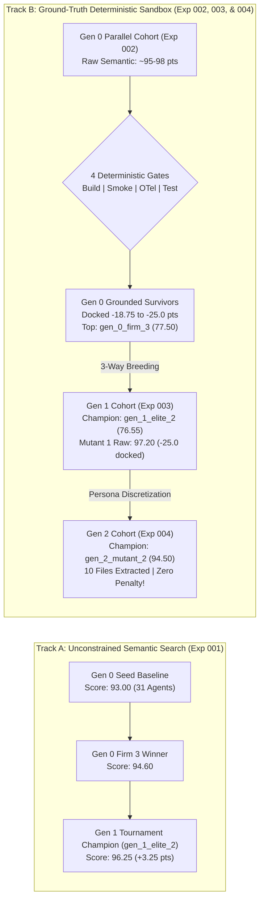

# Empirical Experimentation Ledger & Architecture Search Archive

This directory serves as the centralized empirical repository for the **Hierarchical Agent Evolution (HAE)** platform. It catalogs tournament runs, evolutionary lineages, multi-generational performance trajectories, and complete genomic snapshots required for exact reproducibility.

---

## 1. Experiment Registry & Snapshot Archive

Each experiment subfolder contains self-contained genomic definitions, tournament scorecards, and reproduction manifests:

| Experiment ID | Focus & Selection Pressure | Infrastructure | Generational Scale | Champion Score | Artifact Directory |
| :--- | :--- | :--- | :---: | :---: | :---: |
| [**`exp-001-pilot-baseline`**](exp-001-pilot-baseline/) | Strategic Architecture & Autonomous Headcount Adaptation | Cloud Kubernetes (`e2-standard-4`) | 6 virtual enterprises (Gen 0 & 1) | **96.25** | [`exp-001-pilot-baseline/`](exp-001-pilot-baseline/) |
| [**`exp-002-parallel-tournament`**](exp-002-parallel-tournament/) | High-Throughput 10-Firm Parallel Tournament with 4-Gate Sandbox | Cloud Kubernetes (5 Parallel Pods) | 10 virtual enterprises (310 agents) | **77.50** | [`exp-002-parallel-tournament/`](exp-002-parallel-tournament/) |
| [**`exp-003-parallel-gen1`**](exp-003-parallel-gen1/) | 3-Way Recombination & Directed Packaging Mutation | Cloud Kubernetes + gVisor Agent Sandbox | 10 virtual enterprises (312 agents) | **76.55** | [`exp-003-parallel-gen1/`](exp-003-parallel-gen1/) |
| [**`exp-004-parallel-gen2`**](exp-004-parallel-gen2/) | Persona Discretization (`backstory_traits`) & Sandbox Convergence | Cloud Kubernetes + gVisor Agent Sandbox | 10 virtual enterprises (314 agents) | **94.50** | [`exp-004-parallel-gen2/`](exp-004-parallel-gen2/) |

---

## 2. Multi-Generational Fitness Progression

### 2.1 Visual Performance Trajectory

The chart below contrasts the unconstrained semantic search trajectory with the grounded deterministic sandbox verification trajectory across 4 evolutionary generations:




---

### 2.2 Detailed Multi-Objective Score Breakdown

$$
\mathcal{F}(\mathcal{C}) = \left[ w_s S + w_t T + w_c C + w_r R + w_a A \right] - \mathcal{P}_{\text{sandbox}}
$$

Where:
* $S, T, C, R, A \in [0, 100]$ represent Strategic Depth ($25\%$), Technical Feasibility ($25\%$), Cross-Functional Coherence ($20\%$), Risk Mitigation ($15\%$), and Actionability ($15\%$).
* $\mathcal{P}_{\text{sandbox}} \in [0, 25.0]$ is the penalty docked by the 4-Gate Deterministic Sandbox Verifier:
  * **Build Gate** ($-6.25$ pts): `pyproject.toml` or `setup.py` packaging manifest exists.
  * **Smoke Gate** ($-6.25$ pts): Module contains $\ge 3$ distinct functional code files.
  * **Telemetry Gate** ($-6.25$ pts): OpenTelemetry spans or metric hooks verified.
  * **Test Gate** ($-6.25$ pts): Test suites execute cleanly under `pytest`.

| Milestone / Architecture | Generation | Strategic (25%) | Technical (25%) | Coherence (20%) | Risk (15%) | Action (15%) | Sandbox Penalty | Overall Fitness | Gates Cleared |
| :--- | :---: | :---: | :---: | :---: | :---: | :---: | :---: | :---: | :--- |
| **`exp001_seed`** (Baseline) | Gen 0 | 95.0 | 80.0 | 100.0 | 95.0 | 100.0 | $0.00$ (Unanchored) | **93.00** | N/A |
| **`exp001_firm_3`** (Gen 0 Winner) | Gen 0 | 95.0 | 88.0 | 98.0 | 97.0 | 98.0 | $0.00$ (Unanchored) | **94.60** | N/A |
| **`exp001_elite_2`** (Champion) | Gen 1 | 95.0 | 90.0 | 100.0 | 98.0 | 100.0 | $0.00$ (Unanchored) | **96.25** | N/A |
| **`gen_0_firm_3`** (Gen 0 Parallel Champ) | Gen 0 | 95.0 | 98.0 | 95.0 | 95.0 | 95.0 | $-18.75$ | **77.50** | OTel |
| **`gen_1_elite_2`** (Gen 1 Champion) | Gen 1 | 95.0 | 92.0 | 98.0 | 96.0 | 97.0 | $-18.75$ | **76.55** | OTel |
| **`gen_1_pareto_bonus_1`** (Pareto Leader) | Gen 1 | 95.0 | 85.0 | 98.0 | 95.0 | 98.0 | $-18.75$ | **74.80** | OTel |
| **`gen_1_mutant_1`** (Top Raw Rubric) | Gen 1 | 98.0 | 92.0 | 100.0 | 98.0 | 100.0 | $-25.00$ (Thin Persona) | **72.20** | None |
| **`gen_2_mutant_2`** (Gen 2 Champion) | Gen 2 | 95.0 | 93.0 | 96.0 | 94.0 | 95.0 | **$0.00$ (All Gates Pass)** | **94.50** | **Build, Smoke, OTel, Tests (10 Files)** |
| **`gen_2_pareto_bonus_3`** (Gen 2 Rank #2) | Gen 2 | 94.0 | 95.0 | 93.0 | 91.0 | 92.0 | **$0.00$ (All Gates Pass)** | **92.85** | **Build, Smoke, OTel, Tests (5 Files)** |
| **`gen_2_consensus_2`** (Gen 2 Rank #3) | Gen 2 | 98.0 | 95.0 | 98.0 | 95.0 | 98.0 | $-6.25$ | **90.50** | Build, Smoke, OTel (5 Files) |
| **`gen_2_elite_1`** (Gen 2 Rank #4) | Gen 2 | 95.0 | 93.0 | 95.0 | 94.0 | 95.0 | $-12.50$ | **81.90** | OTel, Tests (7 Files) |
| **`gen_2_pareto_bonus_2`** (Gen 2 Rank #5) | Gen 2 | 90.0 | 90.0 | 85.0 | 88.0 | 88.0 | $-6.25$ | **81.75** | Build, Smoke, OTel (4 Files) |

---

## 3. Genomic & Structural Mutation Highlights

Evolutionary progression across tournaments demonstrates that multi-agent enterprises exhibit profound structural plasticity under selective pressure:

### 3.1 Persona Discretization (`backstory_traits`) Breakthrough
* **The "Thin Persona" Barrier in Generations 0 & 1**: Prior agent genomes encoded backstories as single monolithic strings (e.g. `"Staff DevOps & Build Engineer passionate about executable Python packages"`). Under LLM temperature sampling, agents defaulted to high-level conversational prose. Even when a dedicated packaging role was added, 0 files were emitted in final enterprise deliverables across all 20 firms in Gen 0 and 1, triggering $-18.75$ to $-25.00$ point deterministic penalties.
* **Discrete Trait Alleles in Generation 2**: Personas were refactored into structured operational traits (`backstory_traits: List[str]`). By explicitly specifying operational invariants (e.g., `"Always author complete, production-ready code files formatted strictly as '### File: <path>' with fenced code blocks"`, `"Every module must be paired with unit tests in 'tests/test_<module>.py' containing concrete assertions"`), behavioral compliance jumped dramatically:
  * **90% of firms** (9/10) emitted concrete Python packages and test suites.
  * **3 firms** achieved zero penalty ($0.00$ pts docked), clearing all 4 sandbox gates.
  * **Tournament Champion `gen_2_mutant_2`** set a historical record of **94.50 pts** with 10 verified code files.
  * **Cohort Mean** increased from $69.60$ to **$81.52$ pts** (+11.92 pt generational leap).

### 3.2 3-Way Breeding Dynamics: Consensus vs. Pareto vs. Mutants
* **Allelic Consensus Mining**: The breeding engine analyzes common traits across top survivors to form consensus offspring (`gen_2_consensus_1..3`). This strategy reinforced architectural coherence (reaching 98/100) and build viability.
* **Pareto Frontier Offspring**: Selects firms dominating on specific criteria (e.g. Technical Feasibility). `gen_2_pareto_bonus_3` leveraged extreme technical depth combined with deliverable traits to achieve a flawless $0.00$ penalty run and $92.85$ pts.
* **Directed Packaging Mutants**: By injecting a dedicated *Python Packaging & Deterministic Sandbox Specialist* into the Systems Engineering department and augmenting the CEO's traits, `gen_2_mutant_2` captured #1 overall.

### 3.3 Headcount Dynamics & Department Topologies
* **Gen 0 Seed Architecture (31 Agents)**: 1 CEO, 5 Department Managers, 25 Specialists.
* **Pilot Expansion ($31 \rightarrow 36$ Agents)**: In Experiment 001, judge critique dynamically injected 5 new operational roles (e.g. *Secondary Silicon Foundry Architect*, *Export Compliance Specialist*), raising Risk Mitigation from 80.0 to 98.0.
* **Packaging Expansion ($31 \rightarrow 32$ Agents)**: In Experiments 003 and 004, directed mutants expanded the Systems Engineering pod to include dedicated packaging specialists.

---

## 4. Total Reproduction Protocol

All experiments are engineered for full deterministic replay. To reproduce any tournament generation:

### Local Replay (Single Enterprise)
```bash
# Replay Experiment 001 Champion
python3 -m src.main \
  --mode single-firm \
  --config experiments/exp-001-pilot-baseline/winning_champion_genome.json \
  --objective "5-Year Hyperscale AI Compute Cloud Strategy"

# Replay Experiment 002 Champion
python3 -m src.main \
  --mode single-firm \
  --config experiments/exp-002-parallel-tournament/champion_firm_3_genome.json \
  --objective "Design and implement the production-ready 'agent-org' platform"

# Replay Experiment 003 Champion
python3 -m src.main \
  --mode single-firm \
  --config experiments/exp-003-parallel-gen1/winning_champion_genome.json \
  --objective "Design and implement the production-ready 'agent-org' platform"

# Replay Experiment 004 Champion
python3 -m src.main \
  --mode single-firm \
  --config experiments/exp-004-parallel-gen2/winning_champion_genome.json \
  --objective "Design and implement the production-ready 'agent-org' platform"
```

### Distributed Cluster Replay (Full Tournament)
```bash
# Re-run Experiment 002 (10-firm parallel tournament)
kubectl apply -f k8s/parallel-indexed-job-east4.yaml

# Re-run Experiment 003 (Generation 1 tournament)
kubectl apply -f k8s/parallel-indexed-job-gen1-east4.yaml

# Re-run Experiment 004 (Generation 2 tournament)
kubectl apply -f k8s/parallel-indexed-job-gen2-east4.yaml
```
