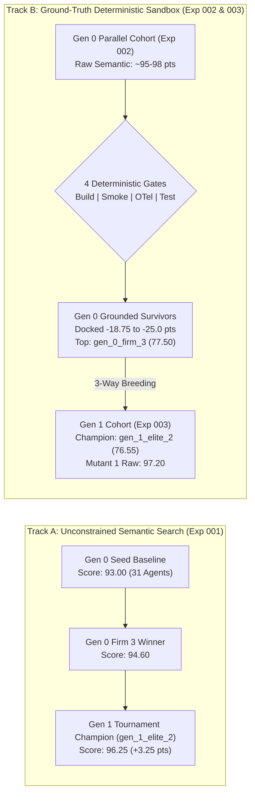

# Empirical Experimentation Ledger & Architecture Search Archive

This directory serves as the centralized empirical repository for the **Hierarchical Agent Evolution (HAE)** platform. It catalogs tournament runs, evolutionary lineages, multi-generational performance trajectories, and complete genomic snapshots required for exact reproducibility.

---

## 1. Experiment Registry & Snapshot Archive

Each experiment subfolder contains self-contained genomic definitions, tournament scorecards, and reproduction manifests:

| Experiment ID | Focus & Selection Pressure | Infrastructure | Generational Scale | Champion Score | Artifact Directory |
| :--- | :--- | :--- | :---: | :---: | :---: |
| [**`exp-001-pilot-baseline`**](exp-001-pilot-baseline/) | Strategic Architecture & Autonomous Headcount Adaptation | Cloud Kubernetes (`e2-standard-4`) | 6 virtual enterprises (Gen 0 & 1) | **96.25** | [`exp-001-pilot-baseline/`](exp-001-pilot-baseline/) |
| [**`exp-002-parallel-tournament`**](exp-002-parallel-tournament/) | High-Throughput 10-Firm Parallel Tournament with 4-Gate Sandbox | Cloud Kubernetes (5 Parallel Pods) | 10 virtual enterprises (310 agents) | **77.50** | [`exp-002-parallel-tournament/`](exp-002-parallel-tournament/) |
| [**`exp-003-parallel-gen1`**](exp-003-parallel-gen1/) | 3-Way Recombination & Directed Packaging Mutation | Cloud Kubernetes + gVisor Agent Sandbox | 10 virtual enterprises (312 agents) | **76.55** | [`exp-003-parallel-gen1/`](exp-003-parallel-gen1/) |

---

## 2. Multi-Generational Fitness Progression

### 2.1 Visual Performance Trajectory

The chart below contrasts the unconstrained semantic search trajectory with the grounded deterministic sandbox verification trajectory across evolutionary iterations:




---

### 2.2 Detailed Multi-Objective Score Breakdown

$$
\mathcal{F}(\mathcal{C}) = \left[ w_s S + w_t T + w_c C + w_r R + w_a A \right] - \mathcal{P}_{\text{sandbox}}
$$

Where:
* $S, T, C, R, A \in [0, 100]$ represent Strategic Depth ($25\%$), Technical Feasibility ($25\%$), Cross-Functional Coherence ($20\%$), Risk Mitigation ($15\%$), and Actionability ($15\%$).
* $\mathcal{P}_{\text{sandbox}} \in [0, 25.0]$ is the penalty docked by the 4-Gate Deterministic Sandbox Verifier:
  * **Build Gate** ($-6.25$ pts): `pyproject.toml` or `setup.py` packaging manifest exists.
  * **Smoke Gate** ($-6.25$ pts): Module contains $\ge 3$ distinct functional code files.
  * **Telemetry Gate** ($-6.25$ pts): OpenTelemetry spans or metric hooks verified.
  * **Test Gate** ($-6.25$ pts): Test suites execute cleanly under `pytest`.

| Milestone / Architecture | Generation | Strategic (25%) | Technical (25%) | Coherence (20%) | Risk (15%) | Action (15%) | Sandbox Penalty | Overall Fitness |
| :--- | :---: | :---: | :---: | :---: | :---: | :---: | :---: | :---: |
| **`exp001_seed`** (Baseline) | Gen 0 | 95.0 | 80.0 | 100.0 | 95.0 | 100.0 | $0.0$ (Unanchored) | **93.00** |
| **`exp001_firm_3`** (Gen 0 Winner) | Gen 0 | 95.0 | 88.0 | 98.0 | 97.0 | 98.0 | $0.0$ (Unanchored) | **94.60** |
| **`exp001_elite_2`** (Champion) | Gen 1 | 95.0 | 90.0 | 100.0 | 98.0 | 100.0 | $0.0$ (Unanchored) | **96.25** |
| **`gen_0_firm_3`** (Gen 0 Parallel Champ) | Gen 0 | 95.0 | 98.0 | 95.0 | 95.0 | 95.0 | $-18.75$ (Cleared Telemetry) | **77.50** |
| **`gen_1_elite_2`** (Gen 1 Champion) | Gen 1 | 95.0 | 92.0 | 98.0 | 96.0 | 97.0 | $-18.75$ (Cleared Telemetry) | **76.55** |
| **`gen_1_pareto_bonus_1`** (Pareto Leader) | Gen 1 | 95.0 | 85.0 | 98.0 | 95.0 | 98.0 | $-18.75$ (Cleared Telemetry) | **74.80** |
| **`gen_1_mutant_1`** (Top Raw Rubric) | Gen 1 | 98.0 | 92.0 | 100.0 | 98.0 | 100.0 | $-25.00$ (Thin Persona Prose) | **72.20** |
| **`gen_1_consensus_1`** (Consensus Offspring) | Gen 1 | 95.0 | 90.0 | 100.0 | 98.0 | 100.0 | $-25.00$ (Non-executable) | **70.95** |
| **`gen_1_mutant_2`** (Directed Mutant 2) | Gen 1 | 95.0 | 90.0 | 98.0 | 95.0 | 100.0 | $-25.00$ (Non-executable) | **70.10** |

---

## 3. Genomic & Structural Mutation Highlights

Evolutionary progression across tournaments demonstrates that multi-agent enterprises exhibit profound structural plasticity under selective pressure:

### 3.1 Headcount Dynamics & Specialist Sub-Pods
* **Gen 0 Seed Architecture (31 Agents)**: Standardized allocation consisting of 1 CEO, 5 Department Managers, and 25 Specialists (5 per pod across Strategy, Silicon/Systems, Software, Product/GTM, and Finance/Risk).
* **Pilot Mutant Evolution ($31 \rightarrow 36$ Agents)**: In Experiment 001, judge critique identified existential dependencies on single-source lithography. The LLM Meta-Architect dynamically injected 5 new operational roles (e.g., *Secondary Silicon Foundry Architect*, *Tariff & Export Compliance Specialist*, and *Autonomous Fault Recovery Engineer*), directly raising Risk Resilience from $80.0$ to $98.0$.
* **Gen 1 Packaging Evolution ($31 \rightarrow 32$ Agents)**: In Experiment 003, directed mutants (`gen_1_mutant_1` and `gen_1_mutant_2`) responded to sandbox gate failures by expanding the Systems Engineering pod to include a dedicated *Python Packaging & Test Automation Engineer* tasked explicitly with authoring valid `pyproject.toml` manifests and executable `pytest` suites.
* **The "Thin Persona" Discovery**: In Gen 1, even with dedicated packaging roles, single-sentence backstories resulted in conversational prose instead of concrete code deliverables. This discovery motivates the transition to multi-bullet structured trait personas (`backstory_traits`) with explicit formatting invariants.

### 3.2 Cognitive Backstory & Behavioral Instruction Mutations
* **Executive Deliberation Evolution**: Early seed generations relied on cooperative consensus reconciliation. Offspring genomes mutated toward **adversarial dialectic review**, actively pitting systems constraints against commercial ambitions and enforcing mandatory red-team stress testing before executive sign-off.
* **Specialist Persona Sharpening**: Specialist prompts evolved from broad domain descriptions to mathematically precise operational briefs (e.g., specifying explicit Roofline model memory bandwidth bounds, CoWoS interposer yield percentages, and OpenTelemetry span naming conventions).

### 3.3 Hyperparameter Temperature Landscapes
Analysis of winning lineages revealed distinct temperature clustering based on organizational hierarchy:
* **Executive Suite ($\tau \in [0.35, 0.45]$)**: Balances strategic synthesis with decision determinism.
* **Market & Strategy Specialists ($\tau \in [0.50, 0.70]$)**: Higher entropy encourages creative disruption, non-obvious moat identification, and counter-factual competitive scenarios.
* **Hardware & Systems Verification Specialists ($\tau \in [0.20, 0.30]$)**: Near-zero entropy eliminates syntax errors, hallucinated packaging files, and invalid physical calculations.

---

## 4. Total Reproduction Protocol

All experiments are engineered for full deterministic replay. To reproduce any tournament generation:

### Local Replay (Single Enterprise)
```bash
# Replay Experiment 001 Champion
python3 -m src.main \
  --mode single-firm \
  --config experiments/exp-001-pilot-baseline/winning_champion_genome.json \
  --objective "5-Year Hyperscale AI Compute Cloud Strategy"

# Replay Experiment 002 Champion
python3 -m src.main \
  --mode single-firm \
  --config experiments/exp-002-parallel-tournament/champion_firm_3_genome.json \
  --objective "Design and implement the production-ready 'agent-org' platform"

# Replay Experiment 003 Champion
python3 -m src.main \
  --mode single-firm \
  --config experiments/exp-003-parallel-gen1/winning_champion_genome.json \
  --objective "Design and implement the production-ready 'agent-org' platform"
```

### Distributed Cluster Replay (Full Tournament)
```bash
# Re-run Experiment 002 (10-firm parallel tournament)
kubectl apply -f k8s/parallel-indexed-job-east4.yaml

# Re-run Experiment 003 (Generation 1 tournament)
kubectl apply -f k8s/parallel-indexed-job-gen1-east4.yaml
```
