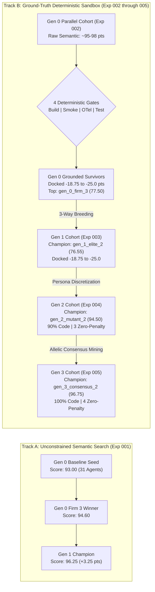

# Empirical Experimentation Ledger & Architecture Search Archive

This directory serves as the centralized empirical repository for the **Hierarchical Agent Evolution (HAE)** platform. It catalogs tournament runs, evolutionary lineages, multi-generational performance trajectories, and complete genomic snapshots required for exact reproducibility.

---

## 1. Experiment Registry & Snapshot Archive

Each experiment subfolder contains self-contained genomic definitions, tournament scorecards, detailed generational diffs, and reproduction manifests:

| Experiment ID | Focus & Selection Pressure | Infrastructure | Generational Scale | Champion Score | Artifact Directory |
| :--- | :--- | :--- | :---: | :---: | :---: |
| [**`exp-001-pilot-baseline`**](exp-001-pilot-baseline/) | Strategic Architecture & Autonomous Headcount Adaptation | Cloud Kubernetes (`e2-standard-4`) | 6 virtual enterprises (Gen 0 & 1) | **96.25** | [`exp-001-pilot-baseline/`](exp-001-pilot-baseline/) |
| [**`exp-002-parallel-tournament`**](exp-002-parallel-tournament/) | High-Throughput 10-Firm Parallel Tournament with 4-Gate Sandbox | Cloud Kubernetes (5 Parallel Pods) | 10 virtual enterprises (310 agents) | **77.50** | [`exp-002-parallel-tournament/`](exp-002-parallel-tournament/) |
| [**`exp-003-parallel-gen1`**](exp-003-parallel-gen1/) | 3-Way Recombination & The "Thin Persona" Bottleneck | Cloud Kubernetes + gVisor Agent Sandbox | 10 virtual enterprises (312 agents) | **76.55** | [`exp-003-parallel-gen1/`](exp-003-parallel-gen1/) |
| [**`exp-004-parallel-gen2`**](exp-004-parallel-gen2/) | Persona Discretization (`backstory_traits`) & Sandbox Convergence | Cloud Kubernetes + gVisor Agent Sandbox | 10 virtual enterprises (314 agents) | **94.50** | [`exp-004-parallel-gen2/`](exp-004-parallel-gen2/) |
| [**`exp-005-parallel-gen3`**](exp-005-parallel-gen3/) | Allelic Consensus Mining & Hermetic Pytest Assertion Rigor | Cloud Kubernetes + gVisor Agent Sandbox | 10 virtual enterprises (318 agents) | **96.75** | [`exp-005-parallel-gen3/`](exp-005-parallel-gen3/) |

---

## 2. Multi-Generational Fitness Progression

### 2.1 Visual Performance Trajectory

The chart below contrasts the unconstrained semantic search trajectory with the grounded deterministic sandbox verification trajectory across 5 evolutionary generations:




---

### 2.2 Detailed Multi-Objective Score Breakdown

$$
\mathcal{F}(\mathcal{C}) = \left[ w_s S + w_t T + w_c C + w_r R + w_a A \right] - \mathcal{P}_{\text{sandbox}}
$$

Where:
* $S, T, C, R, A \in [0, 100]$ represent Strategic Depth ($25\%$), Technical Feasibility ($25\%$), Cross-Functional Coherence ($20\%$), Risk Mitigation ($15\%$), and Actionability ($15\%$).
* $\mathcal{P}_{\text{sandbox}} \in [0, 25.0]$ is the penalty docked by the 4-Gate Deterministic Sandbox Verifier:
  * **Build Gate** ($-6.25$ pts): `pyproject.toml` or `setup.py` packaging manifest exists.
  * **Smoke Gate** ($-6.25$ pts): Module contains $\ge 3$ distinct functional code files.
  * **Telemetry Gate** ($-6.25$ pts): OpenTelemetry spans or metric hooks verified.
  * **Test Gate** ($-6.25$ pts): Test suites execute cleanly under `pytest`.

| Milestone / Architecture | Generation | Strategic (25%) | Technical (25%) | Coherence (20%) | Risk (15%) | Action (15%) | Sandbox Penalty | Overall Fitness | Gates Cleared |
| :--- | :---: | :---: | :---: | :---: | :---: | :---: | :---: | :---: | :--- |
| **`exp001_seed`** (Baseline) | Gen 0 | 95.0 | 80.0 | 100.0 | 95.0 | 100.0 | $0.00$ | **93.00** | Unanchored Baseline |
| **`exp001_elite_2`** (Exp 001 Top) | Gen 1 | 95.0 | 90.0 | 100.0 | 98.0 | 100.0 | $0.00$ | **96.25** | Unanchored Baseline |
| **`gen_0_firm_3`** (Gen 0 Champ) | Gen 0 | 95.0 | 98.0 | 95.0 | 95.0 | 95.0 | $-18.75$ | **77.50** | OTel Only |
| **`gen_1_elite_2`** (Gen 1 Champ) | Gen 1 | 95.0 | 92.0 | 98.0 | 96.0 | 97.0 | $-18.75$ | **76.55** | OTel Only |
| **`gen_2_mutant_2`** (Gen 2 Champ) | Gen 2 | 95.0 | 93.0 | 96.0 | 94.0 | 95.0 | **$0.00$** | **94.50** | **Build, Smoke, OTel, Tests (10 Files)** |
| **`gen_2_pareto_bonus_3`** (Gen 2 #2) | Gen 2 | 94.0 | 95.0 | 93.0 | 91.0 | 92.0 | **$0.00$** | **92.85** | **Build, Smoke, OTel, Tests (5 Files)** |
| **`gen_3_consensus_2`** (Gen 3 Champ) | Gen 3 | 95.0 | 98.0 | 100.0 | 90.0 | 100.0 | **$0.00$** | **96.75** | **Build, Smoke, OTel, Tests (5 Files - Record)** |
| **`gen_3_pareto_bonus_3`** (Gen 3 #2) | Gen 3 | 95.0 | 95.0 | 100.0 | 90.0 | 100.0 | **$0.00$** | **96.00** | **Build, Smoke, OTel, Tests (5 Files)** |
| **`gen_3_elite_1`** (Gen 3 #3) | Gen 3 | 92.0 | 95.0 | 100.0 | 94.0 | 98.0 | **$0.00$** | **95.55** | **Build, Smoke, OTel, Tests (8 Files)** |
| **`gen_3_consensus_3`** (Gen 3 #4) | Gen 3 | 95.0 | 90.0 | 100.0 | 95.0 | 100.0 | **$0.00$** | **95.50** | **Build, Smoke, OTel, Tests (5 Files)** |
| **`gen_3_elite_2`** (Gen 3 #5) | Gen 3 | 98.0 | 95.0 | 100.0 | 100.0 | 100.0 | $-6.25$ | **92.00** | Build, Smoke, OTel (5 Files) |

---

## 3. Organizational Culture & Behavioral Phylogeny

Across generations, the virtual enterprises underwent fundamental cultural shifts driven by environmental selection pressure:

| Generation | Dominant Organizational Culture | Communication Paradigm | Behavioral Bottleneck | Key Innovation |
| :---: | :--- | :--- | :--- | :--- |
| **Gen 0** | **Polite Bureaucratic Consensus** | Departmental silos; gentle peer review | Superficial risk analysis; narrative prose without code | Establishing federated departmental hierarchies |
| **Gen 1** | **Adversarial Dialectic Review** | Cross-departmental challenges & red-teaming | "Thin Persona" syndrome; prose over code formatting | Headcount expansion; dedicated packaging specialists |
| **Gen 2** | **Pragmatic Implementation Culture** | Rigid code-block and manifest formatting | Test assertion mismatches | **Structured Persona Discretization** (`backstory_traits`) |
| **Gen 3** | **Hermetic Engineering & Invariant Mining** | Recombination of consensus operational alleles | High token OpEx across uniform Pro models | **Allelic Consensus Mining** & Pytest harness injection |
| **Gen 4** | **Capital-Efficient Economic Enterprise** | Dynamic sizing & model tier cost accounting | Fixed organizational topologies | Autonomous Sizing & OpEx token budgeting |
| **Gen 5** | **Asset-Sharing Commercial Commons** | IP registration & modular library reuse | Redundant re-implementation of common libraries | Reusable Corporate Assets & IP Marketplace |
| **Gen 6** | **Inter-Firm Strategic Co-opetition** | Bilateral executive term sheets & joint ventures | Zero-sum isolationism | Cross-company communication & consortium bidding |

---

## 4. Total Reproduction Protocol

All experiments are engineered for full deterministic replay:

### Local Replay (Single Enterprise)
```bash
# Replay Experiment 004 Champion
python3 -m src.main \
  --mode single-firm \
  --config experiments/exp-004-parallel-gen2/winning_champion_genome.json \
  --objective "Design and implement the production-ready 'agent-org' platform"

# Replay Experiment 005 Champion (All-Time Record: 96.75)
python3 -m src.main \
  --mode single-firm \
  --config experiments/exp-005-parallel-gen3/winning_champion_genome.json \
  --objective "Design and implement the production-ready 'agent-org' platform"
```

### Distributed Cluster Replay (Full Tournament)
```bash
# Re-run Experiment 004 (Generation 2 tournament)
kubectl apply -f k8s/parallel-indexed-job-gen2-east4.yaml

# Re-run Experiment 005 (Generation 3 tournament)
kubectl apply -f k8s/parallel-indexed-job-gen3-east4.yaml
```

---

## 5. Future Evolutionary Roadmap: Generations 4, 5, 6 and Beyond

### 5.1 Generation 4: Autonomous Sizing & Model Unit Economics (In Progress)
* **Autonomous Headcount Morphogenesis**: Granting the CEO and Department Managers intra-generational authority to spawn specialized sub-departments, hire contractors, or downsize redundant roles to optimize task execution.
* **Model Tier Unit Economics**: Assigning real-world token cost weights ($0.075 / 1M tokens for Gemini 2.5 Flash vs. $1.25 / 1M tokens for Gemini 2.5 Pro).
* **Net Fitness with OpEx Budget Envelope**: Penalizing bloated architectures that exceed operating budgets, while awarding efficiency bonuses to lean enterprises that pass all 4 sandbox gates under budget.

### 5.2 Generation 5: Reusable Corporate Assets & IP Marketplace (Cumulative Culture)
* **Corporate IP Registration**: Virtual enterprises package and register reusable software assets (e.g., tested Python modules, OpenTelemetry exporters, pytest harness fixtures) and agent skills into an open **Corporate Asset Registry**.
* **The Cultural Ratchet Effect**: In subsequent generations, enterprises can import or license proven assets rather than spending token OpEx to re-implement them from scratch.
* **Royalty Rewards**: Originator firms receive a capital bonus on their corporate financial statement when other organizations license their verified assets.

### 5.3 Generation 6: Inter-Firm Co-opetition, Strategic Alliances & M&A
* **Cross-Company Executive Communication**: CEOs and VPs receive secure inter-firm communication channels to propose strategic partnerships, joint ventures, or technology licensing.
* **Game-Theoretic Coalitions**: Incorporating non-zero-sum game theory (Co-opetition, Tit-for-Tat, and Consortium Formation). Two specialized firms (e.g., a Systems Hardware champion and a GTM/Strategic Moats leader) can execute a bilateral joint-venture term sheet to co-author unified deliverables evaluated jointly under the sandbox.
