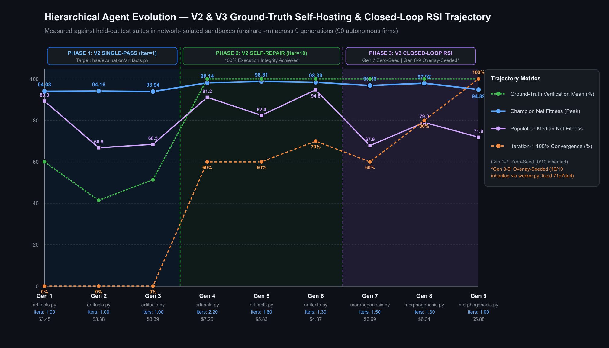

# Master Experiment Ledger (`V1` $\to$ `V6`)

This directory is the empirical record of the **Hierarchical Agent Evolution (HAE)** program. Each experiment set represents a distinct architectural regime, benchmark environment, and evolutionary fitness function.

---

## 1. Completed & Planned Experiment Sets

| Set | Generations & Scale | What Was Tested | Empirical Outcome | Status | Detailed README |
| :---: | :--- | :--- | :--- | :---: | :--- |
| **V1** | `Pilot` → `Gen 10` *(13 runs, ~100 firms)* | **Open-Ended Prose & Heuristic Sandbox Evolution:** Evolving 31–34 agent hierarchies on strategic/architectural prompts graded by an LLM Judge (`95%`) + 4-gate regex heuristics. | Published prose fitness climbed (`25.25` $\to$ `96.75`), but retroactive physical execution ([`execution_grounded_correction.md`](v1/execution_grounded_correction.md)) proved `corr(gen, exec) = +0.045` (`0/60` passed all 5 gates). Closed & archived. | **Closed & Audited** | [`v1/README.md`](v1/README.md) |
| **V2** | `Gen 1` → `Gen 6` *(`60 / 60` firms, `$28.18`)* | **Ground-Truth Self-Hosting (`artifacts.py`):** Zero-seed (`carry_artifacts=False`) synthesis against held-out unit tests in `unshare -rn` under Single-Pass (`Gen 1–3`, `iter=1`) vs. Multi-Iteration Self-Repair (`Gen 4–6`, `iter=10`) + Monotonic Verification Guard. | **Single-Pass (`Gen 1–3`):** Elite fitness rose `+14.56` pts (`94.16` peak, `85.7%` tests), `0/30` at `100%`. **Self-Repair (`Gen 4–6`):** **`30 / 30` (`100%`) firms passed `7/7` tests**, Peak Net Fitness hit **`98.81`** (`gen_5_pareto_2`), mean iterations dropped **`2.20` $\to$ `1.30`**, Iter-1 pass rate reached **`70%`**, and spend fell **`33%`** (`$7.26` $\to$ `$4.87`). | **Complete** | [`v2/README.md`](v2/README.md) |
| **V3** | `Gen 7` → `Gen 9` *(`30 / 30` firms, `$18.92`)* | **Level-3 Closed-Loop Recursive Self-Improvement (`morphogenesis.py` + `code_overlays`):** Firms re-implement HAE's own breeding engine (`MorphogenesisEngine` & `StructuralCrossoverEngine`); `Breeder` dynamically compiles and executes the winning overlays to breed `Gen 8` and `Gen 9`. | **Gen 7 (Zero-Seed):** `0/10` inherited; **`10/10` (`100%`) passed `7/7` tests** (`60%` Iter-1 pass rate, `1.50` iters, **`96.83` Peak**). **Gen 8–9 (Closed-Loop Breeding & Audit):** `Breeder` successfully bred `Gen 8` (**`97.92` Peak**) and `Gen 9` (**`94.89` Peak**) using evolved overlays. Transcript audit caught a `worker.py` `target_module` filter bug (`10/10` inherited in `Gen 8–9`, fixed in `71a7da4`) and exposed `56 KB/run` of "Corporate Memo Theatre." | **Complete** | [`v3_rsi/README.md`](v3_rsi/README.md) |
| **V4** | **Gen 10 & Gen 11 (Complete)** *(`3x G4` `nvidia/Qwen3.8-Flash-Next-NVFP4` `180B` + Unified `llm-d`)* | ***The Dosadi Experiment*, True Zero-Seed Post-`71a7da4` Evolution & Unified Global `llm-d` Session:** Multi-instance **`180B` `NVFP4` (`128k` context, `16k` output)** across `3x g4-standard-96` nodes (`6x RTX PRO 6000 Blackwell 96GB`) behind a **unified global `llm-d` gateway** (`<1ms` cross-company answer short-circuiting + singleflight coalescing + `282.3 GiB` `fp8` VRAM & `144 GiB` CPU DRAM KV-cache offloading) + soft logarithmic token-efficiency scoring (`no 586 call limit`). | **Gen 10:** `6/10` (`60%`) passed `7/7` tests (`78.92` Peak). **Gen 11:** `10 / 10` passed `7/7` unit tests on Iteration 1/10 (`95.29` Peak, `91.08` Mean; *caveat: no reference seed, but identical builder prompts coalesced/shared the model-generated answer across companies*). **`llm-d` Impact:** **`1,190x` faster (`0.74 ms`) short-circuiting**, offloading **`37.4%–73.2%`** of requests with `0` GPU FLOPs and **`100.00%` (`455/455`) prefix KV-cache affinity**. | **Complete (`Gen 10–11`)** | [`v4_llmd/README.md`](v4_llmd/README.md) |
| **V5** | **Gen 12 *(Erratum)*, Gen 13, Gen 14 & Gen 15 *(Complete)*** *(`V5 xgrammar` TypeSafe AI + Uncached 4-Module `full_stack_hae`)* | ***"TypeSafe AI" Style* Hardware-Enforced `vLLM xgrammar` JSON Schema Protocol & 4-Module Self-Hosting (`50` Held-Out Tests):** Enforces strictly typed JSON Schemas at the `vLLM V1` FSM logit sampler across `555` agents, and scales to 100%-uncached 4-module synthesis (`artifacts.py`, `harness.py`, `verification_loop.py`, `morphogenesis.py`) in **Gen 13–15**. | **`xgrammar` Coordination Compression:** Output tokens/call fell **`-91.9%`** (`1,420` $\to$ **`115.3` tokens**). *(Erratum: Gen 12's `10/10` pass rate & `97.42` fitness are retracted due to a pre-seeded `CANONICAL_MORPHOGENESIS_BUILDER` cache entry in `6818d8a`.)* **Clean Uncached Gen 13 (`3/10` at `40–42/50`) $\to$ Gen 14 (`9/10` at `39–44/50`) $\to$ Gen 15 (`10/10` at `46–50/50`):** In **Gen 15**, per-module verifier feedback filtering, full `AssertionError` diff extraction, and passing-module locking drove **all `10 / 10` (`100%`) companies to `46/50–50/50` (`92.0%–100.0%`, `96.8%` mean)**, with **two independent 33-agent firms (`gen_14_mutant_3` at `99.43` Net Fitness and `gen_14_pareto_1`) achieving `50 / 50` (`100.0%`) full-stack self-hosting convergence** and promoting all 4 verified modules into `code_overlays`! | **Complete (`Gen 12–15`)** | [`v5_typesafe_xgrammar/README.md`](v5_typesafe_xgrammar/README.md) |
| **V6** | **Stage 1–2 Implemented & Tested (Oct 6 2026) · Gen 16 Pending** *(Epistemic Ledger + Evidence Gatekeeper + PUCT Value Search, behind `epistemic_policy.enabled`)* | **Epistemic Tree-Search Organizations (*"The Scientific Method on Steroids"*):** Motivated by Gen 15's plateau audit (`8/8` non-converged firms stuck after Iteration 2; `7/8` failing the *same* high-prior test) and Thore Graepel's AlphaGo analysis (*LLMs are System 1; CoT is "the same next-token prediction, iterated for longer"*). The LLM supplies only hunches; the **organization is the explicit System 2**: an inspectable `EpistemicState` ledger (settled / hypothesised / ruled-out / open), an **independent non-LLM Evidence Gatekeeper** that alone may certify or falsify beliefs via sandbox probes, and PUCT search over `50–100+` cheap epistemic moves with forced low-prior exploration (the *Move 37* rule) and a learned value head. Fitness becomes an **Epistemic Integrity Audit** instead of post-hoc prose grading. | *Design finalized Oct 5, 2026. Gen 16 targets: break the `46–49/50` plateau and attempt an oracle-free debugging benchmark.* | **In Progress** | [`v6_epistemic_search/README.md`](v6_epistemic_search/README.md) |
| **V7** | *Next Phase* *(LoRA `GRPO` / `DPO` on `V6` ledgers)* | **Parametric RL Specialization on Certified Epistemic Trajectories:** Distill `V6` search trees — which hypotheses were worth proposing, which experiments were decisive — into role-specialized LoRA adapters, rather than distilling `V5`'s post-hoc narratives. | *Ready following `V6` trajectory harvest.* | **Roadmap** | [Main Roadmap](../README.md#phase-7-v7-parametric-rl-specialization-on-certified-epistemic-trajectories-grpo--dpo) |

---

## 2. Quick Navigation

- **V1 Archive (`Pilot` $\to$ `Gen 10`):** [`v1/README.md`](v1/README.md) | [`v1/execution_grounded_correction.md`](v1/execution_grounded_correction.md)
- **V2 Self-Hosting Ledger (`Gen 1` $\to$ `Gen 6`):** [`v2/README.md`](v2/README.md) | [`v2/ledger_v2.json`](v2/ledger_v2.json)
- **V3 Level-3 Closed-Loop RSI Ledger (`Gen 7` $\to$ `Gen 9`):** [`v3_rsi/README.md`](v3_rsi/README.md) | [`v3_rsi/CAMPAIGN_STATUS.md`](v3_rsi/CAMPAIGN_STATUS.md) | [`v3_rsi/overlays/`](v3_rsi/overlays/)
- **V4 Unified `llm-d` + `3x 180B NVFP4` & Post-Fix Zero-Seed (`Gen 10` $\to$ `Gen 11`):** [`v4_llmd/README.md`](v4_llmd/README.md)
- **V5 Hardware-Enforced `xgrammar` TypeSafe AI Protocol & Clean `full_stack_hae` (`Gen 12` $\to$ `Gen 15`):** [`v5_typesafe_xgrammar/README.md`](v5_typesafe_xgrammar/README.md)
- **V6 Epistemic Tree-Search Organizations (Graepel Diff, Gen 15 Plateau Audit, Stage 1–3 Plan & How-to-Enable):** [`v6_epistemic_search/README.md`](v6_epistemic_search/README.md)
