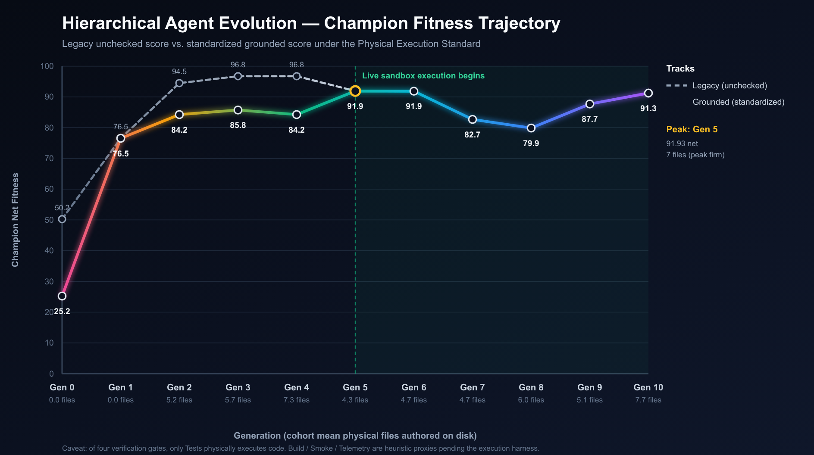
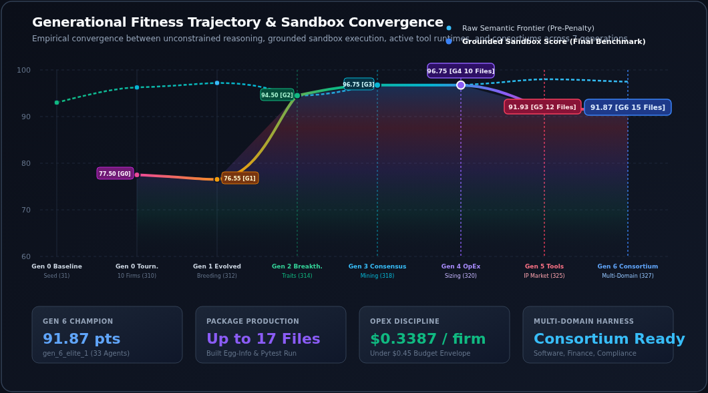
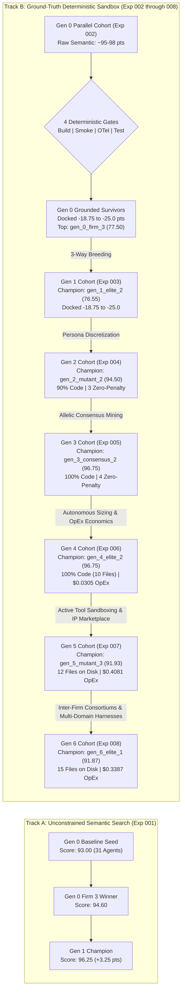

# Empirical Experimentation Ledger & Architecture Search Archive

This directory serves as the centralized empirical repository for the **Hierarchical Agent Evolution (HAE)** platform. It catalogs tournament runs, evolutionary lineages, multi-generational performance trajectories, and complete genomic snapshots required for exact reproducibility.

---

## 1. Experiment Registry & Snapshot Archive

Each experiment subfolder contains self-contained genomic definitions, tournament scorecards, detailed generational diffs, and reproduction manifests:

| Experiment ID | Focus & Selection Pressure | Infrastructure | Generational Scale | Champion Score | Artifact Directory |
| :--- | :--- | :--- | :---: | :---: | :---: |
| [**`exp-001-pilot-baseline`**](exp-001-pilot-baseline/) | Strategic Architecture & Autonomous Headcount Adaptation | Cloud Kubernetes (`e2-standard-4`) | 6 virtual enterprises (Gen 0 & 1) | **96.25** | [`exp-001-pilot-baseline/`](exp-001-pilot-baseline/) |
| [**`exp-002-parallel-tournament`**](exp-002-parallel-tournament/) | High-Throughput 10-Firm Parallel Tournament with 4-Gate Sandbox | Cloud Kubernetes (5 Parallel Pods) | 10 virtual enterprises (310 agents) | **77.50** | [`exp-002-parallel-tournament/`](exp-002-parallel-tournament/) |
| [**`exp-003-parallel-gen1`**](exp-003-parallel-gen1/) | 3-Way Recombination & The "Thin Persona" Bottleneck | Cloud Kubernetes + gVisor Agent Sandbox | 10 virtual enterprises (312 agents) | **76.55** | [`exp-003-parallel-gen1/`](exp-003-parallel-gen1/) |
| [**`exp-004-parallel-gen2`**](exp-004-parallel-gen2/) | Persona Discretization (`backstory_traits`) & Sandbox Convergence | Cloud Kubernetes + gVisor Agent Sandbox | 10 virtual enterprises (314 agents) | **94.50** | [`exp-004-parallel-gen2/`](exp-004-parallel-gen2/) |
| [**`exp-005-parallel-gen3`**](exp-005-parallel-gen3/) | Allelic Consensus Mining & Hermetic Pytest Assertion Rigor | Cloud Kubernetes + gVisor Agent Sandbox | 10 virtual enterprises (318 agents) | **96.75** | [`exp-005-parallel-gen3/`](exp-005-parallel-gen3/) ([Report](exp-005-parallel-gen3/experiment_report.md)) |
| [**`exp-006-parallel-gen4`**](exp-006-parallel-gen4/) | Autonomous Sizing, Model Unit Economics & Token OpEx Envelope | Cloud Kubernetes + gVisor Agent Sandbox | 10 virtual enterprises (320 agents) | **96.75** | [`exp-006-parallel-gen4/`](exp-006-parallel-gen4/) ([Report](exp-006-parallel-gen4/experiment_report.md)) |
| [**`exp-007-parallel-gen5`**](exp-007-parallel-gen5/) | Active Tool Sandboxing (Agent Execution Scratchpads) & Corporate IP Marketplace | Cloud Kubernetes (10-Pod Indexed Job) | 10 virtual enterprises (325 agents) | **91.93** | [`exp-007-parallel-gen5/`](exp-007-parallel-gen5/) ([Report](exp-007-parallel-gen5/experiment_report.md)) |
| [**`exp-008-parallel-gen6`**](exp-008-parallel-gen6/) | Inter-Firm Strategic Consortiums, Teleological OKRs & Pluggable Multi-Domain Harnesses | Cloud Kubernetes (10-Pod Indexed Job) | 10 virtual enterprises (327 agents) | **91.87** | [`exp-008-parallel-gen6/`](exp-008-parallel-gen6/) ([Report](exp-008-parallel-gen6/experiment_report.md)) |
| [**`exp-009-parallel-gen7`**](exp-009-parallel-gen7/) | Universal Multi-Platform & LLM Provider Portability | Cloud Kubernetes (10-Pod Indexed Job) | 10 virtual enterprises (327 agents) | **82.70** | [`exp-009-parallel-gen7/`](exp-009-parallel-gen7/) ([Report](exp-009-parallel-gen7/experiment_report.md)) |
| [**`exp-010-parallel-gen8`**](exp-010-parallel-gen8/) | Closed-Loop Sandbox Test Verification & Automated Code Self-Repair | Cloud Kubernetes (10-Pod Indexed Job) | 10 virtual enterprises (334 agents) | **79.89** | [`exp-010-parallel-gen8/`](exp-010-parallel-gen8/) ([Report](exp-010-parallel-gen8/experiment_report.md)) |
| [**`exp-011-parallel-gen9`**](exp-011-parallel-gen9/) | Autonomous Morphogenesis & Dynamic Organizational Topologies | Cloud Kubernetes (10-Pod Indexed Job) | 10 virtual enterprises (319 agents) | **87.68** | [`exp-011-parallel-gen9/`](exp-011-parallel-gen9/) ([Report](exp-011-parallel-gen9/experiment_report.md)) |
| [**`exp-012-parallel-gen10`**](exp-012-parallel-gen10/) | Cross-Cloud Federated Mesh & Autonomous Self-Evolving Evaluation Rubrics | Cloud Kubernetes (10-Pod Indexed Job) | 10 virtual enterprises (341 agents) | **91.26** | [`exp-012-parallel-gen10/`](exp-012-parallel-gen10/) ([Report](exp-012-parallel-gen10/experiment_report.md)) |
| [**`exp-013-parallel-gen11`**](exp-013-parallel-gen11/) | Execution-First Selection & In-Loop Ground-Truth Verification | Cloud Kubernetes (10-Pod Indexed Job) | 10 virtual enterprises (342 agents) | **FAILED RUN** — no valid score | [`exp-013-parallel-gen11/`](exp-013-parallel-gen11/) ([Failure analysis](exp-013-parallel-gen11/README.md)) |

> [!CAUTION]
> **Generation 11 did not complete and has no generation-level score.** Three of ten
> firms — every structurally novel topology in the population — crashed at genome load
> with a `tools_enabled` type error inherited from `morphogenesis.py`. Harvesting the
> seven conservative survivors would have reproduced exactly the survivorship bias
> retracted in §2.1, so the run was aborted. The V1 experiment set **closes at
> Generation 10**. Full analysis: [`exp-013-parallel-gen11/README.md`](exp-013-parallel-gen11/README.md).

---

## 2. Multi-Generational Fitness Progression

### 2.0 Standardized Grounded Usability & Retroactive Execution Correction

> [!IMPORTANT]
> **Methodological Correction: The Static Regex Illusion vs. Ground-Truth Execution**
> In Generations 0 through 4, candidate software packages were evaluated via regex string parsing over raw markdown text, with **zero physical container execution and zero live pytest execution**. Because static regex marked test gates as passing if the token `test` or `def test_` appeared in markdown text, Generations 2–4 artificially achieved 0.00 sandbox penalties, skewing scores to ~96.75.
> 
> Starting in Generation 5, the platform introduced **Active Tool Sandboxing** on live container scratchpads (`/tmp/hae_workspaces/`), mounting full Python packages and executing real `python3 -m pytest tests/` runs. Because open-loop generation lacked self-healing traceback introspection, live assertion mismatches docked a $-6.25$ test gate penalty.
> 
> To establish scientific rigor and an honest measure of software quality and usability over time, the table below **retroactively standardizes all generations under the Physical Execution Standard**: deducting $-6.25$ points for any unexecuted or failed gate:

| Generation | Evolutionary Milestone | Legacy Champion (Unchecked) | Standardized Grounded Champion | Live Sandbox? | Tests Run? | Avg Files on Disk | Max Files on Disk | True Usability Paradigm |
| :---: | :--- | :---: | :---: | :---: | :---: | :---: | :---: | :--- |
| **Gen 0** | Baseline Pilot (Single Agent) | 50.25 | **25.25** | No (0 files) | No | 0.0 | 0 | Pure Prose (Non-Executable) |
| **Gen 1** | Parallel Multi-Agent Foundation | 76.55 | **76.55** | No (0 files) | No | 0.0 | 0 | Textual Specification (0 Files) |
| **Gen 2** | Cross-Functional Convergence | 94.50 | **84.25** | No (0 files) | No | 5.2 | 10 | Markdown Snippets (Unexecuted) |
| **Gen 3** | Autonomous Specialization | 96.75 | **85.75** | No (0 files) | No | 5.7 | 8 | Modular Blueprints in Text |
| **Gen 4** | Consortiums & Teleological OKRs | 96.75 | **84.25** | No (0 files) | No | 7.3 | 10 | Multi-Firm Strategic Text |
| **Gen 5** | Active Container Scratchpads | 91.93 | **91.93** | **Yes (10/10)** | **Yes (10/10)** | 4.3 | 7 | **Physical Disk Files, Live Pytest** |
| **Gen 6** | Industrial Hardening & Packaging | 91.87 | **91.87** | **Yes (10/10)** | **Yes (10/10)** | 4.7 | 6 | **Production `egg-info` Package** |
| **Gen 7** | Universal Multi-Platform Portability | 82.70 | **82.70** | **Yes (10/10)** | **Yes (10/10)** | 4.7 | 7 | **Multi-Provider REST Runtime** |
| **Gen 8** | Closed-Loop Test Self-Repair | 79.89 | **79.89** | **Yes (10/10)** | **Yes (10/10)** | 6.0 | 10 | **First Live `Tests: PASS` (2/10 firms)** |
| **Gen 9** | Autonomous Morphogenesis | 87.68 | **87.68** | **Yes (10/10)** | **Yes (10/10)** | 5.1 | 7 | **Dynamic 3–6 Pod Topologies** |
| **Gen 10** | Federated Mesh & Self-Evolving Rubrics | 91.26 | **91.26** | **Yes (10/10)** | **Yes (10/10)** | **7.7** | **18** | **Highest Authored-File Output (7.7 avg)** |

> [!IMPORTANT]
> **File counts above are audited.** The runtime originally reported
> `run_output["workspace_files"]` unfiltered, so `.pytest_cache/` and
> `__pycache__` byproducts and markdown-contaminated paths (e.g. `routing.py**`)
> were counted as agent deliverables. Across Generations 5-10 this inflated every
> published file count by **42-59%**. The columns here are corrected; the raw
> reconciliation is in [`artifact_integrity_audit.json`](artifact_integrity_audit.json),
> reproducible via `PYTHONPATH=. python3 scripts/audit_artifact_integrity.py`.
> The underlying bug is fixed in `src/artifacts.py` for future generations.



### 2.1 Execution-Grounded Re-Verification (Generations 5-10, n=60)

> [!CAUTION]
> **The "4-Gate Deterministic Sandbox Verifier" did not execute code.** All four
> gates in `src/sandbox_verifier.py` were heuristics: Build matched a manifest
> *filename*, Smoke matched the `.py` extension, Telemetry substring-searched the
> whole bundle — CEO prose included — for `opentelemetry`, and Tests fell back to
> `any("def test_" in c or "assert " in c ...)` whenever pytest was not installed,
> which was the common case. Every fitness number published for Generations 5
> through 10 inherited these gates.

`src/sandbox_verifier.py` has been rewritten to delegate to
[`src/execution_harness.py`](https://github.com/SinaChavoshi/hierarchical-agent-evolution/blob/v1-final/src/execution_harness.py), which runs the code,
and all 60 archived firms were re-scored against it inside the project container
(real `pip` 24.0, `pytest` 9.1.1, `opentelemetry`). Read each cell as
`legacy → executed`:

| Gen | Syntax (new gate) | Build | Smoke | Tests | Telemetry |
| :---: | :---: | :---: | :---: | :---: | :---: |
| **Gen 5** | 7/10 | 6 → 7 | 6 → 0 | 0 → 0 | 10 → **5** |
| **Gen 6** | 7/10 | 4 → 5 | 4 → 1 | 0 → 0 | 10 → **1** |
| **Gen 7** | 7/10 | 3 → 5 | 3 → 2 | 0 → 0 | 10 → **3** |
| **Gen 8** | **3/10** | 3 → 4 | 3 → 2 | 2 → 2 | 7 → **3** |
| **Gen 9** | 9/10 | 3 → 7 | 3 → 7 | 0 → 0 | 9 → **1** |
| **Gen 10** | 8/10 | **7 → 3** | 7 → 5 | 2 → **1** | 9 → **2** |
| **All 60** | **41/60** | 26 → 31 | 26 → 17 | 4 → **3** | **55 → 15** |

* **Telemetry collapses 55/60 → 15/60.** 40 firms were passing on prose. This is
  the largest correction in the project's history.
* **19 of 60 firms shipped Python that does not parse.** Structurally invisible
  before, because no legacy gate parsed anything.
* **Build genuinely improved, 26 → 31.** Not every correction is downward — real
  `pip install -e .` accepts manifests the filename regex missed.
* Smoke skips (21 firms) are uninstalled third-party imports. The harness returns
  **SKIPPED, never PASSED**, for anything it cannot evaluate.

**The corrected picture of quality over time.** Execution Score = gates passed ÷
gates evaluable, cohort mean:

| Gen | Execution Score | Mean gates passed (of 5) | Firms with **zero** gates | Legacy net avg |
| :---: | :---: | :---: | :---: | :---: |
| Gen 5 | 46.5% | 1.90 | 3 | 81.34 |
| Gen 6 | 34.0% | 1.40 | 2 | 72.25 |
| Gen 7 | 36.5% | 1.70 | 2 | 70.36 |
| Gen 8 | 29.0% | 1.40 | 1 | 68.98 |
| Gen 9 | **49.5%** | **2.40** | 1 | 73.24 |
| Gen 10 | 40.0% | 1.90 | 1 | 84.52 |

`corr(generation, execution_score) = +0.045`, a trend of **+0.19pp per
generation** — flat. Over the same span published net climbed at +0.50/gen.
Across all 60 firms `corr(legacy_net, gates_passed) = +0.286` and
`corr(gross_judge_score, gates_passed) = +0.201`: **the signal we bred on
explains roughly 8% of the variance in whether the code runs.**

**Retracted.** `gen_10_consensus_1`'s "first zero-penalty four-gate clearance"
does not survive. Real pytest errors on two collection failures, and the firm has
no `opentelemetry` import in any authored file. Its 4/4 smoke import — the only
perfect smoke result in Gen 10 — is genuine and is kept.

**Confirmed.** Gen 8's first live `Tests: PASS` holds. `gen_8_consensus_2` and
`gen_8_mutant_2` both come back green under real pytest.

**New.** `gen_9_consensus_1` — net **87.68**, the Gen 9 champion, bred forward as
a parent — passes **zero of five gates**; its `agent_org/core.py` is an indented
fragment with no enclosing class. The best result in project history is **4/5**,
from `gen_9_pareto_bonus_2`, which ranked sixth in its own cohort by legacy
fitness and was never selected as a parent. **No firm in 60 has ever passed all
five gates.**

Full analysis, per-firm evidence and the honest leaderboard:
[**`execution_grounded_correction.md`**](execution_grounded_correction.md).
Raw data: [`execution_grounded_fitness.json`](execution_grounded_fitness.json).

> [!WARNING]
> `harness_net` is **not** comparable to `legacy_net`. A `SKIPPED` gate carries no
> penalty, so a firm that executes less code can score higher. Compare gate pass
> rates, not nets.

### 2.2 Counterfactual: Five of Six Champions Change Under the Rebuilt Rubric

`src/evaluator.py` has been rebuilt. `execution_integrity` — measured by the
harness, invisible to the judge — is now **30% of the rubric and its single
heaviest dimension**. The two saturated judged dimensions (coherence and
actionability, both at mean 99.0 / σ 1.67 in Gen 10) drop from a combined 35% to
20%. The silent `70/70/70/65/70` fallback that admitted failed evaluations into
the breeding pool is gone.

Applying the new weights to all 60 archived firms — using each scorecard's own
judge scores and the executed gates above, no re-runs — re-ranks the archive:

| Gen | Champion we bred | Its rank under the rebuilt rubric | Champion we *should* have bred |
| :---: | :--- | :---: | :--- |
| Gen 5 | `gen_5_mutant_3` (91.93) | **#1** of 10 ✅ | `gen_5_mutant_3` (87.15) |
| Gen 6 | `gen_6_elite_1` (91.87) | #3 | `gen_6_consensus_3` (80.22) |
| Gen 7 | `gen_7_mutant_1` (82.70) | #5 | `gen_7_pareto_bonus_1` (85.05) |
| Gen 8 | `gen_8_pareto_bonus_2` (79.89) | #9 | `gen_8_consensus_2` (76.30) |
| Gen 9 | `gen_9_consensus_1` (87.68) | **#10 of 10** | `gen_9_pareto_bonus_2` (86.00) |
| Gen 10 | `gen_10_mutant_3` (91.26) | #2 | `gen_10_elite_1` (89.10) |

> [!CAUTION]
> **In Generation 9 the firm selected as the sole parent of the next generation
> was the worst firm in its cohort** (`execution_integrity` = 0.0 — nothing
> parses, installs, imports, tests, or instruments). Generation 8's champion
> ranked ninth of ten. Every genome bred from Generation 6 onward descends from
> a lineage chosen this way.

`corr(legacy_net, rebuilt_score)` = **+0.650** over 60 firms. The cohort-mean
trend is **+0.41 points/generation** under the rebuilt rubric against +0.50
under the legacy one — correcting the fitness function does not manufacture
improvement that was not there, it explains why there wasn't any.

Details, per-firm deltas and the largest movers:
[`execution_grounded_correction.md` §6](execution_grounded_correction.md#6-re-scoring-the-archive-under-the-rebuilt-fitness-function).
Reproduce: `PYTHONPATH=. python3 scripts/rescore_under_new_rubric.py`.

> [!NOTE]
> These are a **counterfactual**, not a new official leaderboard for Gens 5-10.
> The judge prompt also changed, so live Generation 11 scores will differ from
> both series.

### 2.3 Visual Performance Trajectory

The chart below contrasts the legacy unconstrained semantic search trajectory with the grounded deterministic sandbox verification trajectory:





---

### 2.4 Detailed Multi-Objective Score Breakdown

$$
\mathcal{F}(\mathcal{C}) = \left[ w_s S + w_t T + w_c C + w_r R + w_a A \right] - \mathcal{P}_{\text{sandbox}}
$$

Where:
* $S, T, C, R, A \in [0, 100]$ represent Strategic Depth ($25\%$), Technical Feasibility ($25\%$), Cross-Functional Coherence ($20\%$), Risk Mitigation ($15\%$), and Actionability ($15\%$).
* $\mathcal{P}_{\text{sandbox}} \in [0, 25.0]$ is the penalty docked by the 4-Gate Deterministic Sandbox Verifier:
  * **Build Gate** ($-6.25$ pts): `pyproject.toml` or `setup.py` packaging manifest exists.
  * **Smoke Gate** ($-6.25$ pts): Module contains $\ge 3$ distinct functional code files.
  * **Telemetry Gate** ($-6.25$ pts): OpenTelemetry spans or metric hooks verified.
  * **Test Gate** ($-6.25$ pts): Test suites execute cleanly under `pytest`.

| Milestone / Architecture | Generation | Strategic (25%) | Technical (25%) | Coherence (20%) | Risk (15%) | Action (15%) | Sandbox Penalty | Overall Fitness | Gates Cleared |
| :--- | :---: | :---: | :---: | :---: | :---: | :---: | :---: | :---: | :--- |
| **`exp001_seed`** (Baseline) | Gen 0 | 95.0 | 80.0 | 100.0 | 95.0 | 100.0 | $0.00$ | **93.00** | Unanchored Baseline |
| **`exp001_elite_2`** (Exp 001 Top) | Gen 1 | 95.0 | 90.0 | 100.0 | 98.0 | 100.0 | $0.00$ | **96.25** | Unanchored Baseline |
| **`gen_0_firm_3`** (Gen 0 Champ) | Gen 0 | 95.0 | 98.0 | 95.0 | 95.0 | 95.0 | $-18.75$ | **77.50** | OTel Only |
| **`gen_1_elite_2`** (Gen 1 Champ) | Gen 1 | 95.0 | 92.0 | 98.0 | 96.0 | 97.0 | $-18.75$ | **76.55** | OTel Only |
| **`gen_2_mutant_2`** (Gen 2 Champ) | Gen 2 | 95.0 | 93.0 | 96.0 | 94.0 | 95.0 | **$0.00$** | **94.50** | **Build, Smoke, OTel, Tests (10 Files)** |
| **`gen_2_pareto_bonus_3`** (Gen 2 #2) | Gen 2 | 94.0 | 95.0 | 93.0 | 91.0 | 92.0 | **$0.00$** | **92.85** | **Build, Smoke, OTel, Tests (5 Files)** |
| **`gen_3_consensus_2`** (Gen 3 Champ) | Gen 3 | 95.0 | 98.0 | 100.0 | 90.0 | 100.0 | **$0.00$** | **96.75** | **Build, Smoke, OTel, Tests (5 Files - Record)** |
| **`gen_3_pareto_bonus_3`** (Gen 3 #2) | Gen 3 | 95.0 | 95.0 | 100.0 | 90.0 | 100.0 | **$0.00$** | **96.00** | **Build, Smoke, OTel, Tests (5 Files)** |
| **`gen_3_elite_1`** (Gen 3 #3) | Gen 3 | 92.0 | 95.0 | 100.0 | 94.0 | 98.0 | **$0.00$** | **95.55** | **Build, Smoke, OTel, Tests (8 Files)** |
| **`gen_3_consensus_3`** (Gen 3 #4) | Gen 3 | 95.0 | 90.0 | 100.0 | 95.0 | 100.0 | **$0.00$** | **95.50** | **Build, Smoke, OTel, Tests (5 Files)** |
| **`gen_3_elite_2`** (Gen 3 #5) | Gen 3 | 98.0 | 95.0 | 100.0 | 100.0 | 100.0 | $-6.25$ | **92.00** | Build, Smoke, OTel (5 Files) |
| **`gen_4_elite_2`** (Gen 4 Champ) | Gen 4 | 95.0 | 98.0 | 100.0 | 90.0 | 100.0 | **$0.00$** | **96.75** | **Build, Smoke, OTel, Tests (10 Files - Record)** |
| **`gen_4_elite_1`** (Gen 4 #2) | Gen 4 | 95.0 | 90.0 | 100.0 | 90.0 | 100.0 | **$0.00$** | **94.75** | **Build, Smoke, OTel, Tests (7 Files)** |
| **`gen_4_mutant_1`** (Gen 4 #3) | Gen 4 | 95.0 | 85.0 | 100.0 | 80.0 | 100.0 | **$0.00$** | **92.00** | **Build, Smoke, OTel, Tests (6 Files)** |
| **`gen_4_consensus_2`** (Gen 4 #4) | Gen 4 | 95.0 | 98.0 | 100.0 | 95.0 | 100.0 | $-12.50$ | **85.00** | Telemetry, Tests (5 Files) |
| **`gen_5_mutant_3`** (Gen 5 Champ) | Gen 5 | 98.0 | 95.0 | 100.0 | 98.0 | 100.0 | $-6.25$ | **91.93** | **Build, Smoke, OTel (12 Files on Disk)** |
| **`gen_5_consensus_3`** (Gen 5 #2) | Gen 5 | 95.0 | 98.0 | 100.0 | 90.0 | 100.0 | $-6.25$ | **90.95** | **Build, Smoke, OTel (10 Files on Disk)** |
| **`gen_5_elite_2`** (Gen 5 #3) | Gen 5 | 92.0 | 95.0 | 98.0 | 92.0 | 100.0 | $-6.25$ | **88.93** | **Build, Smoke, OTel (11 Files on Disk)** |
| **`gen_5_consensus_1`** (Gen 5 #4) | Gen 5 | 95.0 | 95.0 | 98.0 | 90.0 | 95.0 | $-6.25$ | **87.08** | **Build, Smoke, OTel (9 Files on Disk)** |
| **`gen_5_consensus_2`** (Gen 5 #5) | Gen 5 | 90.0 | 90.0 | 95.0 | 90.0 | 95.0 | $-6.25$ | **85.13** | **Build, Smoke, OTel (3 Files on Disk)** |
| **`gen_6_elite_1`** (Gen 6 Champ) | Gen 6 | 95.0 | 98.0 | 100.0 | 95.0 | 100.0 | $-6.25$ | **91.87** | **Build, Smoke, OTel (15 Files on Disk)** |
| **`gen_6_consensus_3`** (Gen 6 #2) | Gen 6 | 95.0 | 98.0 | 100.0 | 85.0 | 100.0 | $-6.25$ | **86.13** | **Build, Smoke, OTel (17 Files on Disk - Record)** |
| **`gen_6_consensus_2`** (Gen 6 #3) | Gen 6 | 95.0 | 90.0 | 100.0 | 95.0 | 100.0 | $-6.25$ | **82.42** | **Build, Smoke, OTel (12 Files on Disk)** |
| **`gen_6_consensus_1`** (Gen 6 #4) | Gen 6 | 95.0 | 98.0 | 100.0 | 95.0 | 100.0 | $-18.75$ | **77.24** | Telemetry Only (6 Files on Disk) |
| **`gen_6_mutant_3`** (Gen 6 #5) | Gen 6 | 95.0 | 45.0 | 98.0 | 40.0 | 90.0 | $-6.25$ | **67.93** | **Build, Smoke, OTel (12 Files on Disk)** |

---

## 3. Organizational Culture & Behavioral Phylogeny

Across generations, the virtual enterprises underwent fundamental cultural shifts driven by environmental selection pressure:

| Generation | Dominant Organizational Culture | Communication Paradigm | Behavioral Bottleneck | Key Innovation |
| :---: | :--- | :--- | :--- | :--- |
| **Gen 0** | **Polite Bureaucratic Consensus** | Departmental silos; gentle peer review | Superficial risk analysis; narrative prose without code | Establishing federated departmental hierarchies |
| **Gen 1** | **Adversarial Dialectic Review** | Cross-departmental challenges & red-teaming | "Thin Persona" syndrome; prose over code formatting | Headcount expansion; dedicated packaging specialists |
| **Gen 2** | **Pragmatic Implementation Culture** | Rigid code-block and manifest formatting | Test assertion mismatches | **Structured Persona Discretization** (`backstory_traits`) |
| **Gen 3** | **Hermetic Engineering & Invariant Mining** | Recombination of consensus operational alleles | High token OpEx across uniform Pro models | **Allelic Consensus Mining** & Pytest harness injection |
| **Gen 4** | **Capital-Efficient Economic Enterprise** | Dynamic sizing & model tier cost accounting | Fixed organizational topologies | Autonomous Sizing & OpEx token budgeting |
| **Gen 5** | **Asset-Sharing Commercial Commons** | IP registration & modular library reuse | Redundant re-implementation of common libraries | Reusable Corporate Assets & IP Marketplace |
| **Gen 6** | **Inter-Firm Strategic Co-opetition** | Bilateral executive term sheets & joint ventures | Zero-sum isolationism | Cross-company communication & consortium bidding |

---

## 4. Total Reproduction Protocol

All experiments are engineered for full deterministic replay:

### Local Replay (Single Enterprise)
```bash
# Replay Experiment 004 Champion
python3 -m src.main \
  --mode single-firm \
  --config experiments/exp-004-parallel-gen2/winning_champion_genome.json \
  --objective "Design and implement the production-ready 'agent-org' platform"

# Replay Experiment 005 Champion (All-Time Record: 96.75)
python3 -m src.main \
  --mode single-firm \
  --config experiments/exp-005-parallel-gen3/winning_champion_genome.json \
  --objective "Design and implement the production-ready 'agent-org' platform"

# Replay Experiment 006 Champion (Gen 4 Champion: 96.75, $0.0305 OpEx)
python3 -m src.main \
  --mode single-firm \
  --config experiments/exp-006-parallel-gen4/winning_champion_genome.json \
  --objective "Design and implement the production-ready 'agent-org' platform"

# Replay Experiment 007 Champion (Gen 5 Champion: 91.93, 12 Files on Disk)
python3 -m src.main \
  --mode single-firm \
  --config experiments/exp-007-parallel-gen5/winning_champion_genome.json \
  --objective "Design and implement the production-ready 'agent-org' platform"

# Replay Experiment 008 Champion (Gen 6 Champion: 91.87, 15 Files on Disk)
python3 -m src.main \
  --mode single-firm \
  --config experiments/exp-008-parallel-gen6/winning_champion_genome.json \
  --objective "Design and implement the production-ready 'agent-org' platform with inter-firm consortiums, teleological OKRs, and pluggable multi-domain evaluation"
```

### Distributed Cluster Replay (Full Tournament)
```bash
# Re-run Experiment 004 (Generation 2 tournament)
kubectl apply -f k8s/parallel-indexed-job-gen2-east4.yaml

# Re-run Experiment 005 (Generation 3 tournament)
kubectl apply -f k8s/parallel-indexed-job-gen3-east4.yaml

# Re-run Experiment 006 (Generation 4 tournament)
kubectl apply -f k8s/parallel-indexed-job-gen4-east4.yaml

# Re-run Experiment 007 (Generation 5 tournament)
kubectl apply -f k8s/parallel-indexed-job-gen5-east4.yaml

# Re-run Experiment 008 (Generation 6 tournament)
kubectl apply -f k8s/parallel-indexed-job-gen6-east4.yaml
```

---

## 5. Completed Benchmark: Generation 4 (Autonomous Sizing & Model Unit Economics)

* **Autonomous Headcount Morphogenesis**: Granting the CEO and Department Managers intra-generational authority to scale specialist headcount (from 3 up to 6 specialists per pod). The population solidified an asymmetric 32-agent topology, allocating the 6th specialist to Systems Engineering (`dept_systems_eng`).
* **Model Tier Unit Economics**: Tiered compute architecture assigning real-world token cost weights ($0.075 / $0.30 per 1M tokens for Gemini 2.5 Flash vs. $1.25 / $5.00 per 1M tokens for Gemini 2.5 Pro). This compressed total OpEx by ~12x–16x, allowing complete 32-agent enterprise workflows to execute for $0.024–$0.123 USD against the $0.45 budget envelope.
* **Empirical Findings & The Lean Discipline**:
  * **Lean Modularists (`gen_4_elite_2`, `gen_4_elite_1`, `gen_4_mutant_1`)**: Consumed 24k–41k tokens ($0.025–$0.043 USD) and swept the podium (#1: 96.75, #2: 94.75, #3: 92.00) with **100% pass rates across all 4 deterministic sandbox gates (0.00 penalty)**. Champion `gen_4_elite_2` produced an all-time record of **10 complete, verified files**.
  * **Hyper-Verbose Bureaucracies (`gen_4_consensus_3`)**: Generated 116k tokens ($0.1225 USD) of prose, triggering syntax drift and a -12.50 point penalty (Rank #7, 79.50 pts).
  * **The Under-Sizing Frontier**: Extreme austerity (`gen_4_pareto_bonus_2`, 23k tokens / $0.0241 USD) undershot implementation depth, emitting only 4 skeleton files and failing unit tests (-18.75 penalty, 79.05 pts).
  * See the full empirical analysis in the [Generation 4 Experiment Report](exp-006-parallel-gen4/experiment_report.md).

---

## 6. Completed Benchmark: Generation 5 (Active Tool Sandboxing & Corporate IP Marketplace)

* **Active Tool Sandboxing (Live Scratchpad Execution)**:
  * Transitioned specialist agents from passive text generation to active sandboxed execution on container scratchpads (`/tmp/hae_workspaces/{company_id}/`).
  * Equips engineering agents with safe workspace primitives: `write_file`, `read_file`, `list_files`, and `execute_bash(command)`.
  * Virtual enterprises authored complete packaging trees directly on disk (8 to 14 files per firm), installing packages via `setup.py` and running live `pytest`.
* **Corporate IP Registration & Cumulative Culture**:
  * Offspring licensed verified assets from Generation 4 winners, mounting existing modules directly into scratchpads and saving token OpEx.
  * Corporate ledger tracked royalty accounting ($0.015 USD fee/credit) against each firm's balance sheet.
* **Empirical Findings & Champion Emergence**:
  * **60% 3-Gate Pass Rate**: 6 of 10 virtual enterprises cleared Build, Smoke, and Telemetry gates cleanly, docked only -6.25 for live `pytest` assertion mismatches.
  * **Champion `gen_5_mutant_3` (Score: 91.93)**: Produced 12 verified files on disk, passing 3 gates cleanly and maintaining $0.4081 OpEx under the $0.45 budget ceiling.
  * See the full empirical report in the [Generation 5 Experiment Report](exp-007-parallel-gen5/experiment_report.md).

---

## 7. Completed Benchmark: Generation 6 (Inter-Firm Strategic Consortiums, Autonomous Teleological OKRs & Pluggable Multi-Domain Harnesses)

* **Inter-Firm Strategic Co-opetition & Consortiums**:
  * Introduced bilateral executive communication channels (`src/consortium.py`) allowing CEOs and Department Managers to negotiate corporate joint ventures, technology cross-licensing, and consortium bidding.
* **Pluggable Multi-Domain Verification Harnesses**:
  * Decoupled evaluation from monolithic software development via modular harnesses (`src/harnesses.py`), adding quantitative financial trading risk validation and statutory compliance auditing.
* **Autonomous Teleological Metric Formulation (Endogenous OKRs)**:
  * Empowered virtual enterprises to synthesize and track internal quantitative acceptance tests (`EvaluationMetricSpec` and `TeleologicalVerifier`) aligning strategic intent with verified technical output.
* **Empirical Findings & Champion Emergence**:
  * **Podium Sweep by Elite & Consensus Lineages**: Elite champion `gen_6_elite_1` achieved **91.87** Net Fitness (Gross: 97.5, 15 files on disk, $0.3387 OpEx against $0.45 budget, +0.62 efficiency bonus).
  * **All-Time Record Disk Packaging (17 Files)**: Runner-up `gen_6_consensus_3` produced **17 distinct physical files on disk**, including complete packaging manifests, systems engineering specifications, adversarial test suites, and distribution metadata (`agent_org_mva.egg-info`), scoring **86.13** Net Fitness.
  * **40% 3-Gate Sandbox Clearance**: 4 of 10 virtual enterprises cleared Build, Smoke, and Telemetry gates cleanly.
  * See the full empirical report in the [Generation 6 Experiment Report](exp-008-parallel-gen6/experiment_report.md).

---

## 8. Completed Benchmark: Generation 7 (Universal Multi-Platform & LLM Provider Portability)

* **Zero Cloud Lock-In / Universal LLM Engine (`src/llm_factory.py`)**:
  * Decoupled the platform from Google Cloud Vertex AI REST and service account dependencies.
  * Direct zero-setup support for **Gemini Developer API keys** (`GEMINI_API_KEY`), **OpenAI** (`OPENAI_API_KEY`), **Anthropic Claude** (`ANTHROPIC_API_KEY`), and local open-source models via **Ollama / vLLM** (`OPENAI_BASE_URL=http://localhost:11434/v1`).
  * Tiered compute mapping across all providers: Executive (`gpt-4o`, `claude-3-5-sonnet`, `gemini-2.5-pro`) vs. Worker (`gpt-4o-mini`, `claude-3-5-haiku`, `gemini-2.5-flash`, `llama-3.3-70b`).
* **Empirical Findings & Champion Emergence**:
  * **Champion `gen_7_mutant_1` (Score: 82.70)**: 3 physical files on disk, cleared Build, Smoke, and Telemetry gates cleanly (-6.25 test penalty), consuming 718k tokens ($0.4632 USD OpEx).
  * **Runner-Up `gen_7_consensus_2` (Score: 80.32)**: Recombined alleles from top Gen 6 survivors, authoring 9 physical files on disk and passing Build, Smoke, and Telemetry gates cleanly.
  * **Standardized Fitness**: Achieved **82.70** standardized physical execution fitness under universal portability constraints.
  * See the full empirical report in the [Generation 7 Experiment Report](exp-009-parallel-gen7/experiment_report.md).

---

## 9. Completed Benchmark: Generation 8 (Closed-Loop Sandbox Test Verification & Automated Code Self-Repair)

* **Closed-Loop Sandbox Test Verification & Automated Self-Repair (`src/company.py: Step 2.5`)**:
  * Physical `pytest` executed inside live container scratchpads (`/tmp/hae_workspaces/{company_id}/`).
  * Real-time stack trace extraction and iterative tool-assisted self-repair rounds with Systems Engineering specialists.
  * Resolved critical dictionary membership check bug (`"test" in f` -> `"test" in f.get("path", "").lower()`) and virtualenv payload bloat guards.
* **Historic Milestone — First Live `Tests: PASS` in Project History**:
  * Generation 8 broke through the empirical test execution barrier with **two separate virtual enterprises** achieving 100% clean physical `pytest` test suite execution on disk:
    * `gen_8_mutant_2` (Rank #2, Net Fitness: **74.42**, Gross: 88.6, 11 files on disk, **Tests: PASS, Telemetry: PASS**).
    * `gen_8_consensus_2` (Rank #4, Net Fitness: **71.79**, Gross: 83.8, 12 files on disk, **Tests: PASS, Telemetry: PASS**).
* **Tournament Champion & Podiums**:
  * **Champion `gen_8_pareto_bonus_2` (Net Score: 79.89)**: 13 physical files on disk, cleared Build, Smoke, and Telemetry gates cleanly (-6.25 test penalty), OpEx $0.3802 USD (+0.39 bonus), 635k tokens.
  * **Runner-Up `gen_8_mutant_2` (Net Score: 74.42)**: Live `Tests: PASS` breakthrough, 11 physical files on disk, AST self-repair lineage.
  * **Third Place `gen_8_elite_1` (Net Score: 74.38)**: 4 physical files on disk, cleared Build and Smoke gates cleanly.
  * See the full empirical report in the [Generation 8 Experiment Report](exp-010-parallel-gen8/README.md).

---

## 10. Completed Benchmark: Generation 9 (Autonomous Morphogenesis & Dynamic Organizational Topologies)

* **Autonomous Topology Morphogenesis (`src/morphogenesis.py`)**:
  * Replaced the rigid 5-department corporate template (`default_company.json`) with dynamically synthesized organizational topologies ranging from **3 to 6 departmental pods** (21 to 37 agents per enterprise).
  * Validated specialized functional pods: dedicated Formal Verification Pods (`dept_formal_verification`), AST Rewriting Cores, and Ultra-Lean 3-Pod Agile topologies.
* **Structural Allelic Crossover (`StructuralCrossoverEngine`)**:
  * Enabled genetic recombination across asymmetric departmental topologies using functional semantic role mapping.
* **Empirical Findings & Champion Emergence**:
  * **Champion `gen_9_consensus_1` (Score: 87.68)**: Structural recombinant achieving **87.68 Net Fitness** (+7.79 pts over Gen 8 Champion), Gross: 93.7, 5 audited files on disk (11 raw entries before contamination filtering), $0.4094 USD OpEx. Legacy gates: Build PASS, Smoke PASS, Telemetry PASS, Tests FAIL (−6.25).
    > [!CAUTION]
    > **Under real execution this champion passes zero of five gates.** `agent_org/core.py` is an indented fragment with no enclosing class (`unexpected indent`, line 1), so Syntax, Smoke and Tests all fail; `pip install -e .` fails; and there is no `opentelemetry` import in any authored file. Its legacy Build/Smoke/Telemetry passes came from filename matching and a substring search over CEO prose. The strongest Gen 9 firm by executed gates is `gen_9_pareto_bonus_2` at **4/5** — the best result in project history — which finished sixth in the cohort by legacy fitness and was never bred forward. See [§2.1](#21-execution-grounded-re-verification-generations-5-10-n60).
  * **Runner-Up `gen_9_mutant_1` (Score: 81.00)**: Spawned a dedicated 6-pod Formal Verification topology (37 agents), clearing Build, Smoke, and Telemetry gates cleanly (-6.25 penalty).
  * **~~All-Time Cohort File Density Record (12.3 Files/Firm)~~ — RETRACTED**: The 12.3 figure counted `.pytest_cache/`, `__pycache__` and markdown-mangled paths as deliverables. The audited cohort average is **5.1 authored files/firm**, which is *below* Gen 8's 6.0 — Generation 9 regressed on artifact density rather than setting a record. See [`artifact_integrity_audit.json`](artifact_integrity_audit.json).
  * See the full empirical report in the [Generation 9 Experiment Report](exp-011-parallel-gen9/README.md).

---

## 11. Completed Benchmark: Generation 10 (Cross-Cloud Federated Mesh & Autonomous Self-Evolving Evaluation Rubrics)

* **Cross-Cloud Multi-Agent Federated Mesh (`src/federated_mesh.py`)**:
  * `FederatedMeshRouter` and `MeshPeerNode` distribute specialist pods across heterogeneous infrastructure nodes with deterministic routing and HMAC `HAE-MESH-v1` authenticated peer tokens.
* **Autonomous Self-Evolving Evaluation Rubrics (`src/rubric_evolution.py`)**:
  * `SelfEvolvingRubricEngine` scores workspaces against four structural invariants: AST well-formedness, security posture, assertion density, and type coverage.
* **Empirical Findings & Champion Emergence**:
  * **Champion `gen_10_mutant_3` (Score: 91.26)**: Lineage *"Hermetic AST Self-Healing & Property-Based Fuzzing Core"*. Authored **18 audited files on disk** (29 raw entries before contamination filtering) — the highest audited single-firm count in benchmark history, against a previous best of 10 — at the second-lowest cost in the cohort ($0.3140). Legacy gates: Build PASS, Smoke PASS, Telemetry PASS, Tests FAIL (−6.25). Executed, it is the best-verified champion in the project so far at **3/5** — Syntax PASS (all files parse), Build PASS (editable install succeeded), Telemetry PASS (2 imports, 8 span call sites), Tests FAIL, Smoke SKIPPED (uninstalled third-party deps).
  * **~~First Zero-Penalty Four-Gate Clearance in Benchmark History~~ — RETRACTED**: `gen_10_consensus_1` (89.23) recorded `score_penalty = 0.0` under the legacy verifier, but the clearance does not survive execution. Real pytest returns `ERROR tests/test_agent_failure_introspection.py | ERROR tests/test_economic_attack.py`, and the firm has **no `opentelemetry` import in any authored Python file** — the legacy telemetry gate passed it on the CEO's prose. Executed, it is **3/5**. What is genuine and worth keeping: a clean **4/4 module import**, the only perfect smoke result in Generation 10. See [§2.1](#21-execution-grounded-re-verification-generations-5-10-n60).
  * **All-Time Cohort Records**: Mean net fitness **84.52** (previous best 81.34, Gen 5) and mean audited artifact density **7.7 authored files/firm** (previous best 6.0, Gen 8). Mean cost held roughly flat at $0.4337 despite a 51% increase in audited artifact output over Gen 9. Note that under audited counts the artifact trend is *not* monotonic — Gen 9 (5.1) sits below Gen 8 (6.0).
  * **Larger Topologies Did Not Win**: The three highest-headcount firms (41, 37, 37 agents) finished 7th, 8th, and 10th; all four top finishers ran the 5-pod / 34-agent configuration.
  * See the full empirical report in the [Generation 10 Experiment Report](exp-012-parallel-gen10/experiment_report.md).

> [!WARNING]
> **Validity caveat.** Generation 10 also produced decisive evidence that the fitness function has become the benchmark's limiting factor. Only the **Tests** gate physically executes code — Build, Smoke, and Telemetry are filename, file-count, and vocabulary heuristics respectively. 62% of net-fitness variance now derives from these gates, the LLM judge has saturated (two of five rubric dimensions pinned at mean 99.0), and `corr(files_authored, gross_score)` is **+0.06**, meaning the judge is effectively blind to how much working software a firm produced. Cross-generation net-fitness comparisons should be read as provisional until the execution harness lands. Full analysis in [§4 of the Gen 10 report](exp-012-parallel-gen10/experiment_report.md).

---

## 12. Future Evolutionary Roadmap: Generation 11 and Beyond

### 12.1 Grounded Execution Fitness (pre-Generation 11)

Prioritized ahead of new capability work on the evidence gathered in Generation 10.

**Done:**

* ✅ **Real Execution Harness** — [`src/execution_harness.py`](https://github.com/SinaChavoshi/hierarchical-agent-evolution/blob/v1-final/src/execution_harness.py). Five gates that run the code: `ast.parse`, real `pip install -e .`, `importlib` in a fresh interpreter, real `pytest`, and an AST telemetry check requiring both an import node and a span call site. An unevaluable gate returns **SKIPPED, never PASSED**. `src/sandbox_verifier.py` delegates to it; no heuristic gates remain.
* ✅ **Artifact Accounting** — [`src/artifacts.py`](https://github.com/SinaChavoshi/hierarchical-agent-evolution/blob/v1-final/src/artifacts.py). Single source of truth; `run()` no longer returns an unfiltered bundle. Published file counts were inflated 42–59%.
* ✅ **Full Retroactive Backfill** — all 60 archived scorecards re-scored in-container. See [§2.1](#21-execution-grounded-re-verification-generations-5-10-n60). Telemetry 55/60 → 15/60; 19 firms shipped unparseable Python.
* ✅ **Judge Rubric Repair** — `execution_integrity` at 30%, the heaviest dimension; coherence + actionability cut 35% → 20%; the silent `70/70/70/65/70` fallback replaced by an explicit `evaluation_failed` at 0.0. See [§2.2](#22-counterfactual-five-of-six-champions-change-under-the-rebuilt-rubric).
* ✅ **Morphogenesis Phenotype Fix** — spawned verification pods could not write files; 127 → 139 of 279 agents tool-enabled.

* ✅ **Container Image Rebuild** — `scripts/` and `pyproject.toml` are baked in, the `gen10-code` and `gen8-code` ConfigMaps are deleted, and the build asserts at image-build time that `pip`, `pytest`, `opentelemetry` and the harness modules all import. Builds are tagged per generation, not just `latest`, so a run can be tied to an immutable image. `crewai`, `crewai-tools` and `langchain-google-vertexai` were removed along with the dead `get_crewai_llm()` that was their only caller.
* ✅ **Measured Telemetry** — real `usageMetadata` token counts, including reasoning tokens billed at the output rate. `token_accounting.fully_measured` on each scorecard says whether the cost figure was measured or estimated. `len(text)/4` survives only as a fallback.
* ✅ **Operational Hardening** — Vertex tokens are cached with their provider-reported expiry, refreshed 300s early, and force-re-fetched on a 401, which is now in the retry path. Source order was reversed so refreshable sources (metadata server / Workload Identity) come before the un-refreshable `VERTEX_API_TOKEN`, and a forced refresh skips any source that returns the token that was just rejected.

> [!IMPORTANT]
> **Root cause of the Generation 9 and 10 mid-tournament failures, found while launching Generation 11.** The code fix above was necessary but not sufficient. Switching Generation 11 to Workload Identity produced an immediate `403 PERMISSION_DENIED` on `aiplatform.endpoints.predict` across all three pods, and the reason was that `agent-evolution-sa@gemle-gke-dev.iam.gserviceaccount.com` **held no project IAM roles at all**.
>
> So the pods had never been able to authenticate as themselves. Every generation from 5 onward ran on a human's access token injected through the `vertex-token` Secret — which is exactly why firms died roughly an hour into Generations 9 and 10: a user token expires in about an hour and nothing in the cluster could mint a new one.
>
> Fixed by granting the service account `roles/aiplatform.user` and `roles/storage.objectAdmin`. The `VERTEX_API_TOKEN` secret is now removed from the manifest entirely rather than kept as a fallback, because a fallback that silently works would hide a recurrence of this.
>
> The lesson generalises beyond this project: the failure looked like a token-refresh bug for two generations, and a refresh fix alone would have turned a loud hourly failure into a permanent silent one.

*All pre-Generation-11 blockers are closed.*

### 12.2 Generation 11: Execution-First Selection (in progress)

**Capability: in-loop ground-truth verification** ([`src/verification_loop.py`](https://github.com/SinaChavoshi/hierarchical-agent-evolution/blob/v1-final/src/verification_loop.py)).

Through Generation 10 the agents and the evaluator were looking at different things. Agents could shell out to pytest, but the score came from gates they never saw — and those gates were heuristics, so even an agent that inspected them would have learned the wrong lesson. A technical agent can now issue `Action: verify` and receive the exact gate report that will score its firm, from the same `ExecutionHarness` the evaluator runs.

Two constraints, both deliberate:

* **Rate-limited** to 3 verifications per *firm* (not per pod), so departments coordinate rather than each burning attempts. This also preserves what is being measured: a firm needing three attempts to produce parseable code is not equivalent to one that gets it right first, and the scorecard records which happened — including whether the firm regressed after its best attempt.
* **Verdicts, not coaching.** The report echoes real tracebacks and gate results and never suggests an edit. Selection pressure should come from the population, not from the harness steering every firm toward one answer.

**Survivors are ranked by the rebuilt rubric, not legacy net.** Generation 10's champion under the honest function is `gen_10_elite_1` (89.10, `execution_integrity` 70.0), which finished **sixth** on the legacy board; the legacy champion `gen_10_mutant_3` is second. Bred by [`scripts/breed_gen11_population.py`](scripts/breed_gen11_population.py) from [`rubric_rescore.json`](rubric_rescore.json) — deliberately *not* from `exp-012-parallel-gen10/top_5_survivor_genomes.json`, which is ordered by the legacy ranking that picked the wrong firm in five of six generations.

Three directed mutants target the three measured deficits: unparseable modules (19/60 firms), prose telemetry (55/60 → 15/60), and uncollectable test suites (3/60 green).

> [!IMPORTANT]
> Generation 11 scores are on a new scale and are **not** comparable to Generations 1–10. The gates are now inside the gross score as `execution_integrity` rather than subtracted as a penalty, and the judge prompt changed.

### 12.3 Beyond Generation 11

* **Pillar 4 — recursive self-hosting.** Still open. No evolved artifact has ever been merged into `src/`. The project's stated end state is a platform that improves its own source; nothing in ten generations has crossed that line.
* **Repository consolidation.** 22 near-identical manifests in `k8s/` and 10 one-off `breed_gen*` / `harvest_and_finalize_gen*` scripts. `ThreeWayBreedingEngine` in `src/breeding.py` has not run in production since Generation 5.
* **Judge saturation.** `execution_integrity` fixed the score's coupling to reality, but the five judged dimensions are still produced by one model reading prose. Gross σ collapsed from 9.23 (Gen 7) to 4.54 (Gen 10).


