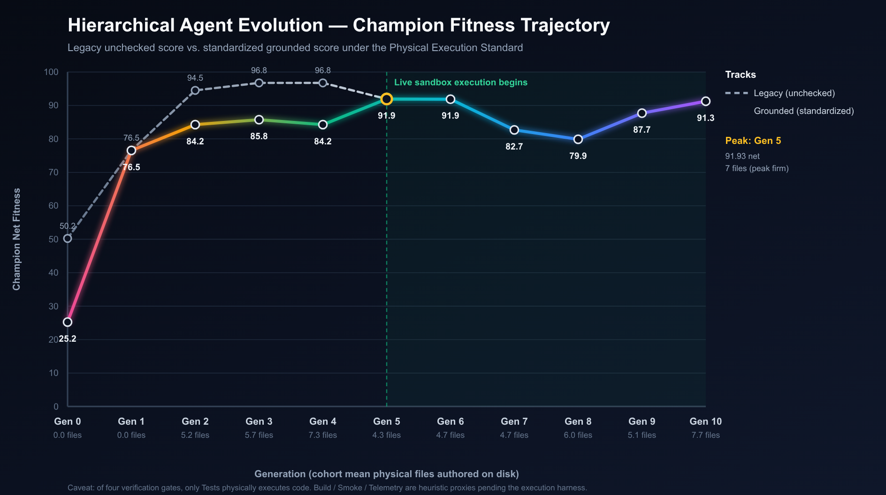
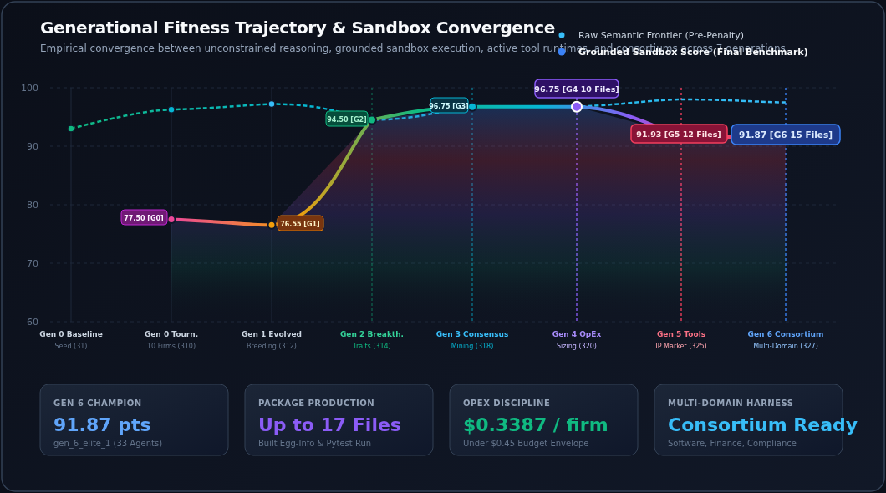

# V1 experiments: prose-graded evolution, Pilot to Generation 10

Status: closed and audited. 13 experiments (Pilot through Generation 10; Generation 11 aborted), archived for reproduction.

This directory is the archive of the V1 phase of Hierarchical Agent Evolution (HAE), a framework that breeds multi-agent LLM software-engineering organisations. In V1 each candidate ("firm") was a hierarchy of 31-34 agents: a CEO, department managers and specialists. Ten firms competed per generation on an open-ended objective (design and implement a production-ready `agent-org` platform), were scored by an LLM judge (95% or more of the weight) plus a four-gate sandbox verifier, and the survivors were recombined and mutated into the next generation.

Two results define the phase.

- Published champion fitness rose from 25.25 in Generation 0 to a peak of 96.75 (Generations 3 and 4), with 91.26 in Generation 10.
- Re-executing all 60 firms from Generations 5-10 ([`execution_grounded_correction.md`](execution_grounded_correction.md)) showed that execution quality did not improve over the same span: corr(generation, execution score) = +0.045, and **0 of 60 firms passed all five execution gates**. Selection had optimised for persuasive memos and markdown blueprints rather than working software.

This audit drove the V2 design: open-ended prose prompts were replaced by self-hosting benchmarks scored by held-out test suites (tests the agents never see) run under `unshare -rn` (an isolated user and network namespace), weighted at 30% of fitness, with `carry_artifacts=False` (no artifacts carried between generations).

## Experiment registry

Infrastructure: exp-001 ran on Cloud Kubernetes (`e2-standard-4` nodes); exp-002 used 5 parallel pods; exp-003 to exp-006 added a gVisor sandbox for agents; exp-007 onward ran as a 10-pod indexed Kubernetes Job. Champion scores are the legacy net fitness published at the time; see the corrections below.

| Experiment | Gen | What changed | Firms (agents) | Champion | Links |
| :--- | :---: | :--- | :---: | :---: | :--- |
| `exp-001-pilot-baseline` | 0-1 | Pilot. Firms adapt their own headcount. | 6 | 96.25 | [folder](exp-001-pilot-baseline/) |
| `exp-002-parallel-tournament` | 0 | First 10-firm parallel tournament; four-gate sandbox penalty introduced. | 10 (310) | 77.50 | [folder](exp-002-parallel-tournament/) |
| `exp-003-parallel-gen1` | 1 | Three-way recombination of parent genomes; short, under-specified personas found to be the bottleneck. | 10 (312) | 76.55 | [folder](exp-003-parallel-gen1/) |
| `exp-004-parallel-gen2` | 2 | Structured persona fields (`backstory_traits`); sandbox penalties converge to zero. | 10 (314) | 94.50 | [folder](exp-004-parallel-gen2/) |
| `exp-005-parallel-gen3` | 3 | Recombination of genome fields shared by top survivors; pytest harness injected into firms. | 10 (318) | 96.75 | [folder](exp-005-parallel-gen3/), [report](exp-005-parallel-gen3/experiment_report.md) |
| `exp-006-parallel-gen4` | 4 | Firms size their own headcount; per-model token cost accounting with a budget. | 10 (320) | 96.75 | [folder](exp-006-parallel-gen4/), [report](exp-006-parallel-gen4/experiment_report.md) |
| `exp-007-parallel-gen5` | 5 | File and shell tools on a container scratchpad; verified modules reused across firms through a royalty ledger. | 10 (325) | 91.93 | [folder](exp-007-parallel-gen5/), [report](exp-007-parallel-gen5/experiment_report.md) |
| `exp-008-parallel-gen6` | 6 | Inter-firm communication channels; firm-defined acceptance metrics; pluggable evaluation harnesses. | 10 (327) | 91.87 | [folder](exp-008-parallel-gen6/), [report](exp-008-parallel-gen6/experiment_report.md) |
| `exp-009-parallel-gen7` | 7 | LLM provider portability (Gemini API, OpenAI, Anthropic, Ollama/vLLM). | 10 (327) | 82.70 | [folder](exp-009-parallel-gen7/), [report](exp-009-parallel-gen7/experiment_report.md) |
| `exp-010-parallel-gen8` | 8 | In-loop pytest with traceback-driven self-repair. | 10 (334) | 79.89 | [folder](exp-010-parallel-gen8/), [report](exp-010-parallel-gen8/experiment_report.md) |
| `exp-011-parallel-gen9` | 9 | Variable topologies (3-6 departments) and structural crossover. | 10 (319) | 87.68 | [folder](exp-011-parallel-gen9/), [report](exp-011-parallel-gen9/experiment_report.md) |
| `exp-012-parallel-gen10` | 10 | Federated mesh routing; self-evolving rubric engine. | 10 (341) | 91.26 | [folder](exp-012-parallel-gen10/), [report](exp-012-parallel-gen10/experiment_report.md) |
| `exp-013-parallel-gen11` | 11 | Execution-first selection with in-loop verification. Failed run, no valid score. | 10 (342) | none | [folder](exp-013-parallel-gen11/), [failure analysis](exp-013-parallel-gen11/README.md) |

> [!CAUTION]
> Generation 11 did not complete and has no generation-level score. Three of ten firms, every structurally novel topology in the population, crashed at genome load with a `tools_enabled` type error inherited from `morphogenesis.py`. Harvesting the seven conservative survivors would have reproduced the survivorship bias retracted in the re-execution section below, so the run was aborted. The V1 set closes at Generation 10. Analysis: [`exp-013-parallel-gen11/README.md`](exp-013-parallel-gen11/README.md).

## How firms were scored

$$
F = 0.25\,S + 0.25\,T + 0.20\,C + 0.15\,R + 0.15\,A - P
$$

S, T, C, R and A are the judge's scores (0-100) for strategic depth, technical feasibility, cross-functional coherence, risk mitigation and actionability. P is the sandbox penalty: 6.25 points per failed gate, at most 25.0.

| Gate | Intended check | What the Generation 5-10 code (`src/sandbox_verifier.py`) actually did |
| :--- | :--- | :--- |
| Build | `pyproject.toml` or `setup.py` exists | Matched a manifest filename; never parsed the contents |
| Smoke | At least 3 distinct code files | Matched the `.py` extension |
| Telemetry | OpenTelemetry spans or metric hooks present | Substring search for `opentelemetry` over the whole bundle, CEO prose included |
| Tests | Test suite passes under `pytest` | Ran pytest if installed; otherwise `any("def test_" in c or "assert " in c ...)`. Pytest was usually not installed |

In Generations 0-4 the verifier was a regex over the markdown output, with no container and no pytest run; a test gate passed if the token `test` or `def test_` appeared in the text, so Generations 2-4 recorded 0.00 penalties and scores near 96.75. From Generation 5 agents worked on container scratchpads (`/tmp/hae_workspaces/`) where they could install their package and run `python3 -m pytest tests/` themselves; with no traceback-driven repair loop, assertion mismatches cost the 6.25-point test penalty. The evaluator's own gates stayed heuristic through Generation 10, and every fitness number published for Generations 5-10 inherited them.

## Fitness by generation, standardized

The table deducts 6.25 points for every gate that was not executed or failed, so that all generations are measured the same way. "Scratchpad" and "Tests run" mean that agents worked on a live container workspace and ran pytest there.

| Gen | Legacy champion | Standardized champion | Scratchpad | Tests run | Avg files | Max files | Deliverable |
| :---: | :---: | :---: | :---: | :---: | :---: | :---: | :--- |
| 0 | 50.25 | 25.25 | no (0 files) | no | 0.0 | 0 | Prose only (single-agent baseline pilot) |
| 1 | 76.55 | 76.55 | no (0 files) | no | 0.0 | 0 | Textual specification, 0 files |
| 2 | 94.50 | 84.25 | no (0 files) | no | 5.2 | 10 | Markdown code snippets, not executed |
| 3 | 96.75 | 85.75 | no (0 files) | no | 5.7 | 8 | Modular blueprints in text |
| 4 | 96.75 | 84.25 | no (0 files) | no | 7.3 | 10 | Multi-firm strategy text |
| 5 | 91.93 | 91.93 | yes (10/10) | yes (10/10) | 4.3 | 7 | Files on disk; pytest run by agents |
| 6 | 91.87 | 91.87 | yes (10/10) | yes (10/10) | 4.7 | 6 | Installable package (`egg-info`) |
| 7 | 82.70 | 82.70 | yes (10/10) | yes (10/10) | 4.7 | 7 | Multi-provider REST runtime |
| 8 | 79.89 | 79.89 | yes (10/10) | yes (10/10) | 6.0 | 10 | First live `Tests: PASS` (2 of 10 firms) |
| 9 | 87.68 | 87.68 | yes (10/10) | yes (10/10) | 5.1 | 7 | Variable 3-6 department topologies |
| 10 | 91.26 | 91.26 | yes (10/10) | yes (10/10) | 7.7 | 18 | Highest authored-file output (7.7 average) |

File counts above are audited. The runtime originally reported `run_output["workspace_files"]` unfiltered, so `.pytest_cache/` and `__pycache__` byproducts and markdown-contaminated paths (such as `routing.py**`) were counted as deliverables. Across Generations 5-10 this inflated every published file count by 42-59%; the reconciliation is in [`artifact_integrity_audit.json`](artifact_integrity_audit.json) (reproduce with `PYTHONPATH=. python3 experiments/v1/scripts/audit_artifact_integrity.py`) and the bug is fixed in `src/artifacts.py`. One published claim falls to this audit: Generation 9's "cohort file density record of 12.3 files per firm" is retracted; the audited average is 5.1 authored files per firm, below Generation 8's 6.0, so Generation 9 regressed on artifact density. Per-firm file counts quoted elsewhere in this document for Generations 5-10 are the pre-audit figures unless marked audited.



## Re-execution of Generations 5-10 (60 firms)

`src/sandbox_verifier.py` was rewritten to delegate to [`src/execution_harness.py`](https://github.com/SinaChavoshi/hierarchical-agent-evolution/blob/v1-final/src/execution_harness.py), which runs the code through five gates: `ast.parse` over every authored `.py` file (a new syntax gate), a real `pip install -e .`, `importlib` in a fresh interpreter, a real `pytest` run, and an AST telemetry check that requires both an `opentelemetry` import node and a span call site. A gate the harness cannot evaluate (for example an uninstalled third-party import) returns SKIPPED, never PASSED. All 60 archived firms were re-scored against it inside the project container (`pip` 24.0, `pytest` 9.1.1, `opentelemetry` installed). Cells read legacy -> executed.

| Gen | Syntax (new) | Build | Smoke | Tests | Telemetry |
| :---: | :---: | :---: | :---: | :---: | :---: |
| 5 | 7/10 | 6 -> 7 | 6 -> 0 | 0 -> 0 | 10 -> 5 |
| 6 | 7/10 | 4 -> 5 | 4 -> 1 | 0 -> 0 | 10 -> 1 |
| 7 | 7/10 | 3 -> 5 | 3 -> 2 | 0 -> 0 | 10 -> 3 |
| 8 | 3/10 | 3 -> 4 | 3 -> 2 | 2 -> 2 | 7 -> 3 |
| 9 | 9/10 | 3 -> 7 | 3 -> 7 | 0 -> 0 | 9 -> 1 |
| 10 | 8/10 | 7 -> 3 | 7 -> 5 | 2 -> 1 | 9 -> 2 |
| All 60 | 41/60 | 26 -> 31 | 26 -> 17 | 4 -> 3 | 55 -> 15 |

- Telemetry falls from 55/60 to 15/60: 40 firms had passed on prose. This is the largest correction in the project.
- 19 of 60 firms shipped Python that does not parse. No legacy gate parsed anything, so this was invisible.
- Build improves, 26 -> 31. A real `pip install -e .` accepts manifests the filename regex missed.
- 21 firms have a SKIPPED smoke gate because of uninstalled third-party imports.

Execution score is gates passed divided by gates evaluable, averaged over the cohort:

| Gen | Execution score | Mean gates passed (of 5) | Firms with zero gates | Legacy net, cohort mean |
| :---: | :---: | :---: | :---: | :---: |
| 5 | 46.5% | 1.90 | 3 | 81.34 |
| 6 | 34.0% | 1.40 | 2 | 72.25 |
| 7 | 36.5% | 1.70 | 2 | 70.36 |
| 8 | 29.0% | 1.40 | 1 | 68.98 |
| 9 | 49.5% | 2.40 | 1 | 73.24 |
| 10 | 40.0% | 1.90 | 1 | 84.52 |

corr(generation, execution score) = +0.045, a trend of +0.19 percentage points per generation, which is flat. Published legacy net climbed at +0.50 per generation over the same span. Across all 60 firms corr(legacy net, gates passed) = +0.286 and corr(gross judge score, gates passed) = +0.201: **the signal selection used explains roughly 8% of the variance in whether the code runs.**

Specific published claims, corrected:

- Retracted: the "first zero-penalty four-gate clearance" by `gen_10_consensus_1` (89.23, `score_penalty = 0.0` under the legacy verifier). Real pytest returns `ERROR tests/test_agent_failure_introspection.py` and `ERROR tests/test_economic_attack.py`, and no authored Python file imports `opentelemetry`; the legacy telemetry gate passed it on the CEO's prose. Executed: 3 of 5. Its clean 4/4 module import, the only perfect smoke result in Generation 10, stands.
- Confirmed: Generation 8's first live `Tests: PASS`. `gen_8_consensus_2` and `gen_8_mutant_2` both pass under real pytest.
- New: `gen_9_consensus_1`, the Generation 9 champion at 87.68 and a parent of the next generation, passes 0 of 5. Its `agent_org/core.py` is an indented fragment with no enclosing class (`unexpected indent`, line 1), so Syntax, Smoke and Tests fail; `pip install -e .` fails; no authored file imports `opentelemetry`. Its legacy Build, Smoke and Telemetry passes came from filename matching and a substring search over CEO prose. The best executed result in the archive is 4/5, from `gen_9_pareto_bonus_2`, which ranked sixth in its cohort by legacy fitness and was never selected as a parent. No firm in 60 passed all five gates.

Full analysis, per-firm evidence and the corrected leaderboard: [`execution_grounded_correction.md`](execution_grounded_correction.md). Raw data: [`execution_grounded_fitness.json`](execution_grounded_fitness.json).

> [!WARNING]
> `harness_net` is not comparable to `legacy_net`. A SKIPPED gate carries no penalty, so a firm that executes less code can score higher. Compare gate pass rates, not nets.

## Counterfactual: the archive under the rebuilt rubric

`src/evaluator.py` was rebuilt. `execution_integrity`, measured by the harness and invisible to the judge, is 30% of the rubric and its heaviest dimension. The two saturated judged dimensions, coherence and actionability (both at mean 99.0, standard deviation 1.67, in Generation 10), drop from a combined 35% to 20%. The silent `70/70/70/65/70` fallback that admitted failed evaluations into the breeding pool is replaced by an explicit `evaluation_failed` at 0.0.

Applying the new weights to all 60 archived firms, using each scorecard's own judge scores and the executed gates above with no re-runs, re-ranks the archive:

| Gen | Champion bred (legacy net) | Its rank under the rebuilt rubric | Champion under the rebuilt rubric (score) |
| :---: | :--- | :---: | :--- |
| 5 | `gen_5_mutant_3` (91.93) | 1 of 10 | `gen_5_mutant_3` (87.15) |
| 6 | `gen_6_elite_1` (91.87) | 3 | `gen_6_consensus_3` (80.22) |
| 7 | `gen_7_mutant_1` (82.70) | 5 | `gen_7_pareto_bonus_1` (85.05) |
| 8 | `gen_8_pareto_bonus_2` (79.89) | 9 | `gen_8_consensus_2` (76.30) |
| 9 | `gen_9_consensus_1` (87.68) | 10 of 10 | `gen_9_pareto_bonus_2` (86.00) |
| 10 | `gen_10_mutant_3` (91.26) | 2 | `gen_10_elite_1` (89.10) |

In Generation 9 the firm selected as the sole parent of the next generation was the worst in its cohort (`execution_integrity` 0.0: nothing parses, installs, imports, tests or instruments). Generation 8's champion ranked ninth of ten. Every genome bred from Generation 6 onward descends from a lineage chosen this way. Generation 10's champion under the rebuilt rubric, `gen_10_elite_1` (`execution_integrity` 70.0), had finished sixth on the legacy board.

corr(legacy net, rebuilt score) = +0.650 over 60 firms. The cohort-mean trend is +0.41 points per generation under the rebuilt rubric against +0.50 under the legacy one: correcting the fitness function does not produce improvement that was not there; it explains why there was none.

These numbers are a counterfactual, not a new official leaderboard for Generations 5-10. The judge prompt also changed, so live Generation 11 scores would have differed from both series. Details and per-firm deltas: [`execution_grounded_correction.md`, section 6](execution_grounded_correction.md#6-re-scoring-the-archive-under-the-rebuilt-fitness-function). Reproduce: `PYTHONPATH=. python3 experiments/v1/scripts/rescore_under_new_rubric.py`.

## Champions and per-firm scores, Generations 0-6



- exp-001 ran without sandbox gates: seed `exp001_seed` 93.00 (31 agents), Generation 0 winner firm 3 at 94.60, Generation 1 champion `exp001_elite_2` at 96.25 (+3.25 over the seed).
- exp-002 (Generation 0, gates applied): raw judge scores of about 95-98 were docked 18.75 to 25.0 points; champion `gen_0_firm_3`, 77.50. exp-003 (Generation 1, three-way breeding): docked 18.75 to 25.0 again; champion `gen_1_elite_2`, 76.55.
- exp-004 (Generation 2): 90% code, 3 zero-penalty firms; champion `gen_2_mutant_2`, 94.50. exp-005 (Generation 3): 100% code, 4 zero-penalty firms; champion `gen_3_consensus_2`, 96.75. exp-006 (Generation 4): 100% code; champion `gen_4_elite_2`, 96.75, 10 files, $0.0305.

Per-firm breakdown for the top firms of each cohort. Judge dimensions are 0-100; penalty and gates are the legacy verifier's; file counts for Generations 5-6 are pre-audit.

| Firm | Gen | Strategic 25% | Technical 25% | Coherence 20% | Risk 15% | Actionability 15% | Penalty | Net | Legacy gates cleared (files) |
| :--- | :---: | :---: | :---: | :---: | :---: | :---: | :---: | :---: | :--- |
| `exp001_seed` | 0 | 95.0 | 80.0 | 100.0 | 95.0 | 100.0 | 0.00 | 93.00 | no gates applied |
| `exp001_elite_2` | 1 | 95.0 | 90.0 | 100.0 | 98.0 | 100.0 | 0.00 | 96.25 | no gates applied |
| `gen_0_firm_3` | 0 | 95.0 | 98.0 | 95.0 | 95.0 | 95.0 | -18.75 | 77.50 | Telemetry only |
| `gen_1_elite_2` | 1 | 95.0 | 92.0 | 98.0 | 96.0 | 97.0 | -18.75 | 76.55 | Telemetry only |
| `gen_2_mutant_2` | 2 | 95.0 | 93.0 | 96.0 | 94.0 | 95.0 | 0.00 | 94.50 | All four (10) |
| `gen_2_pareto_bonus_3` | 2 | 94.0 | 95.0 | 93.0 | 91.0 | 92.0 | 0.00 | 92.85 | All four (5) |
| `gen_3_consensus_2` | 3 | 95.0 | 98.0 | 100.0 | 90.0 | 100.0 | 0.00 | 96.75 | All four (5) |
| `gen_3_pareto_bonus_3` | 3 | 95.0 | 95.0 | 100.0 | 90.0 | 100.0 | 0.00 | 96.00 | All four (5) |
| `gen_3_elite_1` | 3 | 92.0 | 95.0 | 100.0 | 94.0 | 98.0 | 0.00 | 95.55 | All four (8) |
| `gen_3_consensus_3` | 3 | 95.0 | 90.0 | 100.0 | 95.0 | 100.0 | 0.00 | 95.50 | All four (5) |
| `gen_3_elite_2` | 3 | 98.0 | 95.0 | 100.0 | 100.0 | 100.0 | -6.25 | 92.00 | Build, Smoke, Telemetry (5) |
| `gen_4_elite_2` | 4 | 95.0 | 98.0 | 100.0 | 90.0 | 100.0 | 0.00 | 96.75 | All four (10) |
| `gen_4_elite_1` | 4 | 95.0 | 90.0 | 100.0 | 90.0 | 100.0 | 0.00 | 94.75 | All four (7) |
| `gen_4_mutant_1` | 4 | 95.0 | 85.0 | 100.0 | 80.0 | 100.0 | 0.00 | 92.00 | All four (6) |
| `gen_4_consensus_2` | 4 | 95.0 | 98.0 | 100.0 | 95.0 | 100.0 | -12.50 | 85.00 | Telemetry, Tests (5) |
| `gen_5_mutant_3` | 5 | 98.0 | 95.0 | 100.0 | 98.0 | 100.0 | -6.25 | 91.93 | Build, Smoke, Telemetry (12) |
| `gen_5_consensus_3` | 5 | 95.0 | 98.0 | 100.0 | 90.0 | 100.0 | -6.25 | 90.95 | Build, Smoke, Telemetry (10) |
| `gen_5_elite_2` | 5 | 92.0 | 95.0 | 98.0 | 92.0 | 100.0 | -6.25 | 88.93 | Build, Smoke, Telemetry (11) |
| `gen_5_consensus_1` | 5 | 95.0 | 95.0 | 98.0 | 90.0 | 95.0 | -6.25 | 87.08 | Build, Smoke, Telemetry (9) |
| `gen_5_consensus_2` | 5 | 90.0 | 90.0 | 95.0 | 90.0 | 95.0 | -6.25 | 85.13 | Build, Smoke, Telemetry (3) |
| `gen_6_elite_1` | 6 | 95.0 | 98.0 | 100.0 | 95.0 | 100.0 | -6.25 | 91.87 | Build, Smoke, Telemetry (15) |
| `gen_6_consensus_3` | 6 | 95.0 | 98.0 | 100.0 | 85.0 | 100.0 | -6.25 | 86.13 | Build, Smoke, Telemetry (17) |
| `gen_6_consensus_2` | 6 | 95.0 | 90.0 | 100.0 | 95.0 | 100.0 | -6.25 | 82.42 | Build, Smoke, Telemetry (12) |
| `gen_6_consensus_1` | 6 | 95.0 | 98.0 | 100.0 | 95.0 | 100.0 | -18.75 | 77.24 | Telemetry only (6) |
| `gen_6_mutant_3` | 6 | 95.0 | 45.0 | 98.0 | 40.0 | 90.0 | -6.25 | 67.93 | Build, Smoke, Telemetry (12) |

## What each generation changed

Generations 0-3 (exp-001 to exp-005):

- Gen 0: fixed departmental hierarchies. Peer review between departments was polite and shallow; deliverables were narrative prose without code, and risk analysis was superficial.
- Gen 1: cross-department challenge and red-team review; headcount expansion and dedicated packaging specialists. Bottleneck: short, under-specified agent personas, and prose where code formatting was needed.
- Gen 2: structured persona fields (`backstory_traits`) and strict code-block and manifest formatting. Bottleneck: test assertion mismatches.
- Gen 3: recombination of genome fields shared by the top survivors, plus an injected pytest harness. Bottleneck: high token cost with every agent on a Pro-tier model.

### Generation 4 (exp-006)

- The CEO and department managers could change specialist headcount within a generation (3 to 6 per department). The population settled on an asymmetric 32-agent topology with the sixth specialist in `dept_systems_eng`.
- Token cost was charged per model tier: $0.075 / $0.30 per 1M tokens for Gemini 2.5 Flash against $1.25 / $5.00 for Gemini 2.5 Pro. This cut cost per run by roughly 12-16x; a complete 32-agent run cost $0.024-$0.123 against a $0.45 budget.
- Lean firms won. `gen_4_elite_2`, `gen_4_elite_1` and `gen_4_mutant_1` used 24k-41k tokens ($0.025-$0.043), took the top three places (96.75, 94.75, 92.00) with 0.00 penalty on all four legacy gates, and `gen_4_elite_2` produced 10 files, the most to that point. `gen_4_consensus_3` produced 116k tokens ($0.1225) of prose, drifted into syntax errors and took a 12.50 penalty (rank 7, 79.50). `gen_4_pareto_bonus_2` (23k tokens, $0.0241) under-built: 4 skeleton files, failed unit tests, 18.75 penalty, 79.05.
- Report: [`exp-006-parallel-gen4/experiment_report.md`](exp-006-parallel-gen4/experiment_report.md).

### Generation 5 (exp-007)

- Specialist agents moved from text generation to tool use on a per-firm scratchpad (`/tmp/hae_workspaces/{company_id}/`) with `write_file`, `read_file`, `list_files` and `execute_bash(command)`. Firms wrote packaging trees to disk (8 to 14 files per firm), installed them via `setup.py` and ran `pytest`.
- Offspring could mount verified modules from Generation 4 winners into their scratchpads instead of rewriting them; a ledger charged a $0.015 royalty fee or credit against each firm's balance.
- 6 of 10 firms cleared Build, Smoke and Telemetry and lost 6.25 for pytest assertion failures. Champion `gen_5_mutant_3`: 91.93, 12 files on disk, $0.4081 against the $0.45 ceiling.
- Report: [`exp-007-parallel-gen5/experiment_report.md`](exp-007-parallel-gen5/experiment_report.md).

### Generation 6 (exp-008)

- `src/consortium.py`: bilateral channels in which CEOs and department managers negotiate joint ventures, technology cross-licensing and consortium bids with other firms. `src/harnesses.py`: evaluation harnesses decoupled from the software task, adding quantitative financial-trading risk validation and statutory compliance auditing. `EvaluationMetricSpec` and `TeleologicalVerifier`: firms define and track their own quantitative acceptance tests.
- `gen_6_elite_1`: 91.87 net (gross 97.5, 15 files, $0.3387 against $0.45, +0.62 efficiency bonus). `gen_6_consensus_3`: 86.13 net with 17 files, the most to that point, including packaging manifests, systems-engineering specifications, adversarial tests and `agent_org_mva.egg-info`. 4 of 10 firms cleared Build, Smoke and Telemetry.
- Report: [`exp-008-parallel-gen6/experiment_report.md`](exp-008-parallel-gen6/experiment_report.md).

### Generation 7 (exp-009)

- `src/llm_factory.py` removed the dependency on Vertex AI REST and service accounts. Providers: Gemini Developer API (`GEMINI_API_KEY`), OpenAI (`OPENAI_API_KEY`), Anthropic (`ANTHROPIC_API_KEY`), and local models via Ollama or vLLM (`OPENAI_BASE_URL=http://localhost:11434/v1`). Tiers: executive (`gpt-4o`, `claude-3-5-sonnet`, `gemini-2.5-pro`) and worker (`gpt-4o-mini`, `claude-3-5-haiku`, `gemini-2.5-flash`, `llama-3.3-70b`).
- `gen_7_mutant_1`: 82.70, 3 files, Build, Smoke and Telemetry cleared, 6.25 test penalty, 718k tokens ($0.4632). `gen_7_consensus_2`: 80.32, recombined from the top Generation 6 survivors, 9 files, same gates. Standardized fitness equals the legacy figure, 82.70.
- Report: [`exp-009-parallel-gen7/experiment_report.md`](exp-009-parallel-gen7/experiment_report.md).

### Generation 8 (exp-010)

- `src/company.py`, Step 2.5: pytest runs in the scratchpad, tracebacks are extracted, and Systems Engineering specialists get iterative repair rounds. Fixed a dictionary membership bug (`"test" in f` -> `"test" in f.get("path", "").lower()`) and added guards against virtualenv payload bloat.
- First live `Tests: PASS` in the project, from two firms: `gen_8_mutant_2` (rank 2, net 74.42, gross 88.6, 11 files, Tests and Telemetry PASS) and `gen_8_consensus_2` (rank 4, net 71.79, gross 83.8, 12 files, Tests and Telemetry PASS). Both hold under real pytest.
- Champion `gen_8_pareto_bonus_2`: 79.89, 13 files, Build, Smoke and Telemetry, 6.25 test penalty, $0.3802 (+0.39 bonus), 635k tokens. Third: `gen_8_elite_1`, 74.38, 4 files, Build and Smoke.
- Report: [`exp-010-parallel-gen8/README.md`](exp-010-parallel-gen8/README.md).

### Generation 9 (exp-011)

- `src/morphogenesis.py` replaced the fixed 5-department template (`default_company.json`) with synthesized topologies of 3 to 6 departments (21 to 37 agents), including formal-verification departments (`dept_formal_verification`), AST-rewriting cores and 3-department lean topologies. `StructuralCrossoverEngine` recombines genomes across unequal topologies by mapping functional roles.
- Champion `gen_9_consensus_1`: 87.68 (+7.79 over the Generation 8 champion), gross 93.7, 5 audited files (11 raw), $0.4094; legacy gates Build, Smoke and Telemetry PASS, Tests FAIL. Under execution it passes 0 of 5 and the cohort's strongest firm by executed gates was never bred forward; see the re-execution section.
- Runner-up `gen_9_mutant_1`: 81.00, a 6-department formal-verification topology (37 agents), Build, Smoke and Telemetry cleared, 6.25 penalty.
- Report: [`exp-011-parallel-gen9/README.md`](exp-011-parallel-gen9/README.md).

### Generation 10 (exp-012)

- `src/federated_mesh.py`: `FederatedMeshRouter` and `MeshPeerNode` distribute departments across infrastructure nodes with deterministic routing and HMAC-authenticated `HAE-MESH-v1` peer tokens. `src/rubric_evolution.py`: `SelfEvolvingRubricEngine` scores workspaces on AST well-formedness, security posture, assertion density and type coverage.
- Champion `gen_10_mutant_3`: 91.26, 18 audited files (29 raw), the highest audited single-firm count in the archive (previous best 10), at the second-lowest cost in the cohort ($0.3140). Legacy gates Build, Smoke and Telemetry PASS, Tests FAIL. Executed: 3 of 5 (Syntax PASS, Build PASS with an editable install, Telemetry PASS with 2 imports and 8 span call sites, Tests FAIL, Smoke SKIPPED on uninstalled third-party dependencies), the best-verified champion in the archive. The "zero-penalty four-gate clearance" claimed for `gen_10_consensus_1` is retracted; see the re-execution section.
- Cohort records: mean net 84.52 (previous best 81.34, Generation 5) and 7.7 audited files per firm (previous best 6.0, Generation 8). Mean cost was roughly flat at $0.4337 despite 51% more audited artifacts than Generation 9. The artifact trend is not monotonic: Generation 9 (5.1) sits below Generation 8 (6.0). The three largest firms (41, 37 and 37 agents) finished 7th, 8th and 10th; all four top finishers ran the 5-department, 34-agent configuration.
- Caveat recorded at the time: only the Tests gate executed code (Build, Smoke and Telemetry were filename, file-count and vocabulary heuristics); 62% of net-fitness variance came from the gates; two of five judged dimensions sat at mean 99.0; and corr(files authored, gross score) = +0.06, so the judge was effectively blind to how much software a firm produced. Cross-generation net-fitness comparisons are provisional. See section 4 of the [Generation 10 report](exp-012-parallel-gen10/experiment_report.md).

## Fixes made before Generation 11

- Execution harness ([`src/execution_harness.py`](https://github.com/SinaChavoshi/hierarchical-agent-evolution/blob/v1-final/src/execution_harness.py)): the five executed gates described above. `src/sandbox_verifier.py` delegates to it; no heuristic gate remains.
- Artifact accounting ([`src/artifacts.py`](https://github.com/SinaChavoshi/hierarchical-agent-evolution/blob/v1-final/src/artifacts.py)): a single source of truth for file counts; `run()` no longer returns an unfiltered bundle.
- Retroactive backfill of all 60 scorecards and the judge rubric repair, both described above.
- Morphogenesis phenotype: spawned verification departments could not write files; tool-enabled agents went from 127 to 139 of 279.
- Container image: `scripts/` and `pyproject.toml` baked in; the `gen10-code` and `gen8-code` ConfigMaps deleted; the build asserts at image-build time that `pip`, `pytest`, `opentelemetry` and the harness modules import; images tagged per generation rather than only `latest`, so a run can be tied to an immutable image. `crewai`, `crewai-tools` and `langchain-google-vertexai` removed along with the dead `get_crewai_llm()`, their only caller.
- Measured token telemetry: real `usageMetadata` counts, with reasoning tokens billed at the output rate. `token_accounting.fully_measured` on each scorecard says whether the cost figure was measured or estimated; `len(text)/4` remains only as a fallback.
- Vertex credentials: tokens are cached with their provider-reported expiry, refreshed 300 s early, and re-fetched on a 401, which is now in the retry path. Refreshable sources (metadata server, Workload Identity) are tried before the un-refreshable `VERTEX_API_TOKEN`, and a forced refresh skips any source that returns the token just rejected.

Root cause of the Generation 9 and 10 mid-tournament failures, found while launching Generation 11: switching to Workload Identity produced an immediate `403 PERMISSION_DENIED` on `aiplatform.endpoints.predict` in all three pods, because `agent-evolution-sa@gemle-gke-dev.iam.gserviceaccount.com` held no project IAM roles at all. The pods had never authenticated as themselves: every generation from 5 onward ran on a human's access token injected through the `vertex-token` Secret, which expires after about an hour and could not be renewed from inside the cluster. That is why firms died roughly an hour into Generations 9 and 10. Fixed by granting `roles/aiplatform.user` and `roles/storage.objectAdmin`; the `VERTEX_API_TOKEN` secret was removed from the manifest rather than kept as a fallback, because a fallback that silently works would hide a recurrence. For two generations this looked like a token-refresh bug, and a refresh fix alone would have turned a loud hourly failure into a permanent silent one.

## Generation 11: execution-first selection (aborted)

Through Generation 10 the agents and the evaluator looked at different things: agents could run pytest, but the score came from gates they never saw, and those gates were heuristics. [`src/verification_loop.py`](https://github.com/SinaChavoshi/hierarchical-agent-evolution/blob/v1-final/src/verification_loop.py) let a technical agent issue `Action: verify` and receive the exact gate report that scores its firm, from the same `ExecutionHarness` the evaluator runs. Two deliberate constraints:

- Rate-limited to 3 verifications per firm, not per department. The scorecard records how many attempts were used and whether the firm regressed after its best attempt; a firm that needs three attempts to produce parseable code is not equivalent to one that gets it right first.
- Verdicts, not coaching. The report returns real tracebacks and gate results and never suggests an edit, so selection pressure comes from the population rather than from the harness steering every firm toward one answer.

Survivors were ranked by the rebuilt rubric (table above) rather than legacy net. The population was bred by [`scripts/breed_gen11_population.py`](scripts/breed_gen11_population.py) from [`rubric_rescore.json`](rubric_rescore.json), deliberately not from `exp-012-parallel-gen10/top_5_survivor_genomes.json`, which follows the legacy ranking that picked the wrong firm in five of six generations. Three directed mutants targeted the three measured deficits: unparseable modules (19 of 60 firms), prose-only telemetry (55/60 -> 15/60) and uncollectable test suites (3 of 60 green).

Generation 11 scores would have been on a new scale, not comparable to Generations 1-10: the gates sit inside the gross score as `execution_integrity` instead of being subtracted as a penalty, and the judge prompt changed. The run was aborted at genome load; see the registry note above and [`exp-013-parallel-gen11/README.md`](exp-013-parallel-gen11/README.md).

## Open items at the close of V1

- Recursive self-hosting (pillar 4): no evolved artifact was ever merged into `src/`. The stated end state, a platform that improves its own source, was not reached in ten generations.
- Repository consolidation: 22 near-identical manifests in `k8s/` and 10 one-off `breed_gen*` / `harvest_and_finalize_gen*` scripts. `ThreeWayBreedingEngine` in `src/breeding.py` had not run in production since Generation 5.
- Judge saturation: `execution_integrity` couples the score to execution, but the five judged dimensions are still produced by one model reading prose. Gross-score standard deviation fell from 9.23 (Generation 7) to 4.54 (Generation 10).

## Reproduction

The commands target the V1 code tree (tag `v1-final`) and run from the repository root. Each experiment folder holds its champion as `winning_champion_genome.json`.

```bash
# Replay one champion. Substitute the experiment folder:
#   exp-004 (Gen 2, 94.50), exp-005 (Gen 3, 96.75), exp-006 (Gen 4, 96.75, $0.0305),
#   exp-007 (Gen 5, 91.93, 12 files on disk), exp-008 (Gen 6, 91.87, 15 files on disk)
python3 -m src.main \
  --mode single-firm \
  --config experiments/v1/exp-005-parallel-gen3/winning_champion_genome.json \
  --objective "Design and implement the production-ready 'agent-org' platform"
```

The exp-008 champion was run with the objective `Design and implement the production-ready 'agent-org' platform with inter-firm consortiums, teleological OKRs, and pluggable multi-domain evaluation`.

Full tournaments are Kubernetes indexed Jobs. The manifests are in [`k8s/`](k8s/): `parallel-indexed-job-gen2.yaml`, `parallel-indexed-job-gen3.yaml` and `parallel-indexed-job-gen{4,5,6}-east4.yaml` cover Experiments 004 to 008.

```bash
# Re-run the Generation 4 tournament (Experiment 006)
kubectl apply -f experiments/v1/k8s/parallel-indexed-job-gen4-east4.yaml
```
