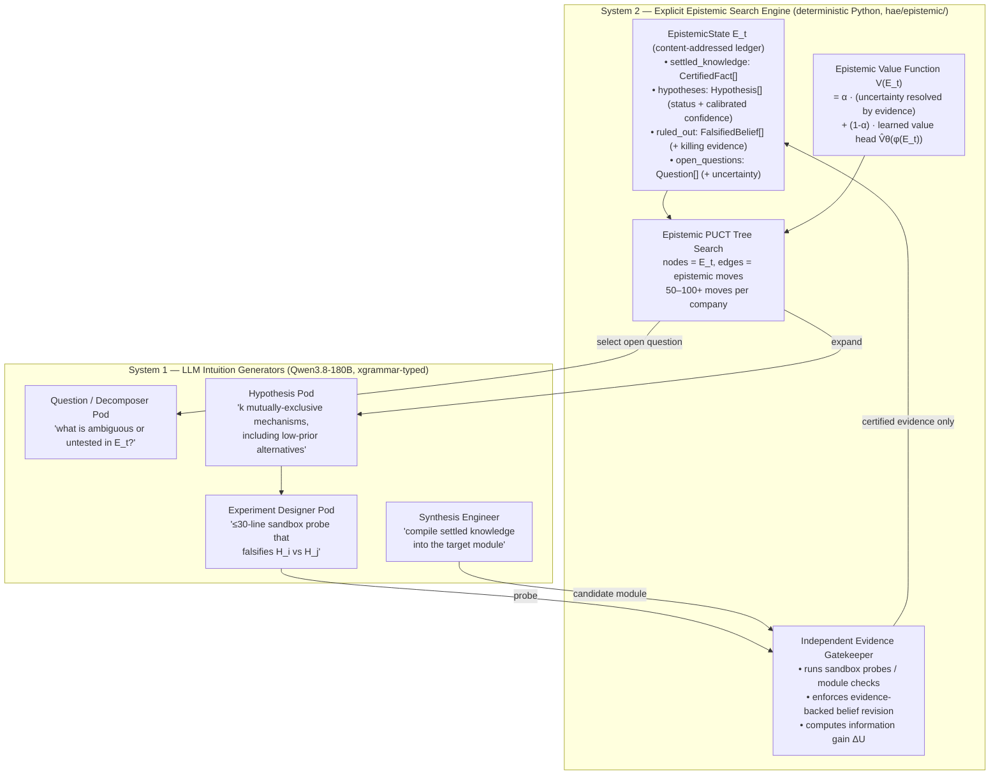

# Phase 6 (`V6`): Epistemic Tree-Search Organizations — *"The Scientific Method on Steroids"*

> **Status:** Design finalized `October 5, 2026` · **Stage 1 & 2 implemented and tested** (`October 6, 2026`: `hae/epistemic/` engine, `epistemic_policy` gene, runner/worker/breeder integration, audit-based fitness; `443` tests, `$0` GPU) · **Gen 16 pilot run `October 6, 2026`** (4 plateau genomes, 3 passes, ≈ 1.7 spot-GPU-hours, cluster deleted afterwards): one plateaued genome converged to `50/50` under `V6` via a `0.10`-prior hypothesis; five engine defects found live and fixed in-tree — see **§3.3** and [`results/hae_gen16_v6_pilot/README.md`](../../results/hae_gen16_v6_pilot/README.md) · **Stage 3 (full cohort) pending** finding #6 and a multi-seed design
> **Trigger:** Thore Graepel (AlphaGo core team, now Chair of Machine Learning at UCL), *["Don't be fooled—LLMs don't reason"](https://www.technologyreview.com/2026/10/02/1145639/dont-be-fooled-llms-dont-reason/)*, MIT Technology Review, October 2, 2026
> **Empirical Motivation:** Generation 15 plateau analysis ([`results/hae_gen15_fullstack_v5/generation_15_summary.json`](../../results/hae_gen15_fullstack_v5/generation_15_summary.json))

---

## 1. Why `V6` Exists: What Generation 15 Taught Us About the Limits of Linear LLM Self-Repair

Generation 15 was our most successful run to date (`10 / 10` firms at `46–50 / 50`, two firms at `50 / 50`). It also produced the clearest evidence yet that **our repair loop is a 1-D greedy hill-climber driven purely by LLM intuition**, and that this architecture has a hard ceiling:

| Symptom in Gen 15 | Evidence | Diagnosis |
| :--- | :--- | :--- |
| **Flat-line repair trajectories** | `gen_14_elite_1` `[49, 49, 49, 49, 49]`, `gen_14_crossover_1` `[49, 49, 49, 49, 49]`, `gen_14_mutant_1` `[48, 48, 48, 48, 48]`, `gen_14_elite_2` `[46, 46, 46, 46, 46]` — **4 firms made zero progress across 16 combined repair iterations.** After Iteration 2, **`8 / 8` non-converged firms were stuck** (only `gen_14_mutant_2` gained `+2` tests at Iteration 4). | At `temperature=0.1`, the Lead Engineer re-emits the same highest-probability patch every iteration. The loop has **no memory of what it already tried and why it failed** (no *ruled-out* ledger), so it cannot pivot. |
| **The same wrong mechanism across independent firms** | `test_pytest_style_functions_are_collected` failed in **`7 / 8`** non-converged firm snapshots; `test_unittest_style_classes_are_collected` failed in **`6 / 8`**. | This is Graepel's *Move 37 problem* in reverse: the LLM's policy prior strongly favours one plausible-but-wrong implementation of stdlib test collection. A system that only samples **high-prior** moves never explores the low-prior alternative that actually passes. |
| **Repair only works when an oracle hands over the traceback** | Every `+36` / `+41` test jump (`gen_14_crossover_3`, `gen_14_pareto_2`, `gen_14_mutant_2`) happened **after** the external benchmark returned exact `AssertionError` diffs. | Firms never **ask their own questions** or **run their own falsification experiments**. Remove the oracle (as in real engineering) and the loop has no mechanism for reducing uncertainty. |
| **`50%` of fitness graded post-hoc prose** | `judge.py` scores `ExecutiveDeliverablePacket` narratives that are generated **after** the code exists. | Graepel: LLMs *"concoct [chains of thought] after the fact, reaching an answer by one route but reporting another."* We are rewarding a convincing story, not an auditable reasoning trail. |

---

## 2. The Architectural Diff: Our Previous "AlphaGo-Style" Plan vs. What AlphaGo Actually Does

Before reading Graepel's essay, our roadmap for "100+ internal iterations" was **MCTS over code snapshots scored by unit tests, with the CEO LLM assigning policy priors $P(s,a)$ and an LLM/heuristic critic as $V(s)$**. Graepel's account of AlphaGo exposes three fundamental errors in that framing:

```diff
- [PREVIOUS PLAN]  State s_t  = workspace code snapshot + binary test pass/fail vector
+ [GRAEPEL / V6]   State E_t  = explicit, persistent, INSPECTABLE EPISTEMIC LEDGER:
+                               { settled_knowledge (certified facts),
+                                 hypotheses (with calibrated confidence),
+                                 ruled_out (falsified beliefs + the evidence that killed them),
+                                 open_questions (unresolved uncertainty) }

- [PREVIOUS PLAN]  Move a_t   = "LLM rewrites a module file -> run external benchmark"
+ [GRAEPEL / V6]   Move a_t   = EPISTEMIC OPERATOR that changes E_t to reduce uncertainty:
+                               ASK / DECOMPOSE -> HYPOTHESIZE (k competing, incl. low-prior)
+                               -> EXPERIMENT (sandbox probe that can falsify) -> REVISE
+                               -> SYNTHESIZE code strictly from settled knowledge

- [PREVIOUS PLAN]  Value V(s) = held-out test count + LLM/AST heuristic critic
+ [GRAEPEL / V6]   Value V(E) = INDEPENDENT, NON-LLM evaluator of "how much uncertainty this
+                               move actually resolved, backed by evidence" + a learned
+                               value head trained on past epistemic search trees
```

| Dimension | ❌ Previous Plan & Current `V5` Runtime | ✅ Graepel's AlphaGo Architecture (`V6`) | Consequence |
| :--- | :--- | :--- | :--- |
| **System 1 / System 2 boundary** | CEO directives, specialist JSON packets, and chain-of-thought were treated as *deliberation*. | **The LLM is 100% System 1.** Chain-of-thought is *"the same next-token prediction process, iterated for longer."* System 2 must be **explicit, non-LLM machinery outside the weights** (AlphaGo's game tree + search). | Stacking more LLM calls on top of LLM calls does not create reasoning. The *organization* must be the System 2. |
| **Who edits beliefs** | Any agent could assert "fixed" / "verified" in prose. | *"An **independent part of the system** must evaluate each move by how much it actually resolves uncertainty, **updating beliefs only when the change is backed by evidence**."* | LLMs may **propose**; only a deterministic **Evidence Gatekeeper** running sandboxed probes may **certify** or **falsify**. |
| **Policy prior & Move 37** | CEO LLM assigns $P(s,a)$ and prunes low-plausibility branches. | AlphaGo's policy net gave Move 37 a **1-in-10,000** prior. Search found it **because it looked past plausibility** and evaluated consequences. | LLM-plausibility pruning systematically kills every "Move 37". `V6` deliberately expands **mutually exclusive, low-prior hypotheses** and lets cheap experiments — not the LLM — decide. |
| **Memory of dead ends** | Only `best_workspace_files` is kept; failed patches are forgotten. | The game tree retains **every variation considered**, annotated with evaluations. | `ruled_out` is a first-class ledger section; proposals matching a falsified mechanism are rejected before spending a turn. |
| **Auditability** | Fitness partly graded on post-hoc narrative. | *"Conclusions arise from an auditable sequence of evidence, inference, and belief revision rather than from a convincing story told after the fact."* | Replace prose rubric with an **Epistemic Integrity Audit** of the ledger (claims backed by certified experiments, calibration, no re-attempted falsified ideas). |

---

## 3. `V6` Architecture: The Company *Is* the System 2



### 3.0 Worked Walkthrough: How Prior Probability ($P$), Step Reward ($\Delta U$), Overlaying Value ($V$), and Calibration Work Together

To see how `V6` separates intuition from verification without any ML black boxes, follow a single open bug question (`q2`, starting at **Uncertainty $U = 1.0$** and ledger **Overlaying Value $V = 0.05$**) using the exact numbers from `gen_14_crossover_2` in the Gen 16 pilot:

1. **Prior Probability ($P$) — *"Which hunch do we check first?"* (LLM System 1 intuition)**
   * The LLM inspects the failure and proposes two competing explanations (`ProposeHypothesis` in [`hae/epistemic/moves.py`](../../hae/epistemic/moves.py)), each paired with a tiny sandbox reproduction script (`probe_lines`) and a falsifiable prediction:
     * **Hypothesis $H_1$:** *"The parent manager attribute is a raw dict instead of an object."* $\rightarrow$ LLM guesses **$P_1 = 0.75$ (75% likely)**.
     * **Hypothesis $H_2$:** *"The parent manager object is valid, `recombine()` just omits passing it to the constructor."* $\rightarrow$ LLM guesses **$P_2 = 0.10$ (10% likely)**.
   * **Crucial invariant:** $P_i$ is an unverified guess. It never counts as evidence; it only orders which probe PUCT runs first (while `low_prior_quota = 0.34` reserves 34% of expansions for long-shot underdogs like $H_2$ so high-prior hallucinations cannot starve the true fix).

2. **Move 1 — Sandbox Falsifies $H_1$ (`75%` hunch) $\rightarrow$ Process-of-Elimination Credit ($\Delta U = +0.44$)**
   * [`EvidenceGatekeeper.apply()`](../../hae/epistemic/gatekeeper.py) executes $H_1$'s probe in an isolated stage. **The prediction fails (`FALSIFIED`).**
   * Even though $H_1$ was wrong, proving what the bug *isn't* narrows the search space. The gatekeeper zeroes $H_1$'s posterior ($0.75 \rightarrow 0.0$), adds $H_1$ to the **tabu list** (`ruled_out`), and updates question uncertainty by process of elimination (`ELIMINATION_CREDIT = 0.5`):
     $$\text{mass} = 0.75 + 0.10 = 0.85, \qquad \text{dead} = 0.75, \qquad \frac{\text{dead}}{\text{mass}} = \frac{0.75}{0.85} = 0.882 \;(88.2\%\text{ of proposed suspects eliminated})$$
     $$U_{\text{new}} = U_0 \times \left(1 - 0.5 \times \frac{0.75}{0.85}\right) = 1.0 - 0.441 = \mathbf{0.559 \approx 0.56}$$
   * Why cap elimination credit at `0.5`? Because ruling out every suspect on the board (`dead / mass = 1.0`) still hasn't proven what the bug *actually is* — so elimination alone can at most cut uncertainty in half (`0.50`).
   * **Step Reward ($\Delta U$):** $1.0 - 0.56 = \mathbf{+0.44}$. **Overlaying Ledger Value ($V$):** rises from $0.05 \rightarrow \mathbf{0.31}$.

3. **Move 2 — Sandbox Confirms $H_2$ (`10%` "Move 37" underdog) $\rightarrow$ Positive Proof ($\Delta U = +0.425$)**
   * The loop next tests $H_2$ (`prior = 0.10`). **Its sandbox probe matches its prediction (`SUPPORTED`)!**
   * With positive physical reproduction (`SUPPORT_STRENGTH = 0.85`), posterior confidence jumps to $p'_2 = 1 - (1 - 0.10)(1 - 0.85) = \mathbf{0.865}$, and question uncertainty drops to:
     $$U_{\text{new}} = \max\!\big(0.05,\; 1.0 \times (1 - 0.865)\big) = \mathbf{0.135}$$
   * **Step Reward ($\Delta U$):** $0.56 - 0.135 = \mathbf{+0.425}$. **Overlaying Ledger Value ($V$):** jumps from $0.31 \rightarrow \mathbf{0.68}$.

4. **Move 3 — Patch Synthesis & Oracle Certification $\rightarrow$ $U = 0.00, V = 1.00$**
   * Only now — **after** a hypothesis is physically `SUPPORTED` — does the loop allow an engineer to edit `morphogenesis.py`. Once [`verify_module()`](../../hae/epistemic/gatekeeper.py) compiles and passes local checks (`Q_RESOLVED`), $U$ drops to `0.02` ($V = 0.92$). When the external 50-test oracle suite confirms `50/50` next iteration, `q2` becomes `CERTIFIED` ($U = 0.00, V = 1.00$).

5. **AlphaFold-Style Confidence Calibration (Grading the LLM's Honesty via Brier Score)**
   * Just as AlphaFold predicts per-residue confidence (**pLDDT**) and is penalized whenever stated confidence diverges from physical accuracy, [`calibration_report()`](../../hae/epistemic/value.py) grades every tested prior $P_i$ against the gatekeeper's actual binary verdict $O_i \in \{0, 1\}$ using Brier error $(P_i - O_i)^2$:
     * Bragging **$P_1 = 0.75$** on a false hunch ($O_1 = 0$) incurs $(0.75 - 0)^2 = \mathbf{0.5625}$ error.
     * Across generations, [`epistemic_integrity_score()`](../../hae/evaluation/judge.py) rewards lineages whose priors beat uninformative coin-flipping ($\text{Brier} < 0.25$) and breeds out overconfident hallucinating lineages.

| Quantity | Who sets it? | Range | Plain-English Role |
| :--- | :--- | :---: | :--- |
| **Prior Probability ($P_i$)** | LLM (System 1) | `0.05 – 0.95` | *"My gut hunch that Hypothesis $i$ is the bug."* Orders which probe runs first; never counts as evidence. |
| **Step Reward ($\Delta U$)** | Gatekeeper (Python) | `0.0 – 1.0` | *"How much real uncertainty this single sandbox experiment just eliminated."* (`0` for refused/no-op moves.) |
| **Overlaying Value ($V(E_t)$)** | [`EpistemicValueFunction`](../../hae/epistemic/value.py) | `0.0 – 1.0` | *"How close is the whole ledger to a verified fix?"* ($\alpha \cdot \text{resolved\_fraction} + (1-\alpha)\hat{V}(E_t)$.) |
| **Calibration (pLDDT / Brier)** | [`calibration_report`](../../hae/epistemic/value.py) | `0.0 – 100` | *"Did the LLM's stated probabilities match physical reality?"* Penalizes confident wrong guesses. |

### 3.1 Stage 1 — Core Engine (`hae/epistemic/`, CPU-only, `$0` GPU)

| Module | Responsibility | Key Invariants |
| :--- | :--- | :--- |
| [`hae/epistemic/ledger.py`](../../hae/epistemic/ledger.py) | `EpistemicState`, `Question`, `Hypothesis`, `CertifiedFact`, `FalsifiedBelief`, `Evidence`. Immutable, content-addressed (`state_hash`), JSON-serialisable, fully inspectable. | Confidence fields are **read-only to LLM proposals**; only `Gatekeeper` transitions mutate status. Every `CertifiedFact` / `FalsifiedBelief` carries the hash of the evidence that produced it. |
| [`hae/epistemic/moves.py`](../../hae/epistemic/moves.py) | Typed epistemic operators: `AskQuestion`, `ProposeHypothesis`, `ProposeExperiment`, `ProposeCodeDiff`, `Synthesize`. Each is an `xgrammar`-enforceable JSON schema the LLM may emit. | A move **proposes**; it never asserts truth. Proposals whose mechanism signature matches a `ruled_out` entry are rejected with `TABU`. |
| [`hae/epistemic/gatekeeper.py`](../../hae/epistemic/gatekeeper.py) | Independent evidence evaluator: executes probes in a disposable **stage** (reference `hae/` tree with the graded modules removed + the firm's workspace overlaid, `PYTHONPATH` pinned, `unshare -rn` network isolation, stdlib-only interpreter), applies deterministic belief-revision rules (`SUPPORTED` / `FALSIFIED` / `CERTIFIED`), computes information gain $\Delta U$, and reconciles the ledger with the oracle between iterations. | **No LLM call inside the gatekeeper.** Belief updates require an `Evidence` record with `exit_code`, `stdout/stderr`, prediction match. Vacuous predictions cannot support; timeouts are `INCONCLUSIVE`, never evidence. Probes that reach for `/app`, `sys.path`, `held_out`, the network or `inspect.getsource` are rejected before they run. |
| [`hae/epistemic/value.py`](../../hae/epistemic/value.py) | Epistemic value function: Stage-A feature-engineered (uncertainty resolved, ruled-out density, stagnation depth, module isolation); Stage-B learned head $\hat V_\theta$ (pure-Python logistic, JSON-serialisable) trained on harvested search trees. | Calibration is scored (Brier) against terminal outcomes; miscalibration is a fitness penalty, not a free lunch. |
| [`hae/epistemic/mcts.py`](../../hae/epistemic/mcts.py) | PUCT tree search over `EpistemicState` nodes; a **question frontier** (≤ `frontier_size` open questions at once, one per cluster of *module + normalised oracle failure*, next move to the question closest to paying off) with **triage** (siblings of a question resolved in this run are deferred to the oracle); forced exploration of low-prior siblings (`low_prior_quota`); dead-end back-propagation; tabu memory; stop reasons `budget_moves · stagnation · all_resolved · exhausted · deferred_to_oracle · token_budget`. | Policy priors are **only** an exploration tie-breaker — never a pruning filter (Move 37 rule). Synthesis is only offered for a `SUPPORTED` hypothesis, and only after `min_hypotheses_before_synthesis` siblings have been tested. |
| [`hae/epistemic/audit.py`](../../hae/epistemic/audit.py) | `build_epistemic_audit(state, search_stats, budget_moves, token_usage)`: the non-LLM audit of the reasoning trail — evidence-backed fraction, status inconsistencies, Brier calibration of System 1 priors vs. gatekeeper verdicts, certified ratio, tabu discipline, resolved fraction, `ledger_hash`. | Pure function of the ledger. This is what fitness reads; prose never enters it. |
| [`hae/epistemic/genes.py`](../../hae/epistemic/genes.py) | `mutate_epistemic_policy` (bounded jitter + rare role re-binding) and `crossover_epistemic_policy` (per-field uniform / numeric midpoint) for the `epistemic_policy` gene. | Operators never flip `enabled`; that is a generation-level decision (`GenerationSpec.epistemic_policy`). Breeding is seeded per slot, so a spec always breeds the same child. |

### 3.2 Stage 2 — Organizational Integration (`company.py`, `schema.py`, `worker.py`, `breeder.py`, `judge.py`) — *implemented*

1. **`CompanyGenome.epistemic_policy`** ([`schema.py`](../../hae/genome/schema.py), `EpistemicPolicyGene`) — heritable, mutable, crossover-able. Fields and bounds: `enabled` (default `False`), `search_budget_moves` `[4, 400]` (default `40`), `branching_k` `[2, 6]`, `c_puct` `[0.1, 5.0]`, `low_prior_quota` `[0.0, 0.8]` (default `0.34` — the Move-37 quota), `experiment_timeout_s`, `max_probe_lines`, `value_alpha`, `min_hypotheses_before_synthesis`, `max_stagnant_moves`, `max_hypothesis_rounds`, `frontier_size` `[1, 8]` (default `3` — how many open questions the search works on at once; see finding #6), and `role_bindings` (`question → qa`, `hypothesis → engineering`, `experiment → verification`, `synthesis → engineering`; matched against department id/name/mandate so morphogenesis-invented pods still route). Genomes from Gen ≤ 15 deserialise with the default gene and behave exactly as before.
2. **`HierarchicalCompanyRunner.run_epistemic_search(objective, failures, iteration)`** ([`company.py`](../../hae/runtime/company.py)) — one repair iteration as a tree-search: the oracle's failure lines seed or update the ledger (`reconcile_epistemic_state`), the bound departments propose `HYPOTHESIS_SET` packets (an `xgrammar` schema, like every `V5` packet), the gatekeeper runs each probe, and a patch is synthesised through the existing tool loop **only** for a hypothesis that survived. Returns the same record shape as `run()` plus `epistemic_ledger` / `epistemic_search`, so every downstream consumer of a scorecard keeps working. `run()` itself is untouched.
3. **Worker dispatch** ([`worker.py`](../../hae/orchestration/worker.py)) — iteration 1 is always `run()`; iterations `2..N` go to `run_epistemic_search()` when the gene is enabled. After the loop the ledger is reconciled with the oracle's *final* verdict (vanished failures → `CERTIFIED` by oracle evidence; still-failing "resolved" questions → reopened and their patches `FALSIFIED`), the non-LLM audit is computed and handed to the evaluator, and the full trail is written to `<company_id>_epistemic_tree.json` next to the scorecard.
4. **Breeder** ([`breeder.py`](../../hae/orchestration/breeder.py)) — crossovers blend the parents' policies, mutants perturb them, elites/pareto clones carry them verbatim; `GenerationSpec.epistemic_policy` applies cohort-level overrides (`{"enabled": true, ...}`) after inheritance and refuses unknown or out-of-range fields. `rank_scorecards` ranks `V6` scorecards by the same audit-weighted composite the worker scored with; `V5` scorecards rank exactly as before.
5. **Fitness** ([`judge.py`](../../hae/evaluation/judge.py)) — when a ledger exists, `composite_score` becomes `EPISTEMIC_WEIGHTS`: **`60%` held-out execution · `25%` ledger integrity** (`30%` evidence backing & status consistency, `25%` Brier calibration of System 1 priors against gatekeeper verdicts, `30%` oracle-certified ratio, `15%` proposal discipline — the share of proposals that were *new, testable* work: a tabu re-proposal or a probe the gatekeeper refused costs a full point, a duplicate or a probe it had to repair in place half a point, all over `proposed_total`, bounded at zero; audits without these counters score as before) **· `15%` search efficiency** (`60%` uncertainty resolved, `40%` resolved per unit of move budget). The prose rubric is still *reported* on the scorecard for continuity but has **zero weight** in a `V6` composite. Without a ledger the `V5` composite is used unchanged.

### 3.3 Stage 3 — Generation 16

#### 3.3.1 The pilot (`October 6, 2026`) — *run; report in [`results/hae_gen16_v6_pilot/`](../../results/hae_gen16_v6_pilot/README.md)*

Before any cohort, four Gen-14 genomes that plateaued under `V5` in Gen 15 were re-run with **one field changed** — `epistemic_policy.enabled = true` — on the same task, model, verifier and objective ([`configs/generation_16_pilot_population.json`](../../configs/generation_16_pilot_population.json)). Infra: a throw-away GKE cluster with one spot `g4-standard-96` serving one vLLM replica ([`k8s/gen16-pilot-serving.yaml`](../../k8s/gen16-pilot-serving.yaml)), Jobs [`k8s/hae-gen16-v6-pilot{,-r2,-r3}-job.yaml`](../../k8s/), results harvested from the pod logs. The cluster was deleted when the last firm finished.

| firm | Gen 15 (`V5`) held-out trajectory | `V6` pilot, working code (pass 2) |
|---|---|---|
| `gen_14_crossover_2` | `[47, 49, 49, 49, 49]` | **`[48, 48, 50]` — converged at iteration 3** on a patch synthesised from a `0.10`-prior hypothesis the gatekeeper SUPPORTED after the `0.75`-prior one was falsified; both questions oracle-`CERTIFIED` |
| `gen_14_mutant_1` | `[48, 48, 48, 48, 48]` | `[49, 49, 49, 49, 49]` — 18 hypotheses, 18 falsified (two of them *after* a module-check-passing synthesis, by the oracle's final verdict) |
| `gen_14_elite_1` | `[49, 49, 49, 49, 49]` | `[48, 48, 48, 48, 48]` — one SUPPORTED hypothesis never synthesised: the search starved on refused probes (finding #3) |
| `gen_14_elite_2` | `[46, 46, 46, 46, 46]` | `[50]` at iteration 1 (pass 1) — the unchanged `V5` first pass; the search never ran |

The pilot took three passes because the first two surfaced defects that only a live grammar-constrained decoder and a live proposer could expose. Each was fixed in-tree with tests before the next pass:

| # | finding | fix |
|---|---|---|
| 1 | `xgrammar` cannot emit a multi-line `probe_code` string — every hypothesis packet degenerated into a repetition loop until `max_tokens`; pass 1 tested **zero** hypotheses | probe as a `probe_lines` array, truncated-packet salvage (`a1bb3b8`) |
| 2 | `max_hypothesis_rounds` was a lifetime cap per question → iterations 3–5 ran `0 moves` | rounds are per search run; the tabu list is the cross-iteration memory (`e14fd03`) |
| 3 | a probe the gatekeeper refused left its hypothesis `UNVERIFIED`; PUCT re-selected it 17 times | `UNTESTABLE` status + in-place probe repair on re-proposal (`998538d`) |
| 4 | tabu was lexical: 7 paraphrased re-proposals of falsified mechanisms slipped under Jaccard `0.8` (scored `0.46–0.71`) | `same_mechanism`: Jaccard **or** containment ≥ `0.75` **or** claim-Jaccard ≥ `0.8`, thresholds measured on the pilot ledgers (`c869dcc`) |
| 5 | 7 of 9 synthesis moves in `crossover_2` re-emitted the module byte-for-byte, silently | logged with failure counts; summary says `module unchanged`; *open:* targeted-edit synthesis |
| 6 | a `7/50` first pass seeded 18 questions and the search proposed breadth-first (18 of 40 moves before any experiment); in pass 2 a supported-but-unsynthesised `q1` (`u = 0.105`) starved behind a fresh `q2` (`u = 1.0`) | **question frontier + triage**: ≤ `frontier_size` (gene, default `3`) open questions at once, one per cluster (`module` + `failure_signature`: exception class and message with numbers/paths/literals masked); the next move goes to the question with a synthesis ready, then one with experiments pending, then the most uncertain; once a question resolves its cluster siblings are **deferred to the oracle** (`stop = deferred_to_oracle`, `questions_deferred` in the audit). On the 18-question shape this is 4 moves to a verified patch instead of 18 proposal rounds (`tests/test_epistemic_frontier.py`) |
| 7 | *(cohort, `elite_1__s3`)* a graded suite that **could not import** (`[execution_harness] suite failed to import: ModuleNotFoundError`) did not match the failure-key regex → the question was filed under module `""` and every synthesis fell back to the first required module; the search correctly diagnosed "`harness.py` is missing" (`SUPPORTED`) but could only *repair an existing file*, so a `7/50` first pass sat at 7 for three iterations. 14 probes in the same run were `UNTESTABLE` for using `__file__` / `importlib.util.find_spec` | `<tag>:suite_import` failure key with the tag's module as target; a synthesis whose target is absent **authors** it (`mode = author`, stat `syntheses_authored`); the proposer prompt lists the refused constructs (`ee80df0`). Not in the cohort image — see the cohort report |

What the pilot does **not** show: a statistically meaningful lift. `n = 1` per firm per pass and the unchanged `V5` first pass varies wildly (`elite_1` drew 47, 48 and 7/50 in three passes). Proposer priors were badly calibrated on these bugs (Brier `0.12–0.42`, `low_prior_wins = 4` for the converging firm), which is the empirical case for the `V7` value head.

#### 3.3.2 The cohort (`October 6, 2026`) — *two runs of 26 firm-runs; report in [`results/hae_gen16_v6_cohort/`](../../results/hae_gen16_v6_cohort/README.md)*

**Results in one paragraph (run 1, image `b80f543`).** Compare by first-pass class, because iteration 1 is the unchanged `V5` pass and its draw dominates every trajectory (one lineage drew 50, 47, 50; another 48, 7, 7). Of 26 runs, 3 converged at iteration 1; **16 plateau starts (44–49) ended at a mean of 48.6, two of them reaching 50 at iteration 5** (`crossover_3__s2` `[47,47,49,49,50]`, `elite_2__s3` `[48,48,48,48,50]`), the other 14 flat on the same three `execution_harness` held-out tests that capped Gen 15; **7 catastrophic starts (≤ 35) recovered in none** — and the traces show why: finding 7 (table above). The search diagnosed "`harness.py` is missing" with evidence in 2–3 moves and then rewrote `artifacts.py`, because the question carried no module. Pooled mechanics: `874` moves, `529` experiments (`107` supported / `227` falsified / `195` refused), `122` syntheses (`95` verified), `115` forced low-prior picks (`19` supported). Calibration over `334` tested hypotheses: hit rate `7 %`, **flat across every prior bin**, Brier `0.196` vs `0.067` for the base rate — the proposer's confidence carries no information, which is the empirical case for the `V7` value head. `11.5 M` tokens, `$1.82` of model time; GPU node-hours in the report. **Run 2** (image `6665432` = run 1 + A3 + the finding 7 fix, same 26 slots, launched 17:55 UTC) is the controlled follow-up; its partial results — the two run-1-shaped `7/50` starts now author the missing module and recover to 48 in one iteration, `mutant_2__s1` and `mutant_1__s3` go `7 → 50` and `8 → 50` in one iteration — are in the same report with their caveats.

**Design** ([`configs/generations/gen16_cohort.json`](../../configs/generations/gen16_cohort.json) → [`scripts/make_gen16_cohort_population.py`](../../scripts/make_gen16_cohort_population.py) → [`configs/generation_16_population.json`](../../configs/generation_16_population.json); invariants in [`tests/test_gen16_cohort.py`](../../tests/test_gen16_cohort.py)). The cohort is **not a bred generation**: breeding would confound topology with the gene. It re-runs the Gen 14 genomes that plateaued under `V5` in Gen 15 — same task file, verifier, budgets, `max_iterations = 5`, model — with exactly three fields changed: `epistemic_policy.enabled = true`, `search_budget_moves = 60`, `frontier_size = 3`.

| arm | lineages | seeds | firm-runs | reads |
|---|---|---|---|---|
| non-converged (Benchmark A) | `crossover_2`, `elite_1`, `crossover_1`, `mutant_2`, `mutant_1`, `crossover_3`, `pareto_2`, `elite_2` (Gen 15 held-out `46–49/50`) | 3 | 24 | does the evidence-gated repair move a plateaued lineage, and how noisy is that across seeds? |
| converged controls | `mutant_3` (`[48, 50]`), `pareto_1` (`[50]`) | 1 | 2 | does enabling the gene *cost* a lineage that already converged? |

Replicas are named `<lineage>__s<k>` and ordered seed-major, so Job indices `0–9` are one draw of every lineage. Every replica is byte-identical to its source genome except `company_id`, `epistemic_policy` and one appended `mutation_history` line (tested). Image `v6-gen16-cohort` = `main @ b80f543`: the three pilot fixes plus the question frontier (finding #6) and synthesis-as-anchored-change (finding #5). Benchmark B (oracle-free debugging) is deferred to a later cohort.

**Infra** ([`k8s/cluster-setup.sh`](../../k8s/cluster-setup.sh), [`k8s/gen16-cohort-serving.yaml`](../../k8s/gen16-cohort-serving.yaml), [`k8s/hae-gen16-v6-cohort-job.yaml`](../../k8s/hae-gen16-v6-cohort-job.yaml), [`k8s/teardown.sh`](../../k8s/teardown.sh)): a throw-away GKE cluster, 4 × vLLM replicas (Qwen3.8-Flash-Next NVFP4, TP=2) on spot `g4-standard-96` nodes behind the prefix-affinity gateway, and the 26 firm pods on an **on-demand** CPU pool — two spot nodes were preempted within fifteen minutes of launch and `us-central1-b` then reported `ZONE_RESOURCE_POOL_EXHAUSTED` for replacements, so the firms must not live on spot; a replica loss costs them an LLM retry, not the run. Results are harvested from the pod logs (`scripts/harvest_gen16_pilot.py --job-label app=hae-gen16-v6-cohort`) and summarised per lineage by [`scripts/summarize_gen16_cohort.py`](../../scripts/summarize_gen16_cohort.py).

**Cost model, from the pilot** (pass 2, one replica shared by three firms): `94 k` / `250 k` / `458 k` tokens, `$0.03` / `$0.07` / `$0.07`, `9.5` / `37` / `48` min per firm-run, against `$0.03–0.21` per firm under `V5` in Gen 15. For 26 firm-runs that is `2.4–12 M` tokens and `$0.8–1.8` of model time at the vLLM rate card, dominated — as always — by the GPU: every hour of wall-clock is 4 (spot) `g4-standard-96` node-hours. The actual numbers (tokens, wall-clock, node-hours, preemptions) are in the cohort report.

**What the cohort measures** — per lineage, the mean / min / max of the final held-out test count over seeds against the lineage's Gen 15 trajectory, how many seeds converged and at which iteration, and the first-pass draw of each seed (which is the unchanged `V5` pass and the main source of variance). Nets are reported but not compared across `V5` and `V6` (caveat 8). Mechanics per run: frontier admissions and deferrals, syntheses by plan vs. rewrite, no-op retries and recoveries, tabu and duplicate rejections, refused and repaired probes, forced low-prior picks and wins, Brier calibration — the telemetry that decides whether findings #5 and #6 are closed.

### 3.4 How to Enable `V6`, and What to Read in the Results

**Enable for a whole generation** — in `configs/generations/gen16.json` (any field of the gene may be pinned; unlisted fields keep evolving):

```json
{
  "generation": 16, "name": "V6 epistemic search", "parent_scorecards": "results/hae_gen15_fullstack_v5",
  "task_file": "configs/tasks/full_stack_hae.json",
  "epistemic_policy": {"enabled": true, "search_budget_moves": 40, "low_prior_quota": 0.34}
}
```

**Enable for a single firm** — set `"epistemic_policy": {"enabled": true}` on its entry in a population JSON. Nothing else changes: same task file, same verifier, same `max_iterations`.

**What the worker emits** — `[V6 EPISTEMIC]` banner at start; `[epistemic] <firm> q1/h2 prior=0.30 -> SUPPORTED (dU=0.440) ...` per move; `[EPISTEMIC AUDIT] questions=… certified=… evidence_backed=… brier=… resolved=…` at the end; `epistemic_integrity` / `epistemic_efficiency` / `epistemic_audit` on the scorecard; and `<firm>_epistemic_tree.json` (ledger + every search trajectory + audit + the policy that produced it).

**Things to keep in mind when reading Gen 16 (1–3 by design, 4–9 learnt in the pilot, 10 in the cohort):**

1. **One known oracle leak predates `V6` and is left in place:** `AgentWorkspace.write_file`'s *Monotonic Verification Guard* runs the external benchmark on the four graded module paths to refuse score-lowering overwrites. It is a `V4` safeguard, it applies identically to `V5` and `V6` firms, and it is documented here so that nobody mistakes a guard refusal for epistemic progress. The gatekeeper itself never calls the benchmark; probes cannot import `held_out`.
2. **Budgets are soft** (`86c964c`, Sep 24): `Budget.can_spend` is unconditionally `True`, so the search's `token_budget` stop never fires in production. The search is bounded by `search_budget_moves`, `max_stagnant_moves` and `all_resolved` / `exhausted`; cost pressure reaches the gene through Net Fitness (`cost_penalty` / `efficiency_bonus`), exactly as it reaches topology genes.
3. **Iteration 1 is identical in both modes.** A firm that converges on its first pass never opens a ledger and is scored by the `V5` composite — so `V6` can only be *credited* for repair behaviour, which is where Gen 15 plateaued.
4. **Probes travel as `probe_lines` arrays, not strings.** Under `xgrammar` a multi-line string field made the decoder loop until `max_tokens`; the schema in [`moves.py`](../../hae/epistemic/moves.py) therefore takes an array of ≤ 60 lines, and a packet cut off mid-array is salvaged item by item. Legacy `probe_code` strings are still accepted by the parser. Reading an old tree: `hypotheses_tested = 0` with `stop = exhausted` is the pass-1 signature of this defect, not of an unsolvable question.
5. **`UNTESTABLE` is not a verdict.** A hypothesis whose probe the gatekeeper refused (invalid Python, forbidden import, too long) is parked: posterior untouched, nothing in `ruled_out`, mechanism not tabu, excluded from `hypotheses_tested` and from the synthesis gate. The ledger summary tells the proposer which probe was refused and why; a re-proposal of the same mechanism with a different probe repairs it in place (`probe_repairs` in the audit). `probes_refused` counts the gatekeeper's refusals from the evidence log.
6. **Tabu is "same mechanism", not "same words".** [`same_mechanism`](../../hae/epistemic/ledger.py) treats two hypotheses as one if their full signatures have Jaccard ≥ `0.8`, **or** the shorter signature (≥ 6 tokens) is ≥ `75 %` contained in the longer, **or** the claims alone have Jaccard ≥ `0.8`. The thresholds come from the pilot ledgers (seven paraphrased duplicates at claim-Jaccard `1.00` / containment `0.83–0.88`; every distinct pair ≤ `0.48` / ≤ `0.67`). A `tabu_rejections` count is therefore a *detected* re-proposal; it still says nothing about mechanisms the rule cannot see.
7. **A `module unchanged` synthesis is a System 1 failure, not a gatekeeper refusal.** The synthesiser is asked for a complete module rewrite and sometimes re-emits the current file byte for byte; the move is recorded (`synthesis wrote nothing` / `module unchanged`), counts against `MAX_SYNTHESIS_FAILURES = 2` for that hypothesis, and resolves nothing. Nine syntheses with two verified (`crossover_2`) is what that looks like in an audit.
8. **Nets are not comparable across `V5` and `V6`, and `n = 1` trajectories are noisy.** The ledger composite re-weights fitness (`60/25/15`), so compare held-out trajectories, not nets; and because iteration 1 is the unchanged `V5` pass, a single run's trajectory is dominated by that first draw (`elite_1`: 47, 48 and 7/50 across three pilot passes). Quote means only over several seeds per genome.
9. **`deferred_to_oracle` is a deliberate early stop, not a failure.** The search works on at most `frontier_size` questions at a time and, once one is resolved, hands its cluster siblings (same module, same `failure_signature`) to the oracle instead of spending moves on them: if the patch was the common cause, the next iteration certifies them all for free; if not, they come back as open questions with nothing lost but one iteration. The cluster rule is deliberately conservative — different exception classes or message shapes never merge — so under-merging (two true siblings worked separately) is the expected error, not over-merging. Reading a tree: few moves, one `synthesized … matched`, `questions_deferred = 17`, `stop = deferred_to_oracle` is the intended shape for a many-failure first pass; `questions_deferred = 0` with many `frontier_admissions` and `syntheses_verified = 0` means each representative was exhausted and its siblings were admitted in turn — still one cluster at a time, but no patch to defer on. `frontier_size` is a gene, so the breeder can move it; `1` is strict depth-first.
10. **The search is a repair loop; a missing graded module is a special case.** Every move assumes the failing module *exists*: proposals cite its source, probes import it, syntheses rewrite it. When a graded suite cannot import at all the question used to be filed under module `""` and the synthesis silently retargeted the first required module (finding 7, `elite_1__s3`). Since `ee80df0` the question targets the tag's module and a synthesis whose target is absent **authors** it (`syntheses_authored` in the audit). The cohort image (`v6-gen16-cohort`, built at `b80f543`) predates that fix: in those trees a `7/50`–`8/50` first pass that never moves, with every synthesis targeting `artifacts.py`, is this defect, not evidence that the search cannot repair catastrophic passes (`elite_1__s2` recovered `7 → 48` in the same cohort when the proposer happened to pick the right file).

---

## 4. What Does *Not* Change

- `V5` TypeSafe `xgrammar` schemas remain the transport for every System 1 proposal (the epistemic moves are simply new, stricter schemas).
- The unified `llm-d` session, per-module decomposition, and zero-copy content-addressed workspaces are what make `50–100+` moves per company cheap: sibling expansions share `~85%` of their prefix.
- Evolution remains the **outer loop**: `epistemic_policy` genes are selected on audited fitness exactly like topology genes were in `V1–V5`.

## 5. Phase 7 (`V7`): Parametric RL on Certified Trajectories (formerly `V6`)

GRPO / DPO distillation is deferred one phase, for a reason Graepel makes explicit: *"Once these rules are enforced, the model can accumulate certified knowledge and improve its reasoning policy by learning from past reasoning experiences."* Training on `V5` trajectories would distil post-hoc narratives; training on `V6` ledgers distils **evidence-backed moves** (which hypotheses were worth proposing, which experiments were decisive). The RL phase therefore consumes `V6` search trees, not `V5` transcripts.

**V7 heads (shadow mode).** The first learned heads exist, as a measurement rather than a lift: [`scripts/train_value_heads.py`](../../scripts/train_value_heads.py) fits two pure-Python logistic regressions on the `48` cohort trees (`26` firms, runs 1 and 2) and evaluates them out-of-fold with 5 folds grouped by firm (report in [`results/v7_value_heads/`](../../results/v7_value_heads/README.md), heads in [`hae/epistemic/heads/`](../../hae/epistemic/heads/)). The **state-value head** (`v7_value_head.json`: the 11 `MoveRecord.features`, label = the move's question ended `CERTIFIED`; `1,781` rows, base rate `0.28`) reaches OOF Brier `0.186` / log-loss `0.552` / AUC `0.678` (per-fold `0.62–0.75`) against `0.202` / `0.594` for the base rate and `0.221` / `0.646` / AUC `0.44` for the V6 `heuristic_value`, and is roughly calibrated (predicted `0.15` → observed `0.12`, `0.46` → `0.52`). The **hypothesis-prior head** (`v7_prior_head.json`: 32 hypothesis-level features reconstructed from the ledger at selection time, label = the hypothesis ended `SUPPORTED`/`CERTIFIED`; `875` experiment rows, `83` positives) does **not** beat the base rate out of fold — Brier `0.0863` vs `0.0862`, AUC `0.449` with folds from `0.35` to `0.69` — so on this data neither the proposer's stated prior (AUC `0.44`) nor anything cheap computed from the probe, the claim or the ledger state predicts which hypothesis will survive. Both heads ship in **shadow mode**: `epistemic_policy` may name them (`value_head_path`, `prior_head_path`), but with the defaults `prior_head_weight = 0` and `value_head_live = false` the loop only records what they would have said (`MoveRecord.extra`: `head_p`, `head_rank`, `stated_rank`, `head_v`; `x_*` columns in the telemetry CSV; `prior_head_loaded` / `prior_head_steered` in the search stats) and no decision changes — and today `V(s)` drives no decision anyway, since selection reads only the PUCT prior and stopping reads `delta_u`. The caveat is the one that applies to every number in this document: `n = 48` trees from one task family, the failure-class and module one-hots are Gen 16 specific, and `l2` was picked on the reported folds; the heads earn a weight only when a cohort run with `prior_head_weight > 0` beats the stated prior on fresh firms.
