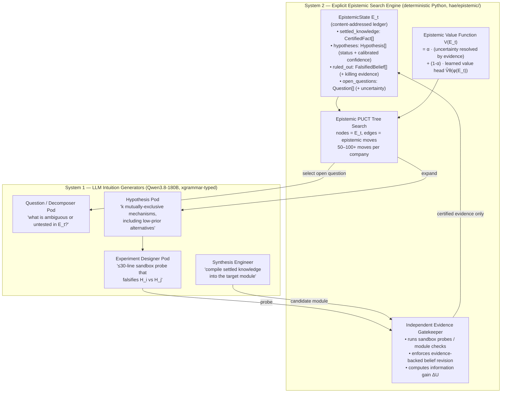

# Phase 6 (`V6`): Epistemic Tree-Search Organizations — *"The Scientific Method on Steroids"*

> **Status:** Design finalized `October 5, 2026` · Stage 1 & 2 implementation in progress · Generation 16 (`V6`) pending
> **Trigger:** Thore Graepel (AlphaGo core team, now Chair of Machine Learning at UCL), *["Don't be fooled—LLMs don't reason"](https://www.technologyreview.com/2026/10/02/1145639/dont-be-fooled-llms-dont-reason/)*, MIT Technology Review, October 2, 2026
> **Empirical Motivation:** Generation 15 plateau analysis ([`results/hae_gen15_fullstack_v5/generation_15_summary.json`](../../results/hae_gen15_fullstack_v5/generation_15_summary.json))

---

## 1. Why `V6` Exists: What Generation 15 Taught Us About the Limits of Linear LLM Self-Repair

Generation 15 was our most successful run to date (`10 / 10` firms at `46–50 / 50`, two firms at `50 / 50`). It also produced the clearest evidence yet that **our repair loop is a 1-D greedy hill-climber driven purely by LLM intuition**, and that this architecture has a hard ceiling:

| Symptom in Gen 15 | Evidence | Diagnosis |
| :--- | :--- | :--- |
| **Flat-line repair trajectories** | `gen_14_elite_1` `[49, 49, 49, 49, 49]`, `gen_14_crossover_1` `[49, 49, 49, 49, 49]`, `gen_14_mutant_1` `[48, 48, 48, 48, 48]`, `gen_14_elite_2` `[46, 46, 46, 46, 46]` — **4 firms made zero progress across 16 combined repair iterations.** After Iteration 2, **`8 / 8` non-converged firms were stuck** (only `gen_14_mutant_2` gained `+2` tests at Iteration 4). | At `temperature=0.1`, the Lead Engineer re-emits the same highest-probability patch every iteration. The loop has **no memory of what it already tried and why it failed** (no *ruled-out* ledger), so it cannot pivot. |
| **The same wrong mechanism across independent firms** | `test_pytest_style_functions_are_collected` failed in **`7 / 8`** non-converged firm snapshots; `test_unittest_style_classes_are_collected` failed in **`6 / 8`**. | This is Graepel's *Move 37 problem* in reverse: the LLM's policy prior strongly favours one plausible-but-wrong implementation of stdlib test collection. A system that only samples **high-prior** moves never explores the low-prior alternative that actually passes. |
| **Repair only works when an oracle hands over the traceback** | Every `+36` / `+41` test jump (`gen_14_crossover_3`, `gen_14_pareto_2`, `gen_14_mutant_2`) happened **after** the external benchmark returned exact `AssertionError` diffs. | Firms never **ask their own questions** or **run their own falsification experiments**. Remove the oracle (as in real engineering) and the loop has no mechanism for reducing uncertainty. |
| **`50%` of fitness graded post-hoc prose** | `judge.py` scores `ExecutiveDeliverablePacket` narratives that are generated **after** the code exists. | Graepel: LLMs *"concoct [chains of thought] after the fact, reaching an answer by one route but reporting another."* We are rewarding a convincing story, not an auditable reasoning trail. |

---

## 2. The Architectural Diff: Our Previous "AlphaGo-Style" Plan vs. What AlphaGo Actually Does

Before reading Graepel's essay, our roadmap for "100+ internal iterations" was **MCTS over code snapshots scored by unit tests, with the CEO LLM assigning policy priors $P(s,a)$ and an LLM/heuristic critic as $V(s)$**. Graepel's account of AlphaGo exposes three fundamental errors in that framing:

```diff
- [PREVIOUS PLAN]  State s_t  = workspace code snapshot + binary test pass/fail vector
+ [GRAEPEL / V6]   State E_t  = explicit, persistent, INSPECTABLE EPISTEMIC LEDGER:
+                               { settled_knowledge (certified facts),
+                                 hypotheses (with calibrated confidence),
+                                 ruled_out (falsified beliefs + the evidence that killed them),
+                                 open_questions (unresolved uncertainty) }

- [PREVIOUS PLAN]  Move a_t   = "LLM rewrites a module file -> run external benchmark"
+ [GRAEPEL / V6]   Move a_t   = EPISTEMIC OPERATOR that changes E_t to reduce uncertainty:
+                               ASK / DECOMPOSE -> HYPOTHESIZE (k competing, incl. low-prior)
+                               -> EXPERIMENT (sandbox probe that can falsify) -> REVISE
+                               -> SYNTHESIZE code strictly from settled knowledge

- [PREVIOUS PLAN]  Value V(s) = held-out test count + LLM/AST heuristic critic
+ [GRAEPEL / V6]   Value V(E) = INDEPENDENT, NON-LLM evaluator of "how much uncertainty this
+                               move actually resolved, backed by evidence" + a learned
+                               value head trained on past epistemic search trees
```

| Dimension | ❌ Previous Plan & Current `V5` Runtime | ✅ Graepel's AlphaGo Architecture (`V6`) | Consequence |
| :--- | :--- | :--- | :--- |
| **System 1 / System 2 boundary** | CEO directives, specialist JSON packets, and chain-of-thought were treated as *deliberation*. | **The LLM is 100% System 1.** Chain-of-thought is *"the same next-token prediction process, iterated for longer."* System 2 must be **explicit, non-LLM machinery outside the weights** (AlphaGo's game tree + search). | Stacking more LLM calls on top of LLM calls does not create reasoning. The *organization* must be the System 2. |
| **Who edits beliefs** | Any agent could assert "fixed" / "verified" in prose. | *"An **independent part of the system** must evaluate each move by how much it actually resolves uncertainty, **updating beliefs only when the change is backed by evidence**."* | LLMs may **propose**; only a deterministic **Evidence Gatekeeper** running sandboxed probes may **certify** or **falsify**. |
| **Policy prior & Move 37** | CEO LLM assigns $P(s,a)$ and prunes low-plausibility branches. | AlphaGo's policy net gave Move 37 a **1-in-10,000** prior. Search found it **because it looked past plausibility** and evaluated consequences. | LLM-plausibility pruning systematically kills every "Move 37". `V6` deliberately expands **mutually exclusive, low-prior hypotheses** and lets cheap experiments — not the LLM — decide. |
| **Memory of dead ends** | Only `best_workspace_files` is kept; failed patches are forgotten. | The game tree retains **every variation considered**, annotated with evaluations. | `ruled_out` is a first-class ledger section; proposals matching a falsified mechanism are rejected before spending a turn. |
| **Auditability** | Fitness partly graded on post-hoc narrative. | *"Conclusions arise from an auditable sequence of evidence, inference, and belief revision rather than from a convincing story told after the fact."* | Replace prose rubric with an **Epistemic Integrity Audit** of the ledger (claims backed by certified experiments, calibration, no re-attempted falsified ideas). |

---

## 3. `V6` Architecture: The Company *Is* the System 2



### 3.1 Stage 1 — Core Engine (`hae/epistemic/`, CPU-only, `$0` GPU)

| Module | Responsibility | Key Invariants |
| :--- | :--- | :--- |
| [`hae/epistemic/ledger.py`](../../hae/epistemic/ledger.py) | `EpistemicState`, `Question`, `Hypothesis`, `CertifiedFact`, `FalsifiedBelief`, `Evidence`. Immutable, content-addressed (`state_hash`), JSON-serialisable, fully inspectable. | Confidence fields are **read-only to LLM proposals**; only `Gatekeeper` transitions mutate status. Every `CertifiedFact` / `FalsifiedBelief` carries the hash of the evidence that produced it. |
| [`hae/epistemic/moves.py`](../../hae/epistemic/moves.py) | Typed epistemic operators: `AskQuestion`, `ProposeHypothesis`, `ProposeExperiment`, `ProposeCodeDiff`, `Synthesize`. Each is an `xgrammar`-enforceable JSON schema the LLM may emit. | A move **proposes**; it never asserts truth. Proposals whose mechanism signature matches a `ruled_out` entry are rejected with `TABU`. |
| [`hae/epistemic/gatekeeper.py`](../../hae/epistemic/gatekeeper.py) | Independent evidence evaluator: executes probes in the isolated sandbox, applies deterministic belief-revision rules (`SUPPORTED` / `FALSIFIED` / `CERTIFIED`), computes information gain $\Delta U$. | **No LLM call inside the gatekeeper.** Belief updates require an `Evidence` record with `exit_code`, `stdout/stderr`, `assertion_diff`. Zero new evidence ⇒ $\Delta U = 0$. |
| [`hae/epistemic/value.py`](../../hae/epistemic/value.py) | Epistemic value function: Stage-A feature-engineered (uncertainty resolved, ruled-out density, stagnation depth, module isolation); Stage-B learned head $\hat V_\theta$ trained on harvested search trees. | Calibration is scored (Brier) against terminal outcomes; miscalibration is a fitness penalty, not a free lunch. |
| [`hae/epistemic/mcts.py`](../../hae/epistemic/mcts.py) | PUCT tree search over `EpistemicState` nodes; forced exploration of low-prior siblings; dead-end back-propagation; tabu memory. | Policy priors are **only** an exploration tie-breaker — never a pruning filter (Move 37 rule). |

### 3.2 Stage 2 — Organizational Integration (`company.py`, `schema.py`, `worker.py`, `judge.py`)

1. **`CompanyGenome` gains an `epistemic_policy` gene** (heritable, mutable, crossover-able): `search_budget_moves`, `branching_k`, `c_puct`, `low_prior_quota`, `experiment_token_cap`, `value_alpha`, and which departments are bound to `question` / `hypothesis` / `experiment` / `synthesis` roles.
2. **`HierarchicalCompanyRunner` gains an `EpistemicSearchLoop`** that replaces linear repair iterations `2..N` with tree search: select node → System 1 proposes → Gatekeeper certifies → ledger & value back-propagate → repeat, for `search_budget_moves` (`50–100+`) cheap moves instead of `5` expensive full-company passes.
3. **Fitness (`judge.py`) becomes an Epistemic Integrity Audit:** `60%` held-out execution, `25%` ledger auditability & calibration (fraction of final-deliverable claims backed by a `CertifiedFact`, no re-attempted `ruled_out` mechanisms, Brier score of $\hat V_\theta$), `15%` uncertainty resolved per unit cost. The post-hoc prose rubric is retired.

### 3.3 Stage 3 — Generation 16 (`V6` Launch)

- **Benchmark A (regression):** `full_stack_hae` (`50` held-out tests) — target: break the `46–49/50` plateau on the 8 non-converged lineages **without** increasing full-company passes.
- **Benchmark B (new, oracle-free):** a multi-file debugging task where **no benchmark traceback is handed to the company** — firms must author their own probes to localise the fault. This is the benchmark `V5` cannot attempt at all.
- **Telemetry harvested for the learned value head:** every `(E_t features, move, ΔU, terminal outcome)` tuple across all firms.

---

## 4. What Does *Not* Change

- `V5` TypeSafe `xgrammar` schemas remain the transport for every System 1 proposal (the epistemic moves are simply new, stricter schemas).
- The unified `llm-d` session, per-module decomposition, and zero-copy content-addressed workspaces are what make `50–100+` moves per company cheap: sibling expansions share `~85%` of their prefix.
- Evolution remains the **outer loop**: `epistemic_policy` genes are selected on audited fitness exactly like topology genes were in `V1–V5`.

## 5. Phase 7 (`V7`): Parametric RL on Certified Trajectories (formerly `V6`)

GRPO / DPO distillation is deferred one phase, for a reason Graepel makes explicit: *"Once these rules are enforced, the model can accumulate certified knowledge and improve its reasoning policy by learning from past reasoning experiences."* Training on `V5` trajectories would distil post-hoc narratives; training on `V6` ledgers distils **evidence-backed moves** (which hypotheses were worth proposing, which experiments were decisive). The RL phase therefore consumes `V6` search trees, not `V5` transcripts.
